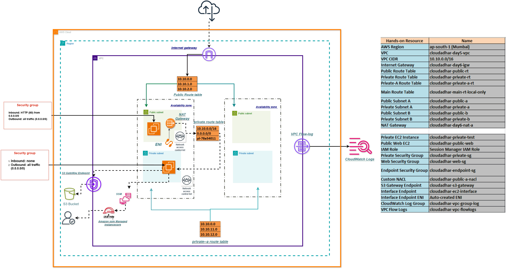
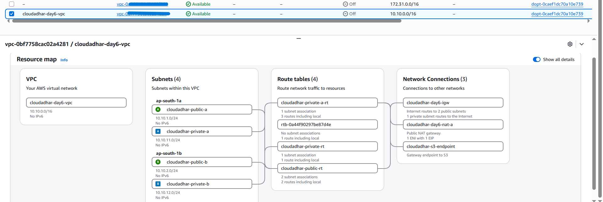
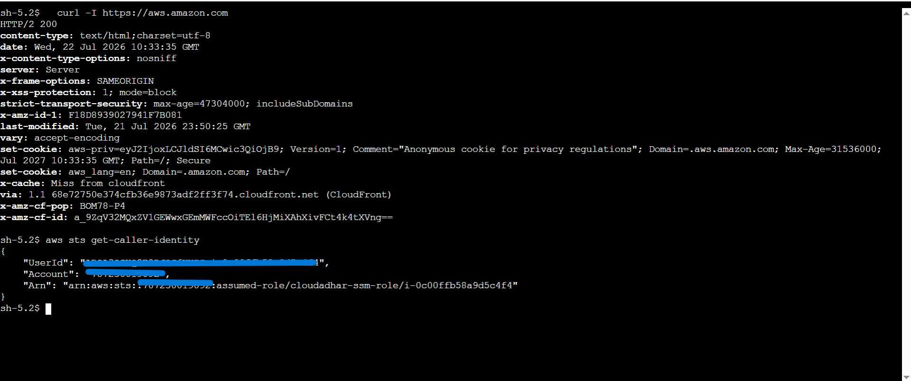
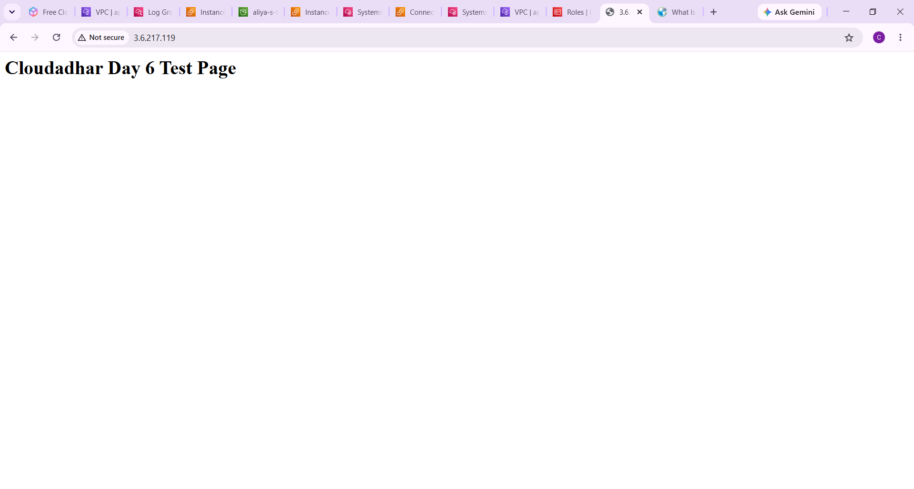
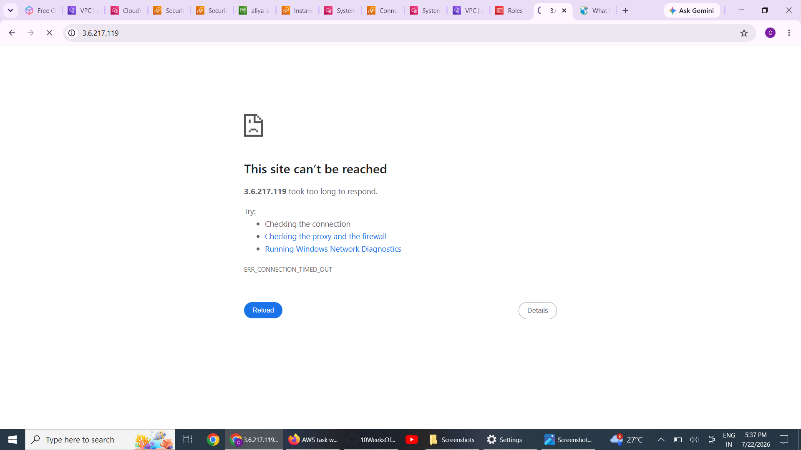
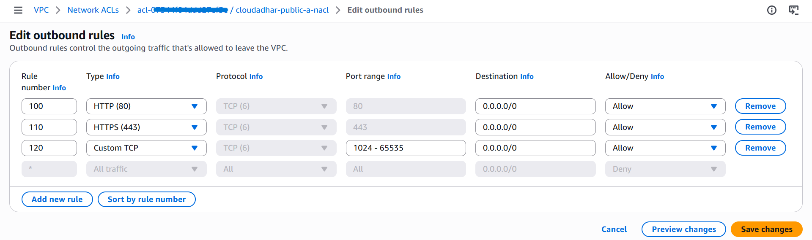
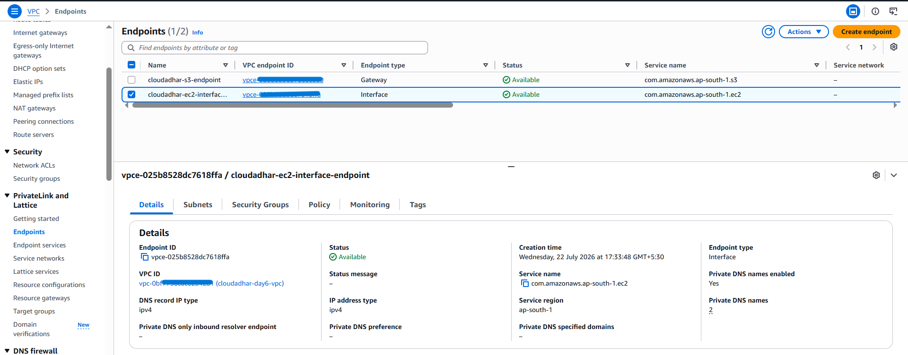
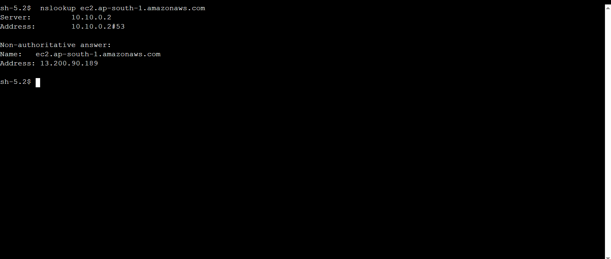
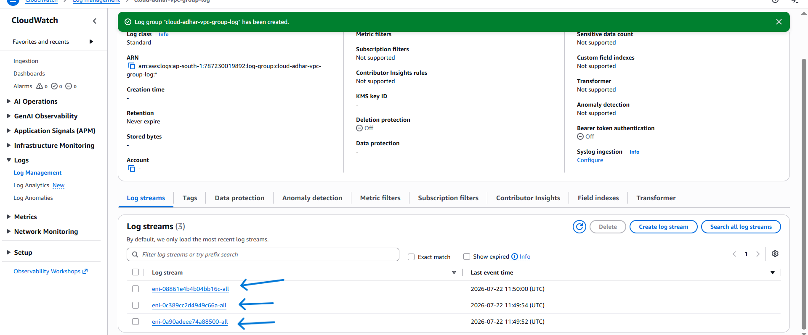

#  Week 3 • Day 6 - Amazon VPC

 ### Shaikh Aliya

---

#  Goal

Build a production-style Amazon VPC with:

- Multi-AZ architecture
- Public and Private Subnets
- Internet Gateway
- NAT Gateway
- Route Tables
- Network ACLs
- Security Groups
- VPC Endpoints
- VPC Flow Logs
- AWS Systems Manager (Session Manager)

---

# AWS Services Used

- Amazon VPC
- EC2
- Internet Gateway
- NAT Gateway
- Route Tables
- Security Groups
- Network ACLs
- VPC Endpoints
- AWS Systems Manager
- CloudWatch Logs
- VPC Flow Logs

---

#  Architecture

Built a **two Availability Zone VPC (`cloudadhar-day6-vpc`)** consisting of:

- Public and Private subnet in each AZ
- Internet Gateway
- NAT Gateway
- Route Tables
- Network ACL
- Security Groups
- VPC Endpoints
- CloudWatch Flow Logs

## Architecture Diagram


---

#  CIDR Plan

| Resource | CIDR | Total Addresses | Usable |
|-----------|------|-----------------|---------|
| VPC | 10.10.0.0/16 | 65,536 | — |
| Public-A | 10.10.1.0/24 | 256 | 251 |
| Private-A | 10.10.11.0/24 | 256 | 251 |
| Public-B | 10.10.2.0/24 | 256 | 251 |
| Private-B | 10.10.12.0/24 | 256 | 251 |

> AWS reserves 5 IP addresses in every subnet.

All subnet ranges fit inside the VPC CIDR and do not overlap.

---

#  VPC Overview

Created a custom VPC with four subnets across two Availability Zones.



---

#  Public vs Private Subnets

## Public Subnet

A subnet becomes **public** when its route table contains:

```
0.0.0.0/0 → Internet Gateway
```

Instances inside can receive internet traffic if they also have:

- Public IP
- Security Group allowing inbound traffic

## Private Subnet

Private subnets do **not** route directly to the Internet Gateway.

Instead:

```
0.0.0.0/0 → NAT Gateway
```

Instances can access the internet for updates without exposing themselves publicly.

---

#  NAT Gateway

Created a NAT Gateway inside the Public Subnet and attached an Elastic IP.

Configured the Private Route Table so that all outbound traffic uses the NAT Gateway.

Verified internet connectivity from the private EC2 instance using Session Manager and the `curl` command.

```bash
curl https://aws.amazon.com
```

### Screenshot



---

#  Public EC2 Access

Launched an EC2 instance in the Public Subnet.

Installed Nginx.

Verified that the website was accessible using the instance's public IP.

### Screenshot



---

#  Security Groups vs Network ACLs

Created a custom Network ACL for the public subnet.

Added:

- Allow HTTP
- Allow Ephemeral Ports
- Allow HTTPS

Then created a **lower-numbered DENY rule** blocking my own public IP.

The NACL evaluated the DENY rule first, making the web server unreachable.

After removing the DENY rule, access was restored.

### Screenshot



---

#  Route Tables

Configured separate Route Tables for Public and Private Subnets.

### Public Route Table

```
0.0.0.0/0 → Internet Gateway
```

### Private Route Table

```
0.0.0.0/0 → NAT Gateway
```

### Screenshot



---

#  VPC Endpoints

Configured two different VPC Endpoints.

## S3 Gateway Endpoint

- Attached to Private Route Table
- Uses AWS Managed Prefix List
- No hourly charges

Verified using S3 API calls from the Private EC2.

---

## EC2 Interface Endpoint

- Enabled Private DNS
- Attached restrictive Security Group
- Verified using:

```bash
nslookup ec2.ap-south-1.amazonaws.com
```

Deleted immediately after testing because Interface Endpoints are billed hourly.

### Screenshot



---

#  VPC Flow Logs

Enabled VPC Flow Logs and sent logs to CloudWatch Logs.

Generated both:

- ACCEPT traffic
- REJECT traffic

Queried CloudWatch Logs Insights and verified:

- Source IP
- Destination IP
- Protocol
- Port
- ACCEPT
- REJECT

### Screenshot



---

#  Architecture Decisions

## Why NAT Gateway?

- Allows Private EC2 instances to access the internet.
- Prevents inbound internet access.
- Keeps workloads secure.

---

## Why S3 Gateway Endpoint?

Without Gateway Endpoint:

Private EC2 → NAT Gateway → Internet → S3

With Gateway Endpoint:

Private EC2 → AWS Private Network → S3

Benefits:

- No hourly cost
- Lower latency
- No NAT data processing charges

---

## Why Transit Gateway instead of Peering?

VPC Peering

- One-to-One
- Non-transitive
- Difficult to manage at scale

Transit Gateway

- Central Hub
- Transitive Routing
- Easier management
- Recommended for large AWS environments

---

#  Troubleshooting

During testing, the SSM Agent changed from **Online** to **Offline**.

I investigated:

- ✅ Route Tables
- ✅ NAT Gateway
- ✅ Internet Gateway
- ✅ Security Groups
- ✅ Network ACLs
- ✅ Endpoint Configuration

Everything appeared correct.

The issue was caused by changes made during networking configuration.

### Resolution

- Rebooted the EC2 instance.
- Removed the incorrect NACL association.
- Confirmed the SSM Agent became Online again.

---

#  Learning Outcomes

After completing this lab I learned:

- Designing Multi-AZ VPCs
- Public vs Private Networking
- NAT Gateway
- Internet Gateway
- Route Tables
- Security Groups
- Network ACLs
- VPC Endpoints
- CloudWatch Flow Logs
- Troubleshooting SSM connectivity

---

#  Cleanup

Deleted all billable resources.

- ✅ Interface Endpoint
- ✅ EC2 Instances
- ✅ NAT Gateway
- ✅ Elastic IP
- ✅ Route Tables
- ✅ Custom Network ACL
- ✅ Internet Gateway
- ✅ VPC Endpoints
- ✅ Subnets
- ✅ VPC

---

#  LinkedIn Posts

- **Day 5:** *Add your LinkedIn URL here*
- **Day 6:** *Add your LinkedIn URL here*

---

# ✅ Project Status

✔️ Completed Successfully
