# Week 4 - Day 7: Golden AMI (Manual + EC2 Image Builder Automation)

## Learner
- Name: Shaikh Aliya
  
- GitHub: github.com/Aliyas-22
  
- LinkedIn: www.linkedin.com/in/shaikh-aliya22

## Day 7

This task i divided into two parts:

- Part 1: Manually creating a Golden AMI from a running EC2 instance.
- Part 2: Automating the same Golden AMI creation using EC2 Image Builder.

Region used for the entire task: `ap-south-1 (Mumbai)`

Architecture diagram of the complete pipeline flow (how the developer triggers the pipeline and how Image Builder builds the image) is available at:

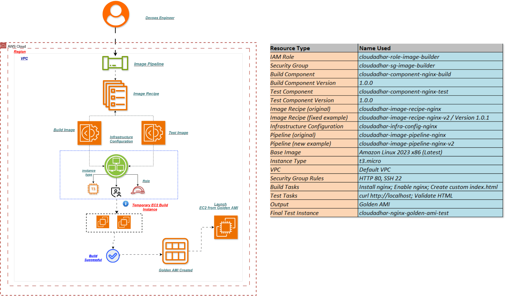

---

## Part 1: Manual Golden AMI Creation

### Step 1: IAM Role Setup

- Went to IAM → Roles → Create Role.
- Selected trusted entity type as AWS Service and use case as EC2.
- Attached policy: `AmazonSSMManagedInstanceCore`.
- Role name given: `cloudadhar-role-ec2-ssm`.
- This role allows connecting to the instance using Session Manager instead of SSH.

`!IAM-roles`
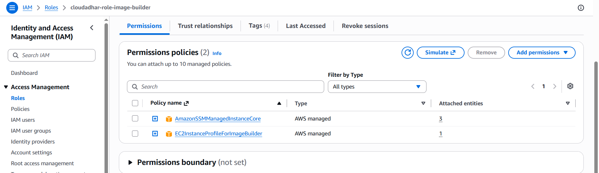

### Step 2: Security Group Setup

- Created a new security group named `cloudadhar-sg-nginx-public`.
- Description: Allow HTTP only.

| Rule Type | Port | Source |
|---|---|---|
| Inbound | HTTP (80) | My IP |
| Outbound | All traffic | Default |

- SSH was intentionally not opened, since Session Manager is used for access.

### Step 3: Launch First EC2 Instance

- Instance name: `cloudadhar-ec2-ami-builder-01`
- AMI: Amazon Linux 2023
- Instance type: t2.micro
- Key pair: None (since access is only through Session Manager)
- Security group: `cloudadhar-sg-nginx-public`
- IAM role: `cloudadhar-role-ec2-ssm`
- Metadata version under Advanced Details set to: `V2 only (token required)` (this enforces IMDSv2)
- User data script added to auto install and configure nginx.

`!1st instance`

### Step 4: Validate Bootstrap (via Session Manager)

Connected using EC2 → Instance → Connect → Session Manager (no SSH used) and ran the validation commands one by one.

| Command | Purpose |
|---|---|
| `sudo cloud-init status --wait` | Confirms user data script finished running |
| `sudo systemctl status nginx --no-pager` | Confirms nginx service is active |
| `curl -I http://localhost` | Confirms nginx is serving requests |
| `sudo tail -40 /var/log/cloud-init-output.log` | Reviews bootstrap logs |

`!running-instance-command-1`
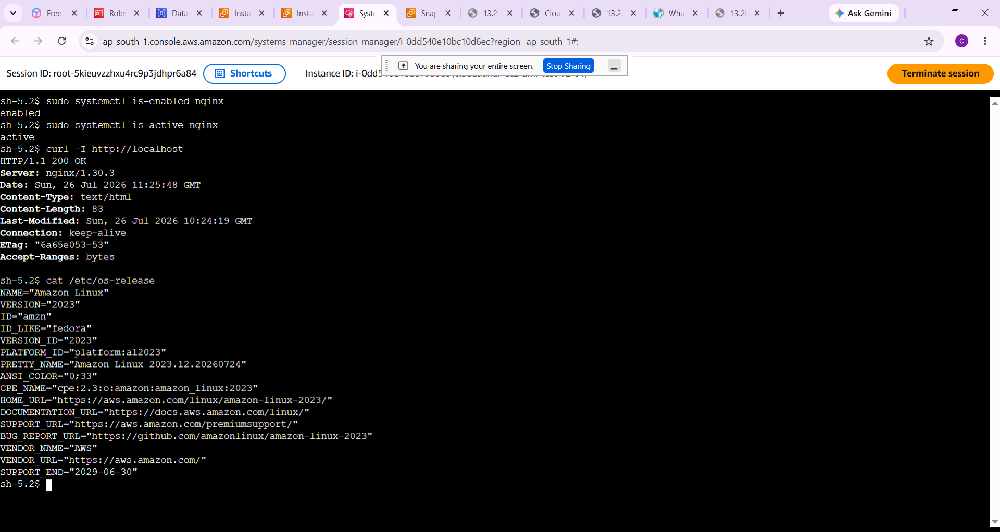

`!running-nginx-1st-instance (1)`
.png)

`!running-nginx-1st-instance (2)`
.png)

### Step 5: Validate IMDSv2

- Ran the metadata curl command without a token first, and got `401 Unauthorized`, which confirms IMDSv2 is enforced.
- Generated a token using the `TOKEN=...` command.
- Ran the metadata commands again using the token, and this time it returned the metadata successfully.

`!command-1`
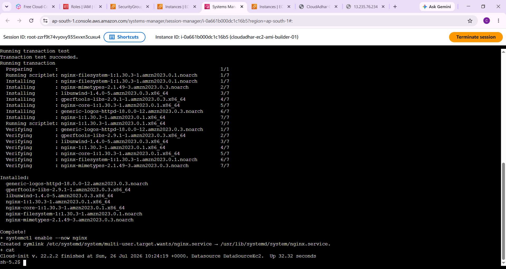

`!coomand-2`
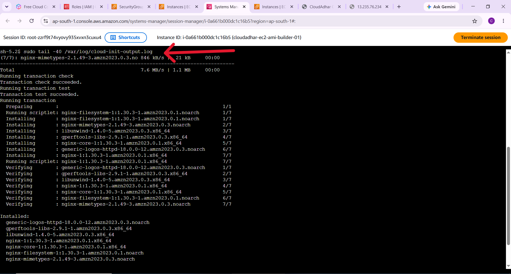

### Step 6: Patch the Instance

Ran the following commands to update and patch the instance before creating the AMI:

- `cat /etc/os-release`
- `sudo dnf check-update`
- `sudo dnf upgrade -y`
- `sudo systemctl restart nginx`
- `curl -I http://localhost`
- `sudo dnf clean all`

`!command-3`
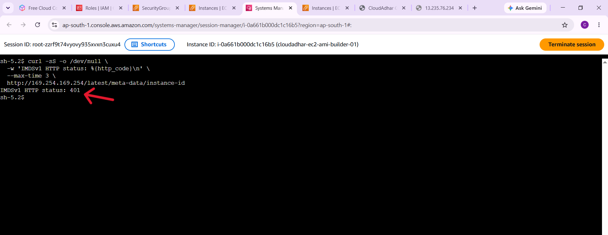

`!command-4`
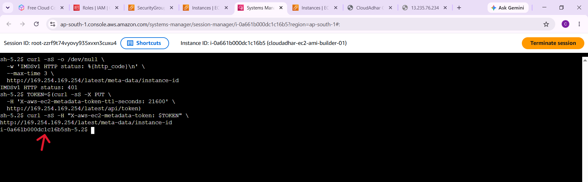

### Step 7: Create Golden AMI

- Went to EC2 → Instances → Actions → Image and Templates → Create Image.
- Image name: `cloudadhar-ami-nginx-golden-v2-20260725`
- Reboot instance kept as Yes.
- Waited until the image status changed to Available.

`!AMI-createdfrom-1st-instance`
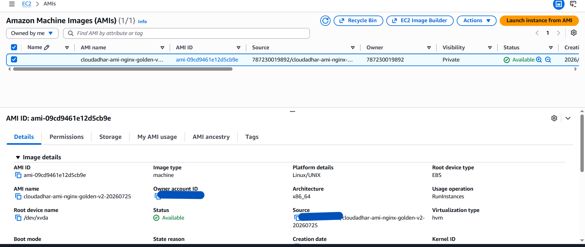

### Step 8: Launch Test Instance from Golden AMI

- Launched a new instance: `cloudadhar-ec2-ami-test-v2-01`
- AMI used: Owned by me → the Golden AMI created above.
- Same IAM role and same security group used.
- IMDSv2 kept as required.
- No user data was added this time, since nginx should already be baked into the AMI.

`!2nd-instance`
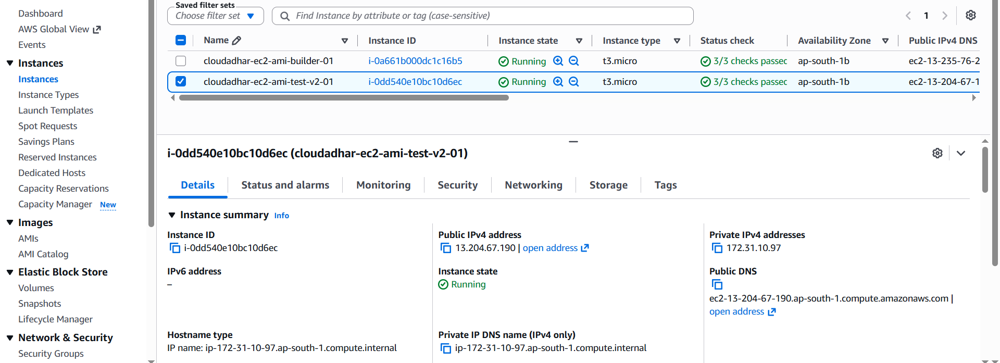

### Step 9: Validate the Golden AMI

Connected to the new test instance via Session Manager and ran:

| Command | Purpose |
|---|---|
| `sudo systemctl is-enabled nginx` | Confirms nginx is enabled without user data |
| `sudo systemctl is-active nginx` | Confirms nginx is already running |
| `curl -I http://localhost` | Confirms the web page is served |
| `cat /etc/os-release` | Confirms OS details |

`!command-5`
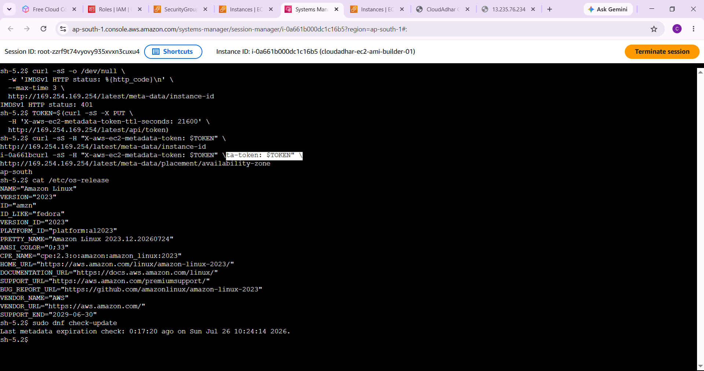

`!running-nginx-2nd-instance`
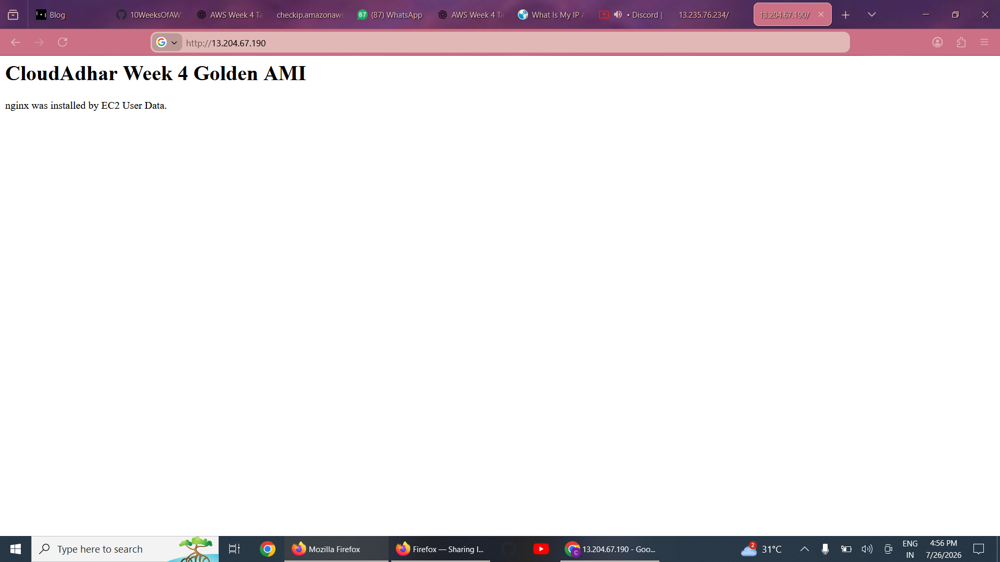

Since nginx was already running without any user data script, the Golden AMI was confirmed to be created successfully.

---

## Part 2: EC2 Image Builder Automation

After completing the manual lab, the same Golden AMI creation was automated using EC2 Image Builder. This section covers building components, a recipe, infrastructure configuration and a pipeline, so that the AMI can be rebuilt automatically instead of manually.

### Step 1: Create Image Builder Components

- Created a custom component that installs and configures nginx, replacing the manual user data script used in Part 1.
- This component defines the build and validate phases.

`!components`
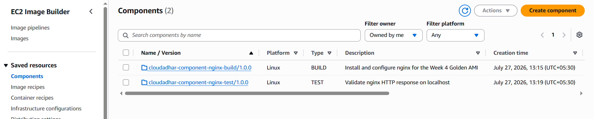

### Step 2: Create Image Recipe

- Created an image recipe using Amazon Linux 2023 as the base image.
- Attached the custom nginx component created above to the recipe.

`!image-recipe`
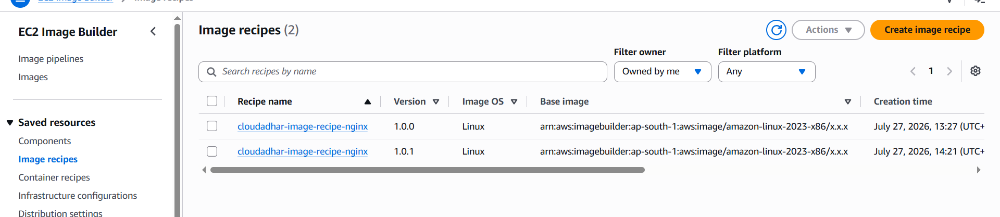

### Step 3: Create Infrastructure Configuration

- Defined the infrastructure configuration used by Image Builder to launch its temporary build instance.
- This includes instance type, IAM instance profile and the security group, matching the same setup used in the manual lab.

`!infra-config`
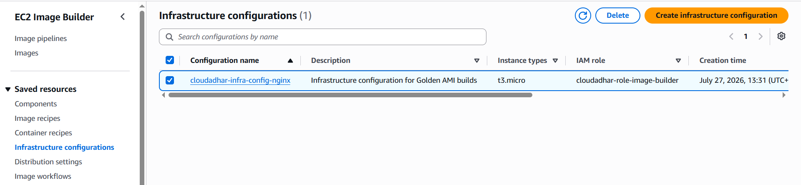

### Step 4: Create Image Pipeline

- Created an image pipeline that links the recipe and the infrastructure configuration together.
- The pipeline automates the process of building, testing and producing the AMI whenever it is run.

`!image-pipeline`
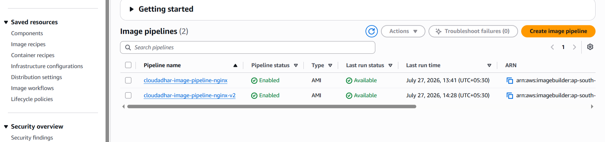

`!pipeline-workflow`
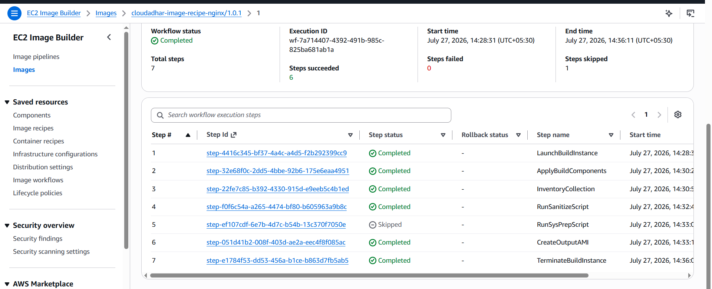

### Step 5: Pipeline Build and Test

- Ran the pipeline manually, which launched a temporary build and test instance automatically.
- Image Builder used this temporary instance to install nginx using the component, and then validated it.

`!build & test temporary instance`

### Step 6: Output AMI from Pipeline

- Once the build and test phase completed, the pipeline produced a new AMI automatically, without any manual AMI creation step.

`!image`
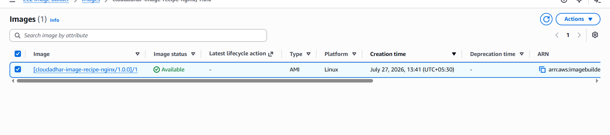

### Step 7: Validate AMI Created from Pipeline

- Launched a new test instance using the AMI produced by the pipeline, with no user data added.
- Connected using Session Manager and verified nginx was already running.

`!instance-created-from-pipeline-image`
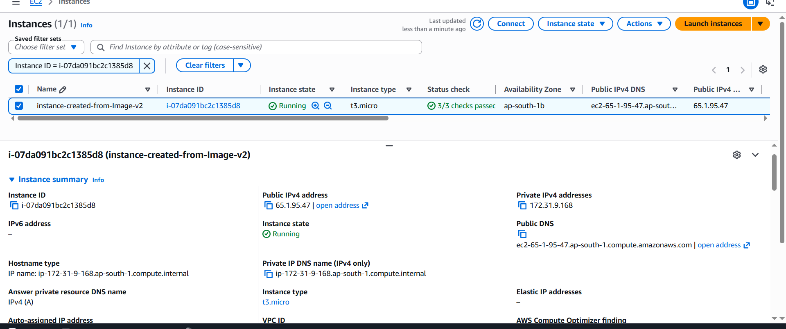

`!running-page-created-from-pipeline-image`
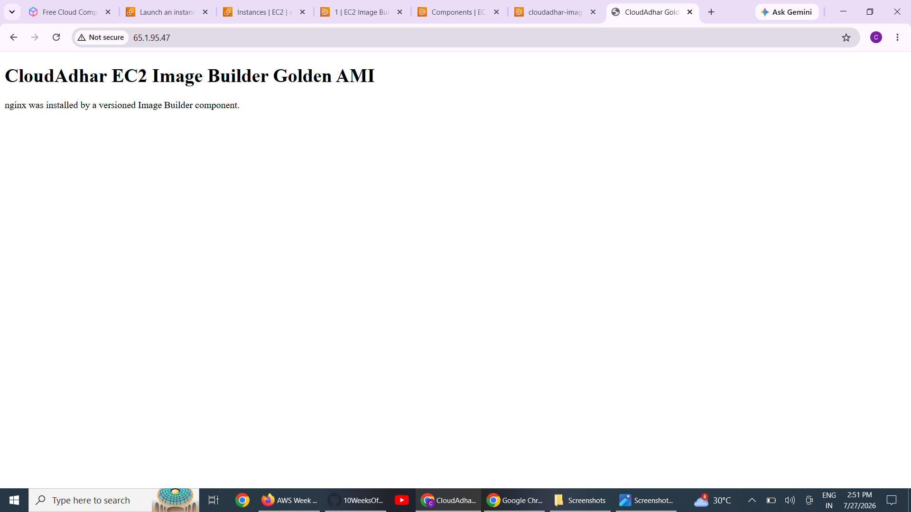

This confirmed that the AMI produced by the automated pipeline works exactly the same as the Golden AMI created manually in Part 1.

---

## Summary

| Part | Method | Outcome |
|---|---|---|
| Part 1 | Manual (Console) | Golden AMI created step by step, one time only |
| Part 2 | EC2 Image Builder | Golden AMI created automatically through a repeatable pipeline |

Both parts result in the same outcome, an AMI with nginx pre-installed and running without requiring any user data, but Part 2 removes the manual steps and makes the process repeatable and automated.
