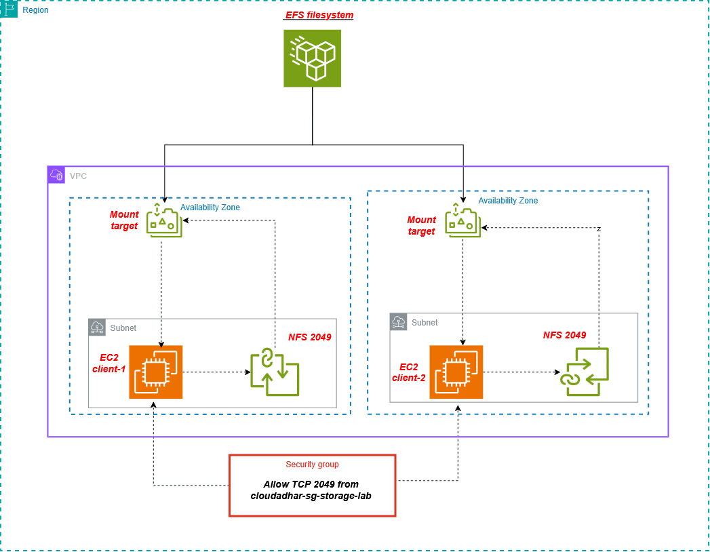
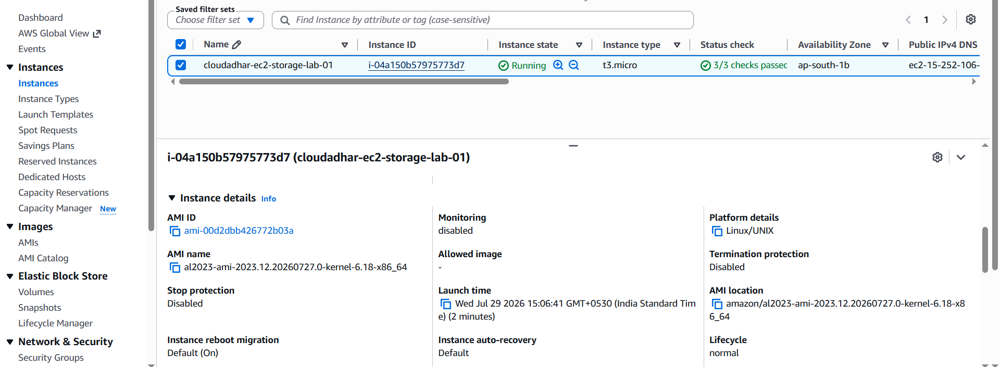
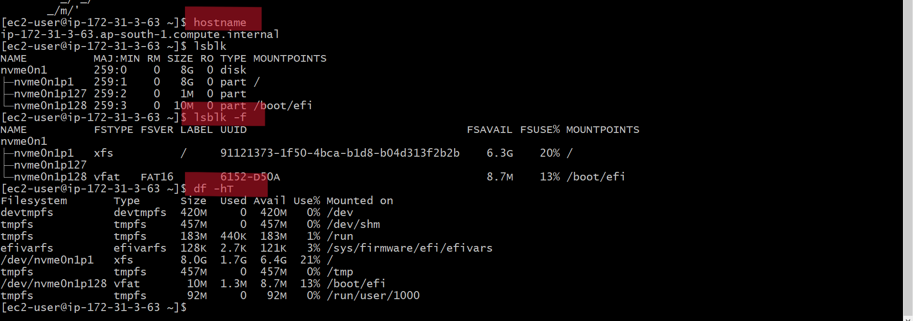
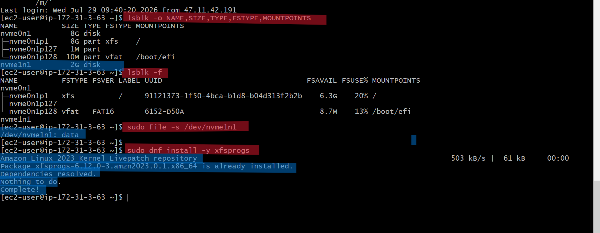
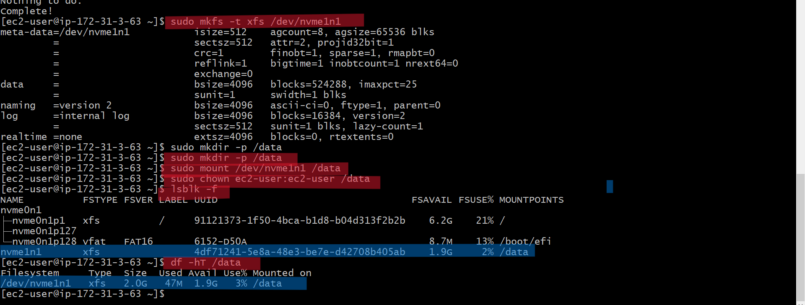
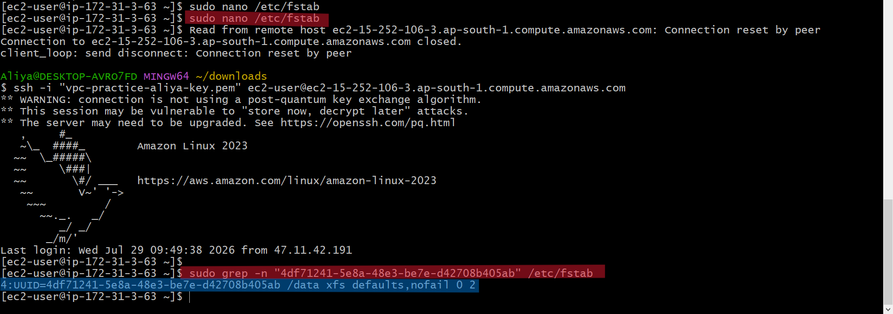
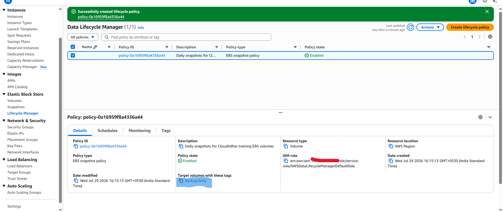
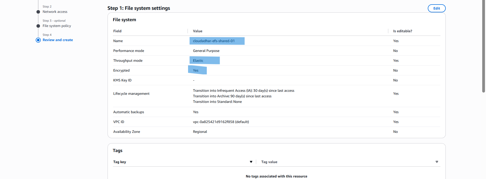

# Day 8 - EBS Persistence, EFS, and Storage Recovery

This document covers the storage lifecycle lab completed on AWS: launching an
EC2 instance, attaching and resizing an EBS volume, taking and restoring
snapshots, copying a snapshot cross-region for disaster recovery, automating
backups with DLM, exploring placement groups, and setting up shared storage
with EFS across two EC2 instances.

## Resources Created

| Resource | Name |
|---|---|
| Storage EC2 instance | `cloudadhar-ec2-storage-lab-01` |
| EC2 client security group | `cloudadhar-sg-storage-lab` |
| Data volume | `cloudadhar-ebs-gp3-data-01` |
| Snapshot (Mumbai) | `cloudadhar-snap-gp3-data-01` |
| Restored volume | `cloudadhar-ebs-gp3-restored-01` |
| DR snapshot (Sydney) | `cloudadhar-snap-dr-sydney-01` |
| DLM policy | `cloudadhar-dlm-daily-ebs-snapshots` |
| EFS filesystem | `cloudadhar-efs-shared-01` |
| EFS security group | `cloudadhar-sg-efs-nfs` |
| EFS client instance | `cloudadhar-ec2-efs-client-02` |
| Placement groups | Cluster, Spread, Partition demos |

Region used: `ap-south-1` (Mumbai), with a cross-region step in
`ap-southeast-2` (Sydney).

---
## Architecture Diagrams
 
Diagrams created to summarize the AZ-scoped versus Regional distinction for
both EBS and EFS.

 
.png)

 

## Part 1: Launch the Storage Instance

Launched `cloudadhar-ec2-storage-lab-01` with an 8 GiB root volume, and
confirmed the instance's hostname and initial disk layout before doing
anything else.

---

## Part 2: Create, Attach, and Mount the gp3 Volume

Created a new 2 GiB gp3 volume in the same Availability Zone as the
instance, attached it, then formatted and mounted it at `/data`.

Edited `/etc/fstab` to make the mount persistent across reboots.

---

## Part 3: Persistent Mounting and Reboot Proof

Confirmed the `/data` mount and its files survived both a reboot and a full
stop and start cycle. This proves EBS data persists independently of the
instance's power state.

---

## Part 4: Resize EBS from 2 GiB to 4 GiB

Modified the volume size in the console, then confirmed the block device
grew before separately growing the XFS filesystem itself to actually use
the extra space.

Note: resizing the EBS volume and growing the filesystem are two separate
steps. The console resize alone does not make the extra space usable.

---

## Part 5: Snapshot and Point-in-Time Restore

Took a snapshot of the data volume, then wrote new data to the live volume
afterward. Restoring from the snapshot into a new volume proved the
snapshot only contains data from the moment it was taken, not the current
state of the source volume.

---

## Part 6: Cross-Region Snapshot Copy

Copied the Mumbai snapshot into the Sydney region to demonstrate a basic
disaster recovery pattern. A copied snapshot is a stored backup only; it
still requires creating a new volume and instance in that region to become
a running recovery environment.

---

## Part 8: Data Lifecycle Manager (DLM)

Configured a DLM policy to automatically snapshot tagged volumes daily and
retain a fixed number of backups, removing the need for manual snapshots
going forward.

---

## Part 12: Placement Groups

Created three placement groups to demonstrate different instance placement
strategies:

- Cluster: instances placed close together for low latency, used for
  tightly coupled workloads.
- Spread: instances placed on distinct hardware, used for a small number
  of critical instances that must not share a failure point.
- Partition: instances grouped into separate rack-level failure domains,
  used for distributed systems that need rack awareness.

---

## Part 13: EFS Shared Storage Across Two EC2 Instances

Created a regional EFS filesystem with mount targets in each required
Availability Zone, secured by a security group that only allows NFS
traffic on TCP 2049 from the EC2 client security group.

Mounted the same EFS filesystem on two separate EC2 instances and proved
real shared access: each instance wrote a file, and each instance could
read the file written by the other.

---

## Key Concepts Confirmed

- EBS volumes are Availability Zone scoped. They can only attach to
  instances in the same AZ they were created in.
- Snapshots and AMIs are Regional resources. They are not tied to a single
  AZ, which is why a snapshot can be restored into a different AZ or
  copied into a different Region entirely.
- A snapshot is a point-in-time backup, not a live copy of the source
  volume. Changes made after the snapshot are not included in it.
- A cross-region snapshot copy supports disaster recovery but is not by
  itself a running recovery environment. It still requires creating a new
  volume and instance in that region during an actual failover.
- EFS is a Regional, network-based file system that multiple EC2
  instances can mount at the same time, unlike EBS which normally
  attaches to a single instance.
- EFS access depends on a mount target existing in each required
  Availability Zone, and on a security group that explicitly allows NFS
  traffic (TCP 2049) from the client's security group.

---

## Cleanup

All resources created in this lab were removed after validation, including
the EC2 instances, EBS volumes, both snapshots (Mumbai and Sydney), the
DLM policy, the EFS filesystem, the security groups, and the three
placement groups, to avoid ongoing storage and backup charges.
