# Day 10 - ALB Blue/Green Routing and Network Load Balancer (NLB)

## Objective

In this lab, I learned how to perform Blue/Green deployment using an Application Load Balancer (ALB). I created two EC2 instances (Blue and Green), configured path-based routing, host-based routing, weighted routing, target group stickiness, health checks, connection draining, and finally reused the same targets behind a Network Load Balancer (NLB).

---

# Services Used

- Amazon EC2
- Application Load Balancer (ALB)
- Network Load Balancer (NLB)
- Target Groups
- Security Groups
- Amazon Linux 2023
- Nginx

---

# Resources Created

| Resource | Name |
|----------|------|
| ALB Security Group | cloudadhar-day10-alb-sg |
| NLB Security Group | cloudadhar-day10-nlb-sg |
| Web Security Group | cloudadhar-day10-web-sg |
| Blue EC2 | cloudadhar-day10-blue-ec2 |
| Green EC2 | cloudadhar-day10-green-ec2 |
| Blue Target Group | cloudadhar-day10-blue-tg |
| Green Target Group | cloudadhar-day10-green-tg |
| Application Load Balancer | cloudadhar-day10-alb |
| Network Load Balancer | cloudadhar-day10-nlb |

---

# Step 1 - Created Security Groups

Created three security groups.

- ALB Security Group
  - HTTP (80) from Anywhere

- NLB Security Group
  - TCP (80) from Anywhere

- Web Security Group
  - HTTP (80) from ALB Security Group
  - HTTP (80) from NLB Security Group
  - SSH (22) from My IP

### Screenshot

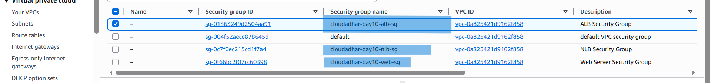

---

# Step 2 - Created Blue and Green EC2 Instances

Created two Amazon Linux 2023 EC2 instances in different Availability Zones.

- Blue Instance
- Green Instance

Installed Nginx using User Data.

Each instance displays

- Version
- Instance ID
- Availability Zone

### Blue Instance

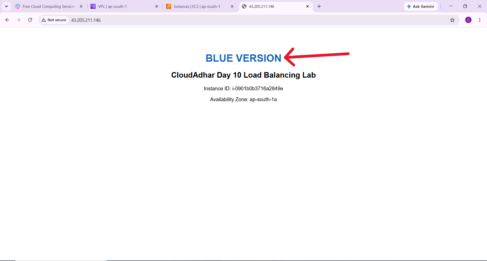

### Green Instance

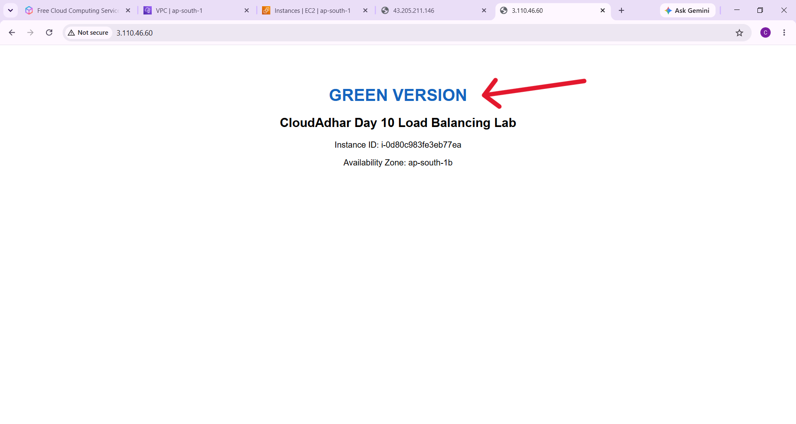

---

# Step 3 - Verified Health Page

Created `/health.html` on both instances.

Verified that the health page was accessible before registering the instances into the target groups.

### Blue Health Page

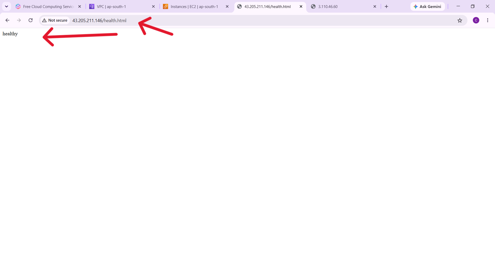

### Green Health Page

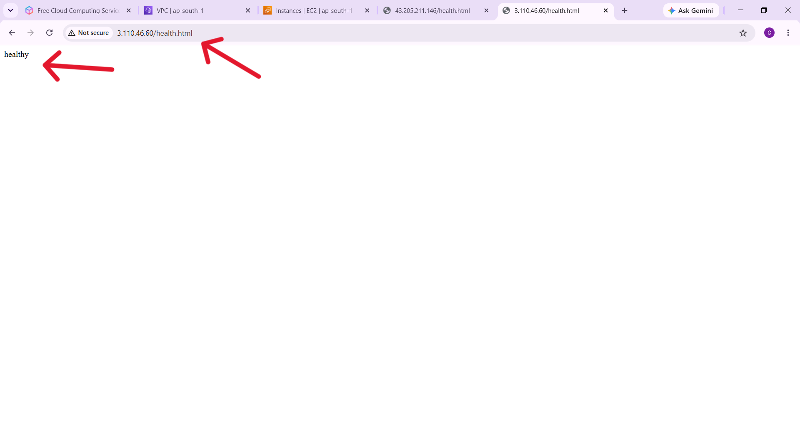

---

# Step 4 - Created Target Groups

Created two Target Groups.

- cloudadhar-day10-blue-tg
- cloudadhar-day10-green-tg

Registered the matching EC2 instance in each Target Group.

Configured Health Check

- Protocol : HTTP
- Port : 80
- Path : /health.html
- Success Code : 200

---

# Step 5 - Created Application Load Balancer

Created an Internet-facing Application Load Balancer.

Configured

- HTTP Listener
- Default Action → Blue Target Group

Verified that the ALB successfully served the Blue application.

### Screenshot

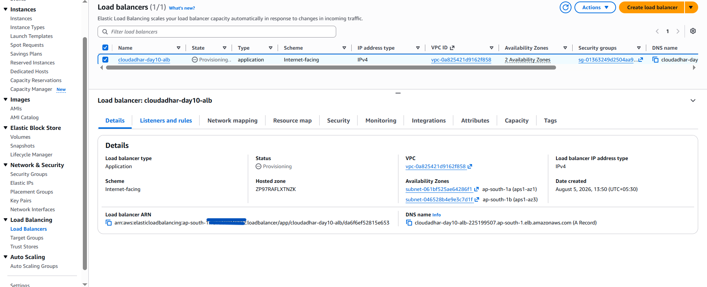

### ALB DNS Result

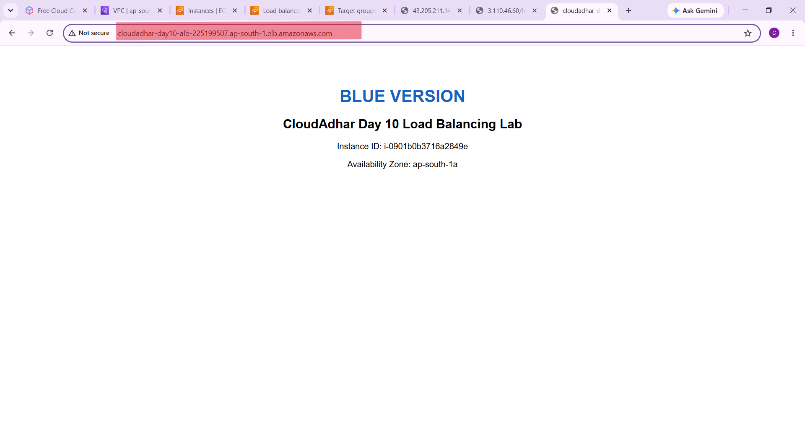

---

# Step 6 - Configured Host-Based Routing

Created a Listener Rule.

Condition

Host Header

```
api.cloudadhar.local
```

Action

Forward request to Green Target Group.

### Screenshot

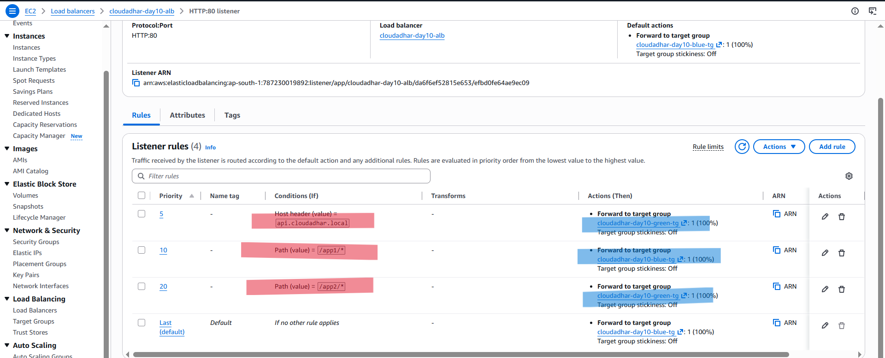

---

# Step 7 - Configured Path-Based Routing

Created two Path Rules.

| Path | Target Group |
|------|--------------|
| /app1/* | Blue |
| /app2/* | Green |

Verified routing.

### App1 routed to Blue

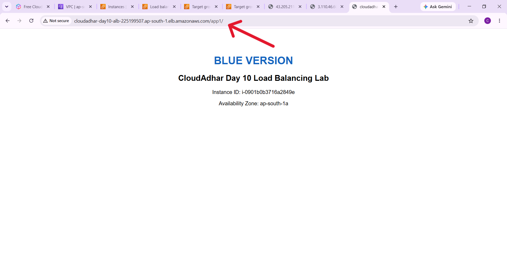

### App2 routed to Green

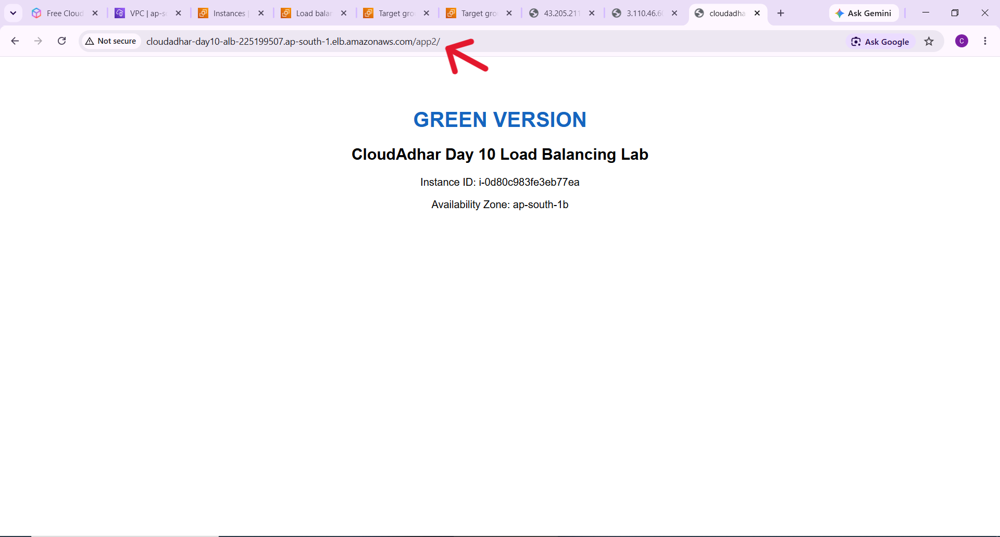

---

# Step 8 - Configured Weighted Routing

Configured the Release path.

```
/release/*
```

Routing Weights

- Blue = 80%
- Green = 20%

Executed the curl command multiple times.

```
for i in $(seq 1 50)
```

Observed approximately

- Blue = 32
- Green = 18

This is expected because ALB distributes requests probabilistically.

### Screenshot

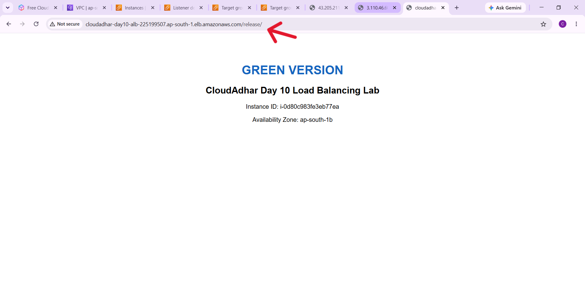

---

# Step 9 - Enabled Target Group Stickiness

Enabled Stickiness

Duration

```
300 Seconds
```

Executed repeated requests using cookies.

Observed that every request reached the same target.

### Stickiness Configuration

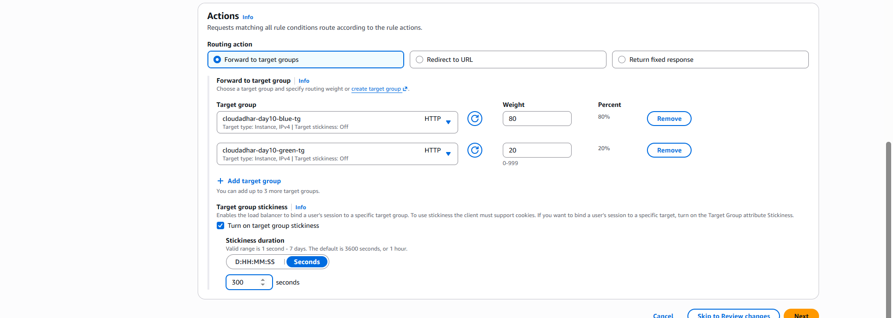

### Result

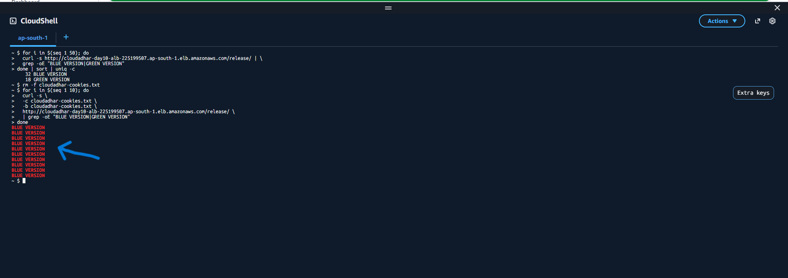

---

# Step 10 - Tested Health Checks

Stopped Nginx on the Green instance.

```
sudo systemctl stop nginx
```

Observed

- Target became Unhealthy.
- ALB stopped routing traffic to the unhealthy target.

### Stop Nginx

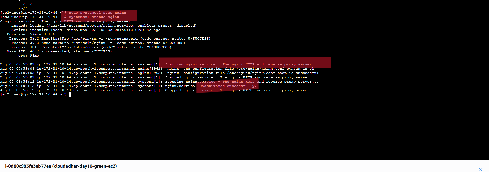

### Unhealthy Target

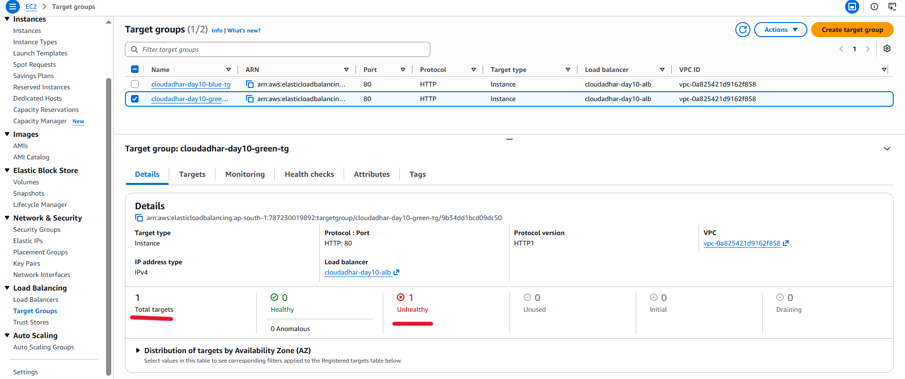

Restarted Nginx.

```
sudo systemctl start nginx
```

The target became Healthy again.

### Screenshot

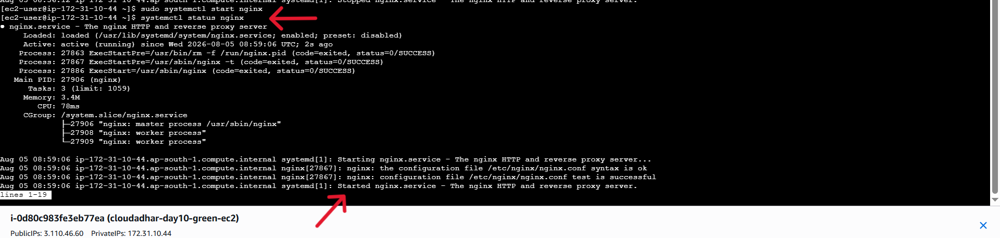

---

# Step 11 - Tested Connection Draining

Changed Deregistration Delay.

```
30 Seconds
```

Started downloading a large file.

### Screenshot

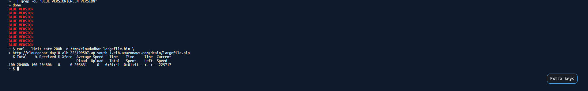

Deregistered the Blue target.

Observed

- Existing download continued successfully.
- Target entered Draining state.

### Deregistration

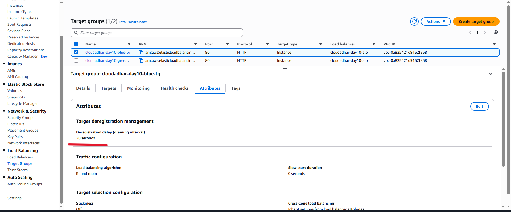

### Draining State

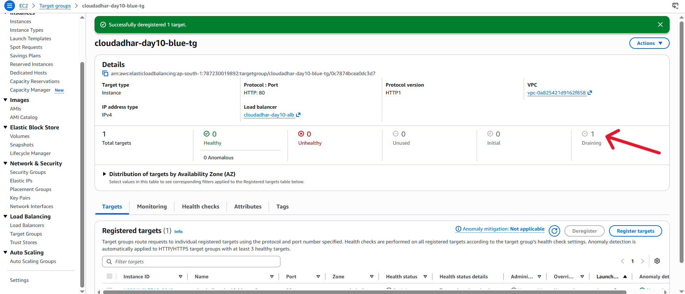

---

# Step 12 - Observed Bad Gateway

While Green was unhealthy, requests to the matching route returned

```
502 Bad Gateway
```

This demonstrated that ALB cannot forward requests if no healthy target exists for that routing rule.

### Screenshot

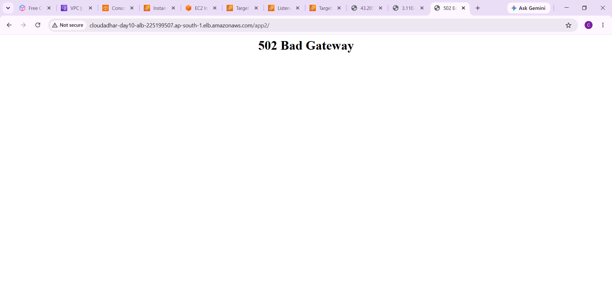

After restarting Nginx, the application became reachable again.

### Screenshot

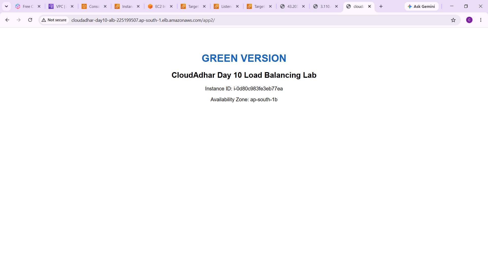

---

# Step 13 - Created Network Load Balancer

Created

- Internet-facing Network Load Balancer

Created

- NLB Target Group

Registered both instances.

### NLB

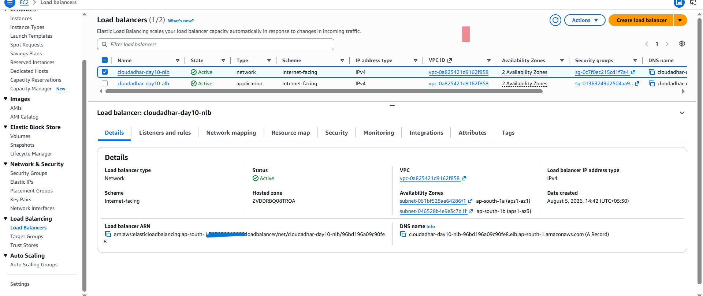

### NLB Target Group

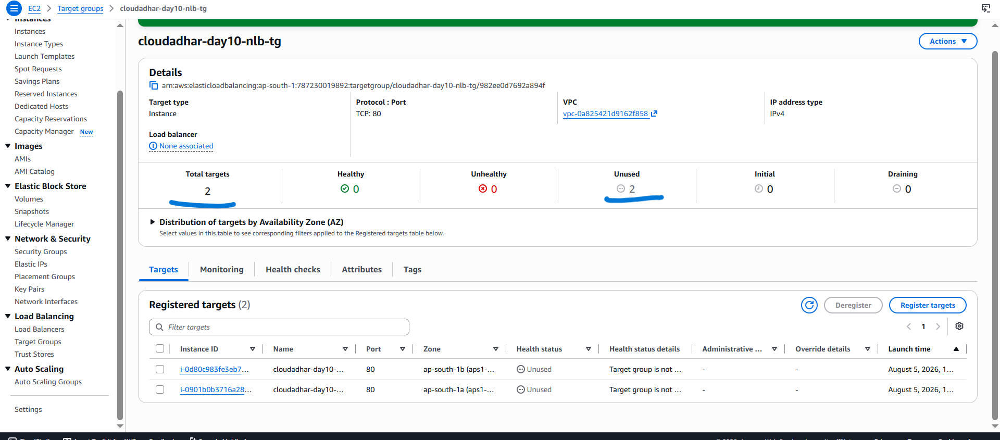

Verified that requests were successfully served through the NLB DNS.

### Screenshot

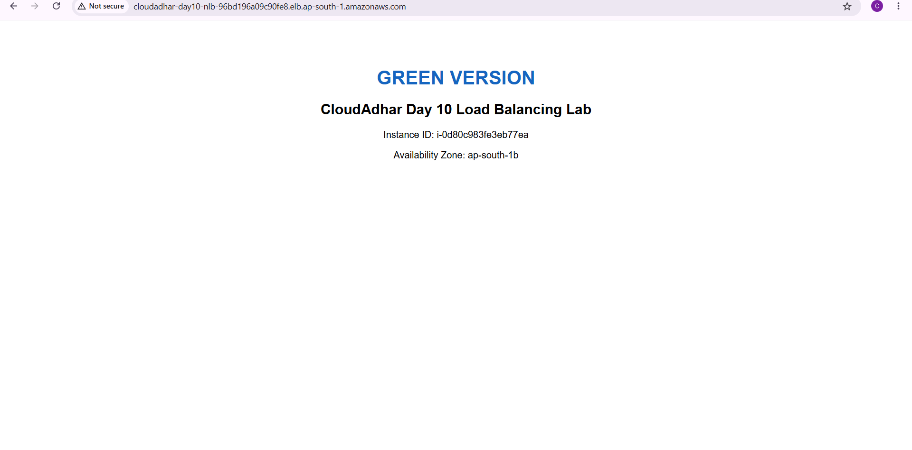

---

# What I Learned

- Difference between ALB and NLB
- Blue/Green deployment
- Host-based Routing
- Path-based Routing
- Weighted Routing
- Target Group Stickiness
- Health Checks
- Connection Draining
- Deregistration Delay
- Target Groups
- Listener Rules
- Network Load Balancer
- Application Load Balancer
- How ALB handles unhealthy targets
- Why a 502 Bad Gateway occurs when no healthy target is available
- How NLB forwards TCP traffic

---

# Key Takeaways

- ALB works at Layer 7 and understands HTTP/HTTPS traffic.
- NLB works at Layer 4 and forwards TCP/UDP traffic.
- Weighted routing helps perform gradual application releases.
- Stickiness ensures that a client continues to communicate with the same target.
- Health checks protect users from unhealthy application instances.
- Connection Draining allows existing user requests to finish before removing a target.
- Blue/Green deployment reduces deployment risk and downtime.
