# Week 5 - Auto Scaling and Elastic Load Balancing

## Learner

| Field | Value |
|-------|-------|
| Name | Shaikh Aliya Firdous |
| GitHub | https://github.com/Aliyas-22 |
| LinkedIn | *Add your LinkedIn profile* |
| AWS Region | ap-south-1 (Mumbai) |

---

# Objective

The objective of this lab was to build a highly available and scalable web application using an Application Load Balancer (ALB) and an Auto Scaling Group (ASG). The infrastructure was designed to automatically distribute incoming traffic across EC2 instances, monitor instance health, launch additional instances during increased CPU utilization, and terminate unnecessary instances when demand decreased. This lab also demonstrated how AWS services work together to provide high availability, fault tolerance, and automatic scaling.

---

# AWS Services Used

- Amazon EC2
- Launch Templates
- Security Groups
- IAM Role
- Target Group
- Application Load Balancer (ALB)
- Auto Scaling Group (ASG)
- CloudWatch
- Amazon Linux 2023
- Nginx

---

# Resources Created

| Resource | Name |
|----------|------|
| Region | ap-south-1 |
| ALB Security Group | cloudadhar-day9-alb-sg |
| Web Security Group | cloudadhar-day9-web-sg |
| Launch Template | cloudadhar-day9-lt |
| Target Group | cloudadhar-day9-tg |
| Application Load Balancer | cloudadhar-day9-alb |
| Auto Scaling Group | cloudadhar-day9-asg |
| Target Tracking Policy | cloudadhar-day9-cpu50-policy |
| EC2 Name Tag | cloudadhar-day9-web-instance |

---

# Day 9

## 1. Security Groups

Two security groups were created to separate public traffic from application traffic.

### ALB Security Group

Configuration:

- HTTP (Port 80) allowed from `0.0.0.0/0`.

Purpose:

- Accept incoming requests from users on the internet.

### Web Security Group

Configuration:

- HTTP (Port 80) allowed only from the ALB Security Group.
- SSH (Port 22) temporarily allowed from my public IP for administration and removed after testing.

Purpose:

- Prevent direct public access to EC2 instances while allowing traffic only through the Application Load Balancer.

### Screenshot

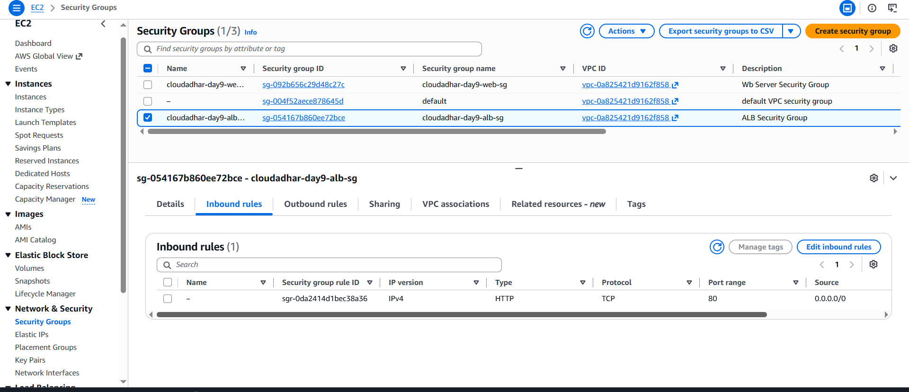

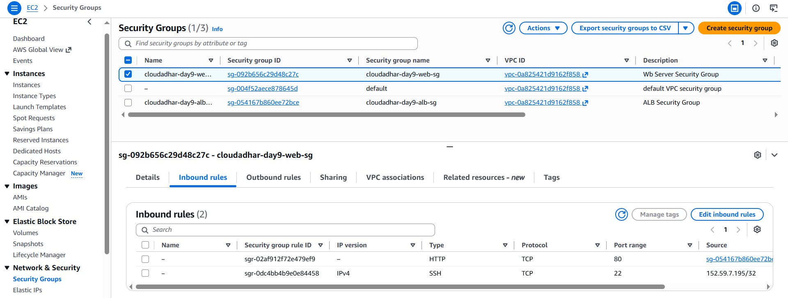

---

## 2. Launch Template

A Launch Template named **cloudadhar-day9-lt** was created to define the EC2 configuration used by the Auto Scaling Group.

Configuration:

- Amazon Linux 2023
- t3.micro
- 8 GiB gp3 encrypted EBS volume
- IMDSv2 enabled
- Detailed Monitoring enabled
- IAM Instance Profile attached
- Web Security Group attached
- User Data configured

The User Data script automatically:

- Installed Nginx
- Enabled and started the service
- Retrieved EC2 metadata using IMDSv2
- Created a dynamic web page showing:
  - Instance ID
  - Instance Type
  - Availability Zone
  - Private IP Address
  - Hostname
- Created `/health.html` for ALB health checks

This ensured every instance launched by the Auto Scaling Group was configured automatically without manual intervention.

### Screenshot

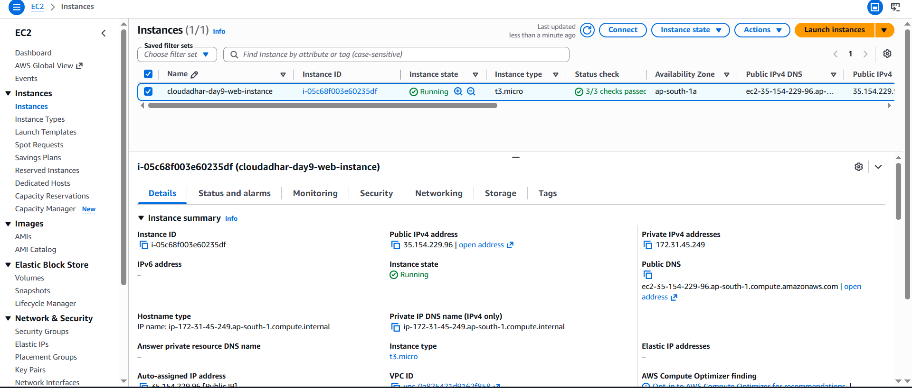

---

## 3. Target Group

An Instance Target Group was created.

Configuration:

| Setting | Value |
|---------|-------|
| Target Type | Instance |
| Protocol | HTTP |
| Port | 80 |
| Health Check Path | /health.html |
| Success Code | 200 |

Purpose:

The Target Group continuously monitors the health of EC2 instances. Only healthy instances receive incoming requests from the Application Load Balancer.

### Screenshot

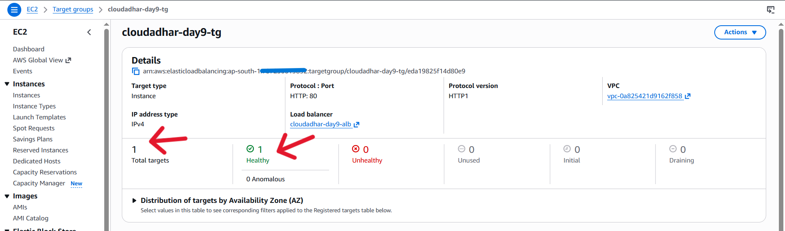

---

## 4. Application Load Balancer

An Internet-facing Application Load Balancer was created.

Configuration:

- Listener: HTTP (Port 80)
- Target Group attached
- Two Availability Zones selected
- ALB Security Group attached

Purpose:

The ALB distributes incoming HTTP requests across healthy EC2 instances, improving availability and fault tolerance.

### Screenshot

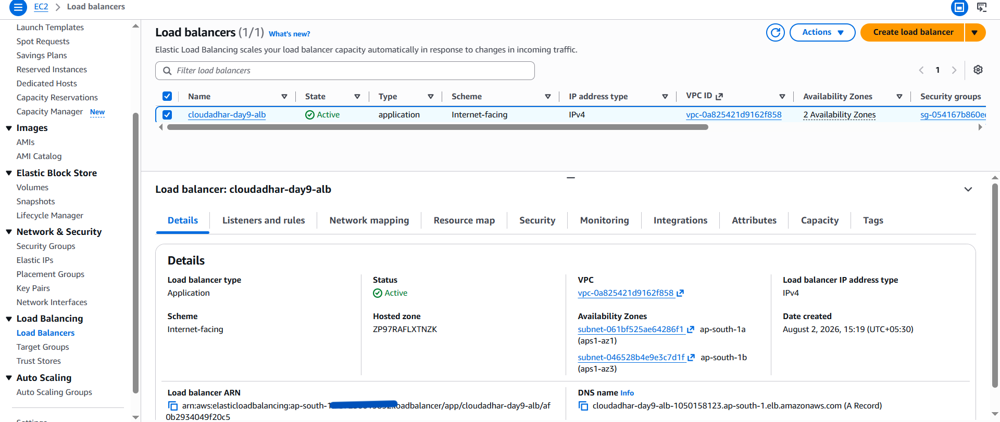

---

## 5. Auto Scaling Group

An Auto Scaling Group named **cloudadhar-day9-asg** was created using the Launch Template.

Configuration:

| Setting | Value |
|---------|-------|
| Minimum Capacity | 1 |
| Desired Capacity | 1 |
| Maximum Capacity | 2 |
| Health Check | EC2 + ELB |
| Grace Period | 300 Seconds |
| Instance Warmup | 120 Seconds |

Purpose:

The Auto Scaling Group automatically maintains the desired number of EC2 instances and replaces unhealthy instances whenever necessary.

### Screenshot

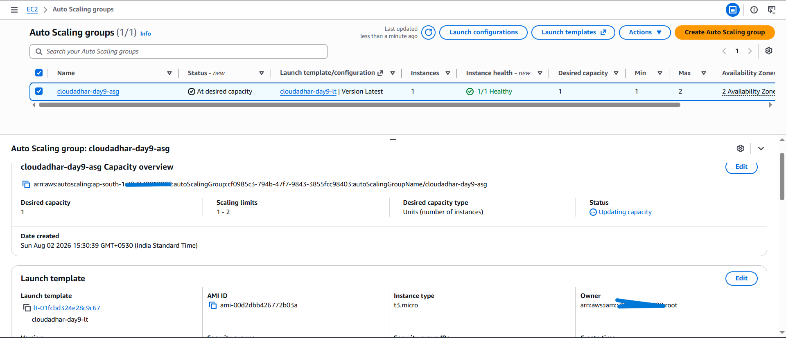

---

## 6. Initial Deployment Verification

After the Auto Scaling Group launched the first EC2 instance:

- The instance entered the Running state.
- Nginx started successfully.
- Target Group health checks passed.
- The instance became Healthy.
- The application was successfully accessed using the ALB DNS.

Command used:

```bash
curl http://<ALB-DNS>
```

### Screenshot

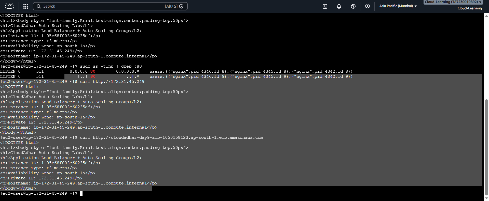

---

## 7. Target Tracking Scaling Policy

A Target Tracking Scaling Policy was created.

Configuration:

| Setting | Value |
|---------|-------|
| Metric | Average CPU Utilization |
| Target Value | 50% |
| Scale-In | Enabled |

Purpose:

Whenever CPU utilization exceeded 50%, the Auto Scaling Group automatically launched an additional EC2 instance. When CPU utilization decreased, the extra instance was terminated automatically.

### Screenshot

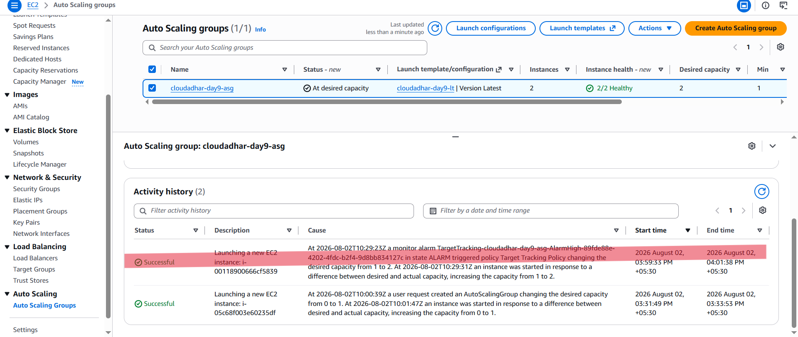

---

## 8. CPU Load Test

To test automatic scaling, CPU stress was generated using **stress-ng**.

Commands executed:

```bash
sudo dnf install -y stress-ng

nohup stress-ng --cpu 2 --cpu-load 95 --timeout 10m \
> /tmp/stress-ng.log 2>&1 &

pgrep -af stress-ng
```

Purpose:

The workload increased CPU utilization above the configured threshold, allowing CloudWatch to trigger the scaling policy.

### Screenshot

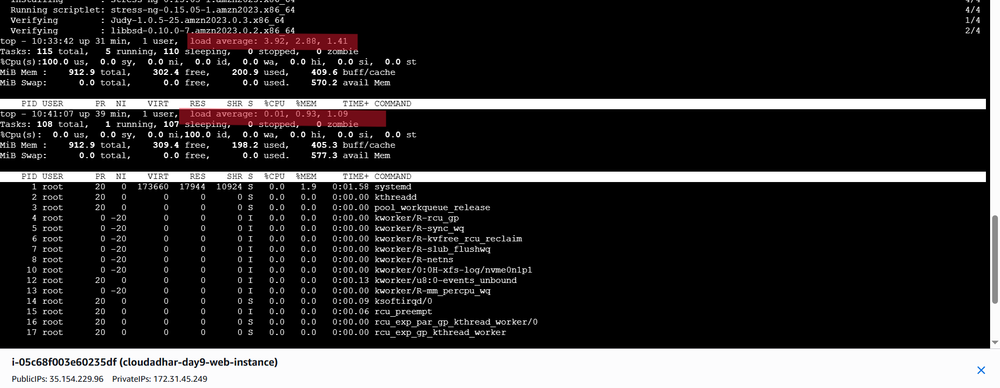

---

## 9. Scale-Out Result

Once CPU utilization remained above 50%:

- CloudWatch Alarm entered the **ALARM** state.
- Desired Capacity changed from **1** to **2**.
- Auto Scaling launched a second EC2 instance.
- The new instance completed initialization.
- The Target Group automatically registered the instance.
- Both instances became Healthy.

### Screenshot

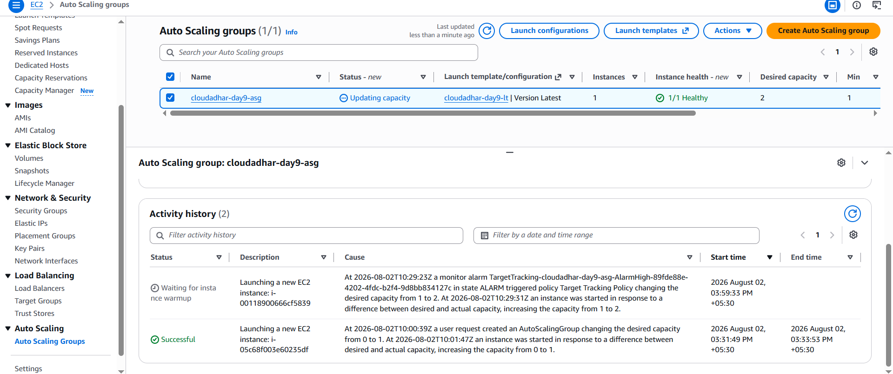

### Screenshot

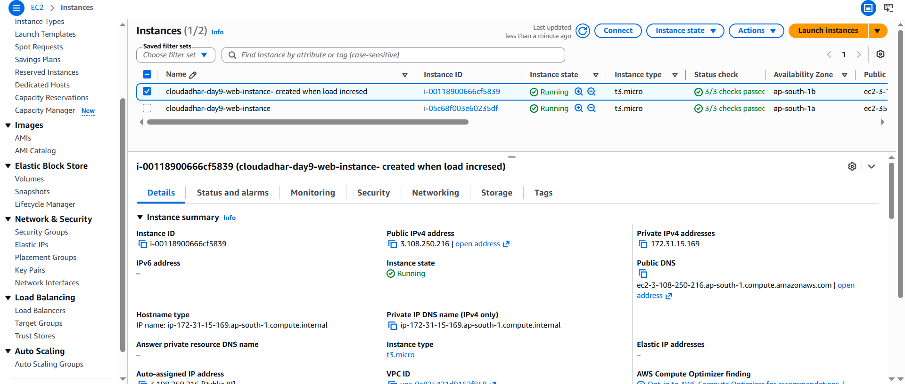

---

## 10. Load Balancing Verification

Repeated requests to the Application Load Balancer returned responses from different EC2 instances.

The displayed Instance ID changed between requests, confirming that traffic was being distributed across both healthy instances.

### Screenshot

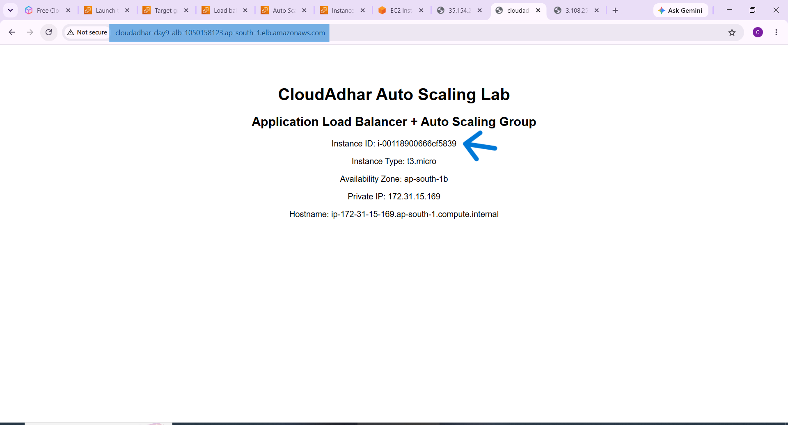

### Screenshot

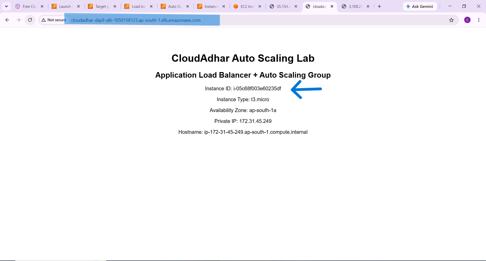

---

## 11. Scale-In Result

After stopping the CPU load:

```bash
sudo pkill stress-ng

pgrep -af stress-ng
```

CloudWatch detected reduced CPU utilization.

The Auto Scaling Group then:

- Changed Desired Capacity from **2** to **1**
- Put one target into the **Draining** state
- Terminated the extra EC2 instance
- Continued serving traffic using the remaining healthy instance

This confirmed that automatic scale-in was functioning correctly.

### Screenshot


---

## 12. Self-Healing Result

The Auto Scaling Group continuously monitors instance health using both EC2 and ELB health checks.

If an instance becomes unhealthy or is manually terminated, the Auto Scaling Group automatically launches a replacement instance to maintain the desired capacity.

**Note:** This functionality was configured as part of the architecture, although a manual self-healing test was not performed during this lab.

---

## 13. Troubleshooting Lesson

### Issue

Initially, the application was accessible through the Application Load Balancer DNS but not through the EC2 Public IP.

### Root Cause

The Web Security Group allowed HTTP traffic only from the ALB Security Group. Direct internet traffic to the EC2 instance was intentionally blocked.

### Resolution

Verified that the application was correctly accessible through the ALB DNS, which is the recommended production architecture.

Another issue encountered was delayed Auto Scaling. The second EC2 instance did not launch immediately because CloudWatch required sufficient evaluation periods before triggering the scaling policy. Once the CPU utilization remained above the configured threshold, the scaling policy launched the second instance successfully.

---

# Architecture Decision

This architecture was designed to provide scalability, availability, and security while minimizing operational effort. A Launch Template was used to define a standard EC2 configuration so that every instance launched by the Auto Scaling Group would have the same operating system, instance type, storage configuration, security group, IAM role, and User Data script. This ensured consistency and reduced manual configuration.

An Application Load Balancer was selected because it distributes incoming HTTP traffic across multiple healthy EC2 instances. Health checks were configured using `/health.html`, allowing the load balancer to send requests only to healthy instances. This improves application reliability and prevents users from reaching failed servers.

The Auto Scaling Group was attached directly to the Target Group so that newly launched instances would be registered automatically without manual intervention. Target Tracking Scaling was chosen because it automatically adjusts capacity based on CPU utilization. During periods of high CPU usage, the Auto Scaling Group launched an additional EC2 instance, and when the workload decreased, it terminated the unnecessary instance, reducing infrastructure cost.

Separate Security Groups were used for the Application Load Balancer and EC2 instances to improve security. The ALB accepted internet traffic, while EC2 instances accepted traffic only from the ALB. IMDSv2 was enabled to securely retrieve instance metadata and protect against metadata service attacks. Overall, this architecture demonstrates AWS best practices for building a secure, highly available, and automatically scalable web application.

---

# Cleanup

The following resources were deleted after completing the lab to avoid unnecessary AWS charges.

- Deleted Auto Scaling Group
- Deleted Dynamic Scaling Policy
- Deleted Application Load Balancer
- Deleted Target Group
- Deleted Launch Template
- Terminated EC2 Instances
- Deleted Security Groups
- Verified no Elastic IPs remained
- Verified no remaining billable resources in `ap-south-1`

---

# Reflection

### 1. Which metric best represents demand for this application?

Average CPU Utilization was selected because the workload generated using `stress-ng` directly increased CPU usage, making it an appropriate metric for demonstrating automatic scaling.

---

### 2. How do grace period, warmup, health checks, and draining differ?

- **Grace Period** delays health evaluation immediately after an instance launches.
- **Instance Warmup** prevents scaling decisions until a new instance has completed initialization.
- **Health Checks** determine whether an instance is healthy enough to receive traffic.
- **Connection Draining** allows existing client requests to complete before an instance is removed from the load balancer.

---

### 3. Which load balancer requirement was easiest to confuse, and why?

The Security Group configuration was initially the most confusing. It became clear that the Application Load Balancer should receive internet traffic, while EC2 instances should accept traffic only from the ALB Security Group. This design improves security by preventing direct public access to backend servers.

---

# Learning Outcomes

After completing this lab, I learned how to:

- Design a secure Application Load Balancer architecture.
- Configure Security Groups following AWS best practices.
- Create reusable Launch Templates.
- Bootstrap EC2 instances automatically using User Data.
- Configure Target Groups and Health Checks.
- Build an Auto Scaling Group using a Launch Template.
- Configure Target Tracking Scaling Policies.
- Generate CPU load using `stress-ng`.
- Observe automatic Scale-Out based on CPU utilization.
- Observe automatic Scale-In after workload reduction.
- Understand how the Application Load Balancer distributes requests across healthy EC2 instances.
- Troubleshoot Security Groups, Target Groups, Health Checks, and Auto Scaling behavior.
