# Week 6 - Amazon S3 and Storage

## Learner

- Name: Shaikh Aliya Firdous
- GitHub:
- LinkedIn:
- Primary Region: `ap-south-1` (Asia Pacific - Mumbai)

---

# Architecture

The architecture diagram for this Day 11 hands-on is available in the repository's `Diagram` folder.

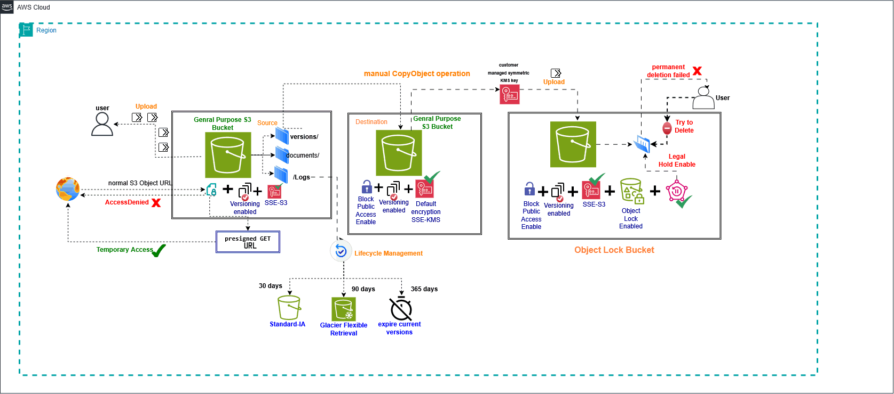

# Day 11 - Amazon S3

## Hands-on Implementation

In this lab, I worked with Amazon S3 and implemented bucket organization, private object access, object copying, versioning, KMS encryption, Object Lock with Legal Hold, presigned URLs, and lifecycle management.

The implementation was completed in the following sequence.

---

## 1. Created the Source S3 Bucket

First, I created the source S3 bucket in the Mumbai (`ap-south-1`) region.

Bucket name:

`cloudadhar-s3-day11-aliya`

The bucket was kept private and used as the main source bucket for the hands-on.

### Screenshot

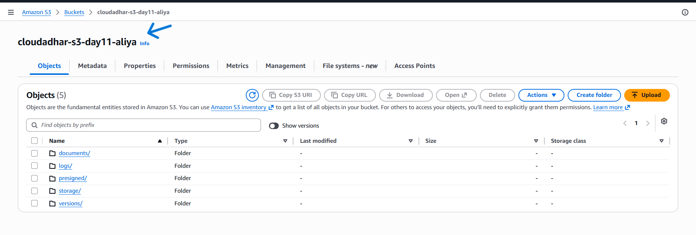

---

## 2. Created Folders Inside the Bucket

After creating the bucket, I created folders inside the bucket to organize the objects.

The folders were created before uploading the files.

S3 uses object key prefixes to represent folders.

### Screenshots

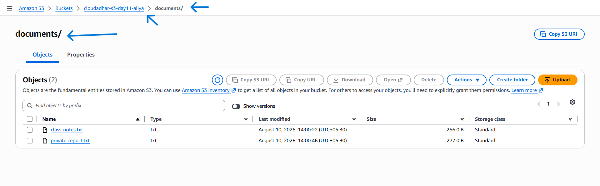

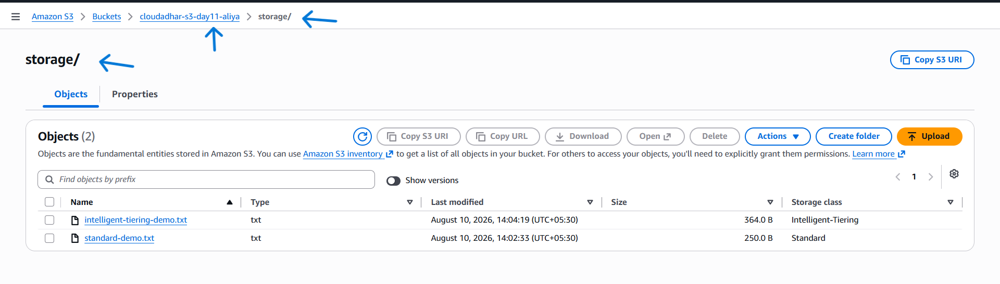

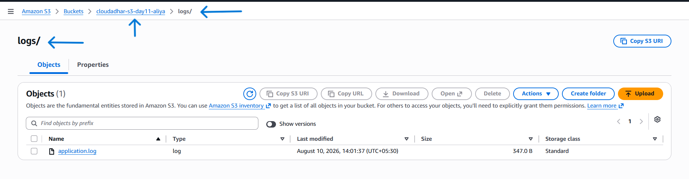

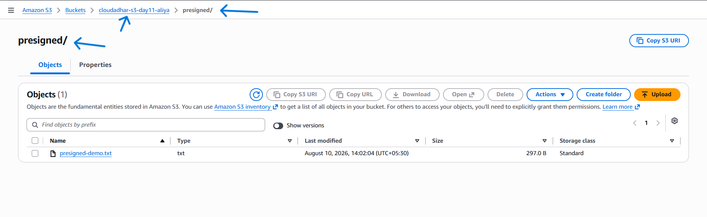

---

## 3. Uploaded Files

After creating the folders, I uploaded the files into the appropriate folders.

The uploaded files were stored as private S3 objects.

One of the files used for the Versioning demonstration was:

`version-demo.txt`

---

## 4. Tested Private Object Access

After uploading the files, I tried to access a private object using its normal S3 Object URL.

The request was denied because the object was private.

This demonstrated that storing an object in S3 does not automatically make it publicly accessible.

### Screenshot

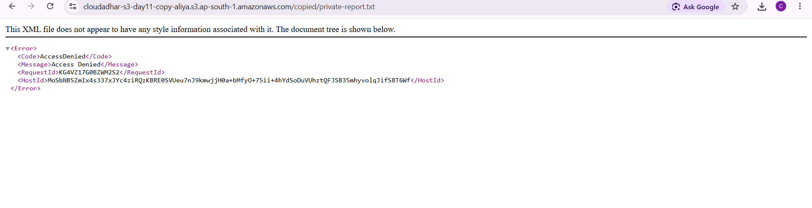

---

## 5. Created the Destination S3 Bucket

Next, I created another S3 bucket to demonstrate copying an object from the source bucket to another bucket.

Destination bucket:

`cloudadhar-s3-day11-copy-aliya`

The destination bucket was also configured with Versioning.

---

## 6. Copied the Object Using CopyObject

After creating the destination bucket, I copied the required object from the source bucket to the destination bucket.

The copy was performed within the same AWS Region.

The copied object was successfully visible in the destination bucket.

### Screenshots

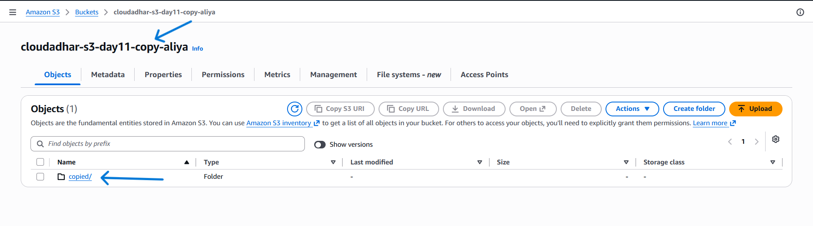

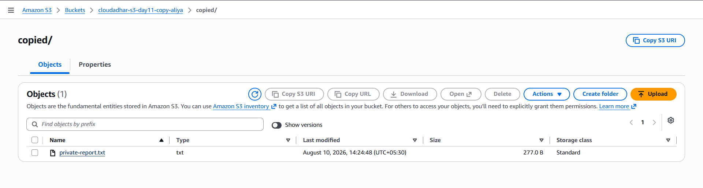

---

## 7. Enabled and Tested S3 Versioning

After the copy operation, I worked with S3 Versioning.

Versioning allows S3 to maintain multiple versions of the same object.

I uploaded/updated the same object multiple times and observed different Version IDs.

This demonstrated how S3 can preserve previous versions of an object.

### Screenshot

---

## 8. Tested Delete Markers and Version Recovery

I then deleted the versioned object.

Because Versioning was enabled, S3 created a Delete Marker instead of immediately permanently deleting the previous object version.

The previous versions were still available under the object's version history.

This demonstrated how Versioning can be used to recover from accidental deletion.

### Screenshots

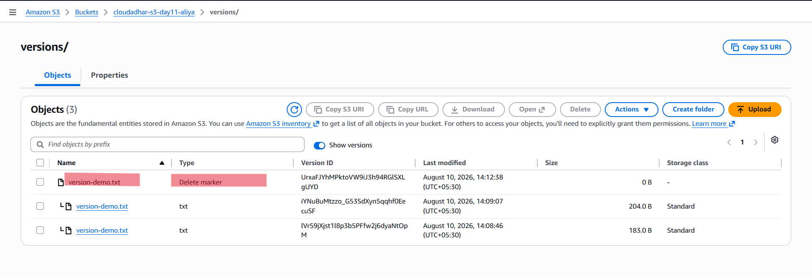

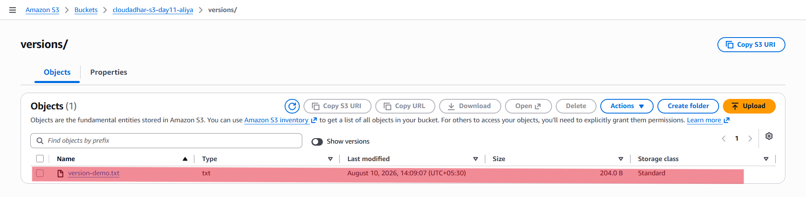

---

## 9. Created a Customer-Managed KMS Key

Next, I created a customer-managed AWS KMS key.

The KMS key alias was:

`alias/cloudadhar-s3-day11`

The key was created to demonstrate SSE-KMS encryption for S3 objects.

Using SSE-KMS provides separate control over the encryption key through AWS KMS.

### Screenshot

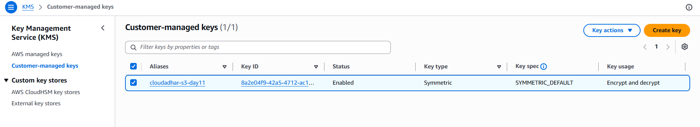

---

## 10. Configured SSE-KMS and S3 Bucket Key

After creating the KMS key, I configured the destination S3 bucket to use SSE-KMS.

The encryption configuration used:

- Encryption: SSE-KMS
- Customer-managed KMS key
- S3 Bucket Key: Enabled

The purpose was to demonstrate encryption of objects using a customer-managed KMS key.

### Screenshot

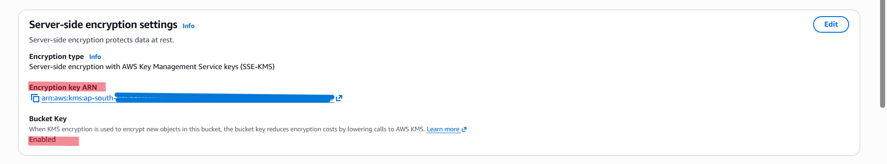

---

## 11. Created the Object Lock Bucket

Next, I created a separate S3 bucket to demonstrate S3 Object Lock.

Bucket name:

`cloudadhar-s3-day11-lock-aliya`

Object Lock was enabled when the bucket was created.

Because Object Lock was enabled, Versioning was also enabled and could not be suspended.

---

## 12. Uploaded `retention-demo.txt`

After creating the Object Lock bucket, I uploaded:

`retention-demo.txt`

This object was used for the Legal Hold demonstration.

---

## 13. Enabled Legal Hold

I enabled Legal Hold on `retention-demo.txt`.

A Legal Hold prevents the protected object version from being deleted or overwritten until the Legal Hold is explicitly removed.

### Screenshot

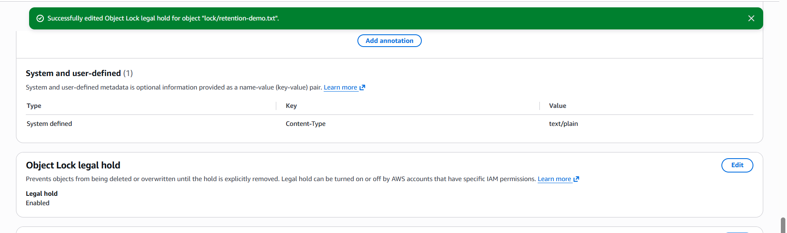

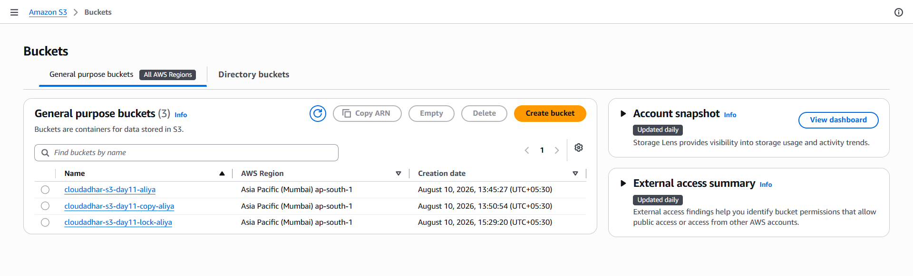

---

## 14. Tested Object Deletion

After enabling Legal Hold, I attempted to delete the protected object.

The deletion failed because the object was protected by Legal Hold.

This demonstrated the WORM protection provided by S3 Object Lock.

### Screenshot

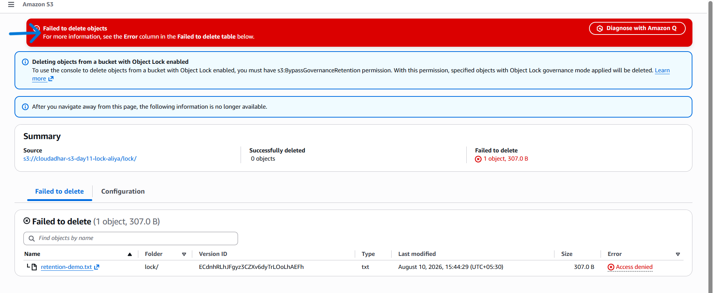

---

## 15. Generated a Presigned GET URL

After testing normal private access, I generated a short-lived presigned GET URL.

The bucket and object remained private.

The presigned URL provided temporary access to the object without making the bucket public.

This demonstrated how temporary access can be provided securely to a private S3 object.

### Screenshots

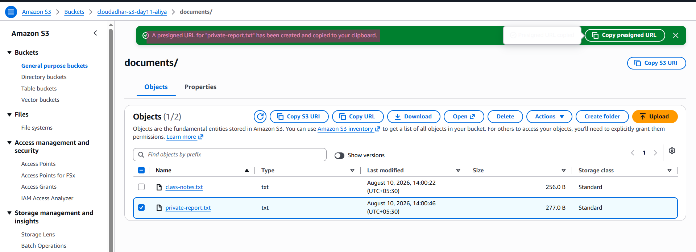

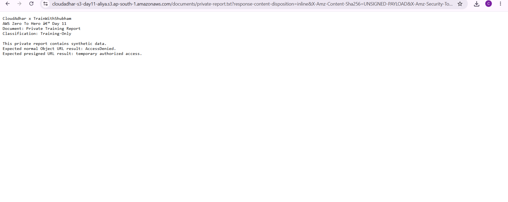

---

## 16. Configured the S3 Lifecycle Rule

Finally, I created an S3 Lifecycle rule.

The lifecycle configuration was used to demonstrate automatic storage-class transitions and expiration of objects based on their age.

The configured lifecycle flow was:

- Day 0: Object uploaded
- Day 30: Transition to Standard-IA
- Day 90: Transition to Glacier Flexible Retrieval
- Day 365: Expire current objects
- Noncurrent versions: Transition to Standard-IA after 30 days
- Noncurrent versions: Permanently delete according to the configured expiration

Lifecycle rules help automate storage management and can reduce storage costs when objects become less frequently accessed.

---

# Architecture

The architecture diagram for this Day 11 hands-on is available in the repository's `Diagram` folder.

The architecture represents the components implemented during this lab:

- Source S3 bucket
- Destination S3 bucket
- S3 Versioning
- SSE-KMS
- Customer-managed KMS key
- S3 Bucket Key
- Object Lock bucket
- Legal Hold
- Presigned GET access
- Lifecycle Management
- Private/unauthenticated access denial

### Architecture Flow

1. Objects are uploaded to the private source S3 bucket.
2. The objects are organized using S3 prefixes/folders.
3. A normal Object URL request is denied because the object is private.
4. Objects are copied from the source bucket to the destination bucket using `CopyObject`.
5. Versioning maintains multiple versions of objects.
6. Delete markers are created when versioned objects are deleted normally.
7. A customer-managed KMS key is used for SSE-KMS encryption in the destination bucket.
8. S3 Bucket Key is enabled to reduce KMS request overhead.
9. A separate Object Lock bucket protects objects using Legal Hold.
10. A protected object cannot be deleted while Legal Hold is enabled.
11. A presigned GET URL provides temporary access to a private object.
12. Lifecycle Management automatically transitions and expires objects according to the configured rule.

---

# Architecture Decision

This lab demonstrated how Amazon S3 can be used not only for storing objects but also for implementing security, recovery, encryption, temporary access, and automated storage management.

I first created a private S3 bucket and organized the objects using folders/prefixes. After uploading files, I tested direct access using a normal S3 Object URL. The access was denied because the object was private.

Next, I created a destination S3 bucket and copied an object from the source bucket using `CopyObject`. After that, I worked with S3 Versioning. By creating multiple versions of an object and deleting it, I observed how S3 creates a Delete Marker while preserving previous versions. This provides a way to recover from accidental deletion.

I then created a customer-managed KMS key and configured SSE-KMS on the destination bucket. This demonstrated how S3 can use AWS KMS for server-side encryption while providing separate control over the encryption key.

After encryption, I created a separate Object Lock bucket. I uploaded `retention-demo.txt`, enabled Legal Hold, and attempted to delete the object. The deletion failed because Legal Hold protects the object from deletion until the hold is removed.

Finally, I generated a short-lived presigned GET URL. This allowed temporary access to a private object without making the bucket public. I also configured an S3 Lifecycle rule to automatically transition objects between storage classes and expire objects based on their age.

Overall, the lab demonstrated the combination of S3 storage, private access, CopyObject, Versioning, KMS encryption, Object Lock, Legal Hold, presigned URLs, and Lifecycle Management.

---

# Reflection

## 1. Which S3 control protects confidentiality, and which protects recovery?

SSE-S3 and SSE-KMS protect data at rest through encryption.

S3 Versioning protects recovery by retaining previous object versions and allowing recovery from accidental deletion or overwriting.

---

## 2. Why is a presigned URL different from making a bucket public?

A presigned URL provides temporary access to a specific private object.

Making a bucket public changes the access permissions of the bucket or its objects.

With a presigned URL, the bucket can remain private while a specific object is temporarily accessible.

---

## 3. Which storage-class or lifecycle decision is easiest to get wrong on cost?

Lifecycle transitions can be easy to get wrong because storage classes have different minimum storage durations, transition request charges, and retrieval costs.

The access pattern and expected retention period should be considered before configuring automatic transitions.

---

## 4. Why did pre-rule objects remain only in the source?

A copy operation and a lifecycle rule are separate S3 operations.

A lifecycle rule does not automatically copy objects to another bucket. Objects must be explicitly copied or replicated to another bucket.

Therefore, an object that exists only in the source bucket remains there unless a copy or replication mechanism is configured.

---

## 5. When would you choose DataSync instead of Snow Family?

I would choose AWS DataSync when I need an automated online transfer between on-premises storage and AWS.

I would consider the AWS Snow Family when transferring a very large amount of data over the network is impractical or network connectivity is limited.

---

# Key Learnings

- S3 is an object storage service.
- S3 buckets can be kept private using Block Public Access.
- S3 folders are represented using object key prefixes.
- `CopyObject` can copy objects between S3 buckets.
- Versioning maintains multiple versions of an object.
- Delete markers are created when versioned objects are deleted.
- Previous versions can be used for recovery.
- SSE-KMS provides encryption using AWS KMS.
- Customer-managed KMS keys provide additional control over encryption.
- S3 Bucket Key can reduce the number of KMS requests.
- Object Lock provides WORM protection.
- Legal Hold prevents protected objects from being deleted or overwritten.
- Presigned GET URLs provide temporary access to private objects.
- Lifecycle rules automate storage-class transitions and expiration.
