# Day 12 – Amazon S3 Replication, Transfer Acceleration & Lifecycle Management
## Learner

- Name: Shaikh Aliya Firdous
- Primary Region: `ap-south-1` (Asia Pacific - Mumbai)

---

# Architecture

The architecture diagram for this Day 11 hands-on is available in the repository's `Diagram` folder.

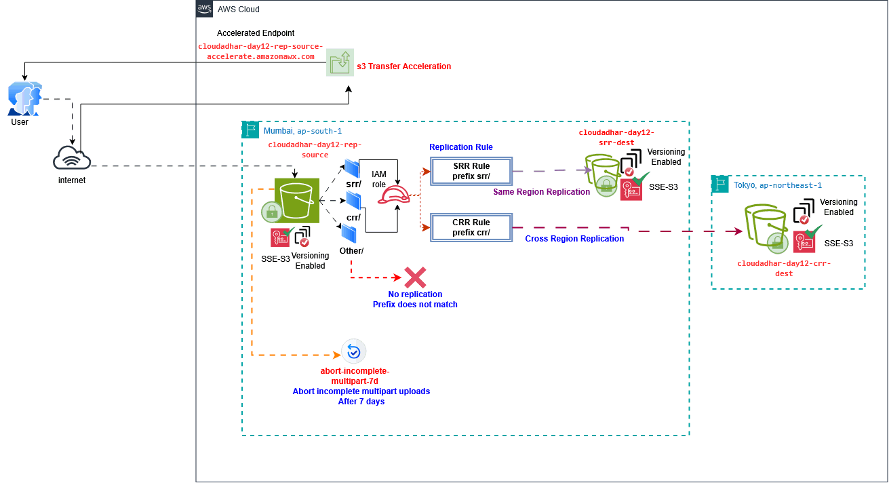

## Objective

The objective of this lab was to configure and validate Amazon S3 Same-Region Replication (SRR), Cross-Region Replication (CRR), Versioning, prefix-based replication, existing-object replication, S3 Transfer Acceleration, and Lifecycle Management for incomplete multipart uploads.

> **Note:** Tasks 12, 13, and 14 were skipped.

---

## 1. Created the S3 Buckets

First, I created three S3 General Purpose buckets for the replication setup.

### Source Bucket

- **Bucket:** `cloudadhar-day12-rep-source`
- **Region:** `ap-south-1 (Mumbai)`

### SRR Destination Bucket

- **Bucket:** `cloudadhar-day12-srr-dest`
- **Region:** `ap-south-1 (Mumbai)`

### CRR Destination Bucket

- **Bucket:** `cloudadhar-day12-crr-dest`
- **Region:** `ap-northeast-1 (Tokyo)`

The source bucket was used to store the original objects, while the other two buckets were used as replication destinations.

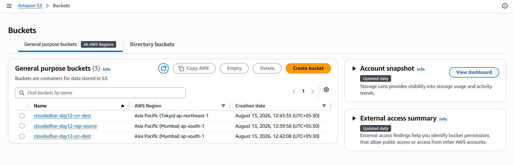

---

## 2. Configured SRR and CRR Replication Rules

Next, I configured two replication rules in the source bucket.

### SRR Rule

The SRR rule was configured with the prefix:

` srr/ `

It replicates matching objects to:

`cloudadhar-day12-srr-dest`

### CRR Rule

The CRR rule was configured with the prefix:

` crr/ `

It replicates matching objects to:

`cloudadhar-day12-crr-dest`

Both replication rules were enabled.

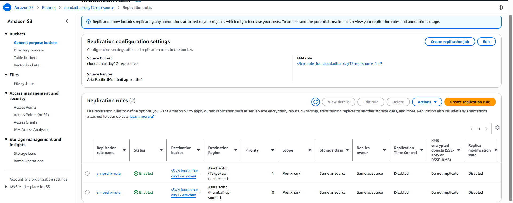

---

## 3. Tested Same-Region Replication (SRR)

After configuring the SRR rule, I uploaded the SRR demonstration file under the `srr/` prefix.

The object key was:

` srr/cloudadhar-srr-demo.txt `

Since the object matched the `srr/` prefix, Amazon S3 replicated it from the source bucket to the SRR destination bucket in the same AWS Region.

The replication status was checked on the source object.

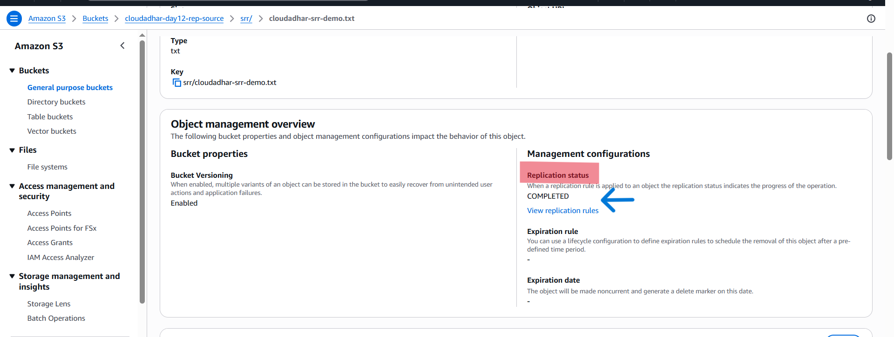

The replicated object was then verified in the SRR destination bucket.

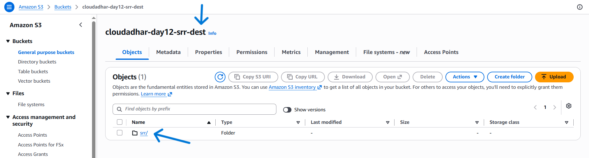

---

## 4. Tested Versioning with SRR

Next, I tested S3 Versioning with Same-Region Replication.

I uploaded Version 1 and Version 2 of the same file using the same object key:

` srr/cloudadhar-srr-demo.txt `

Because Versioning was enabled, S3 stored both versions instead of permanently overwriting the previous version.

Both versions were replicated to the SRR destination bucket.

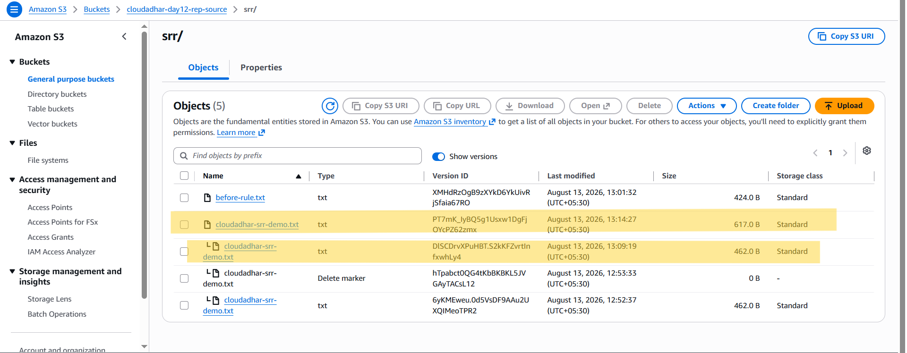

The replicated file was verified in the destination bucket.

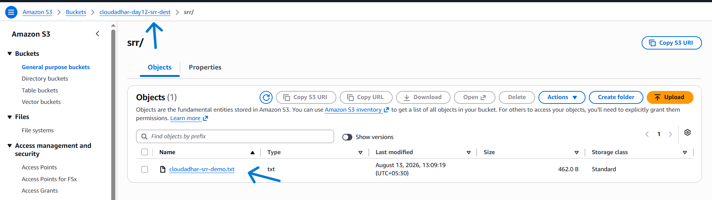

---

## 5. Tested Cross-Region Replication (CRR)

Next, I tested Cross-Region Replication using the `crr/` prefix.

The source object was:

` crr/cloudadhar-crr-demo.txt `

The object was replicated from:

**Source:** Mumbai (`ap-south-1`)

to:

**Destination:** Tokyo (`ap-northeast-1`)

The replication status was checked on the source object.

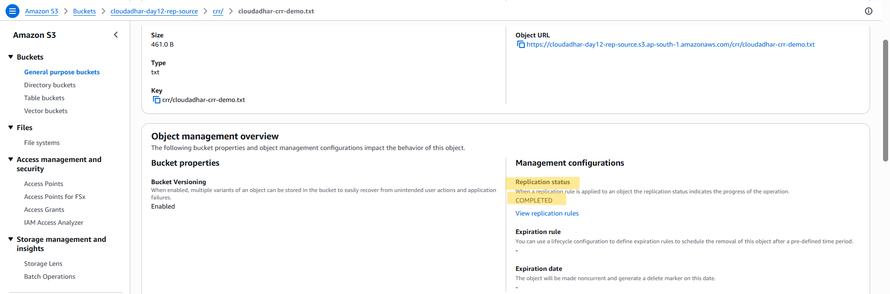

The object was successfully replicated and verified in the Tokyo destination bucket.

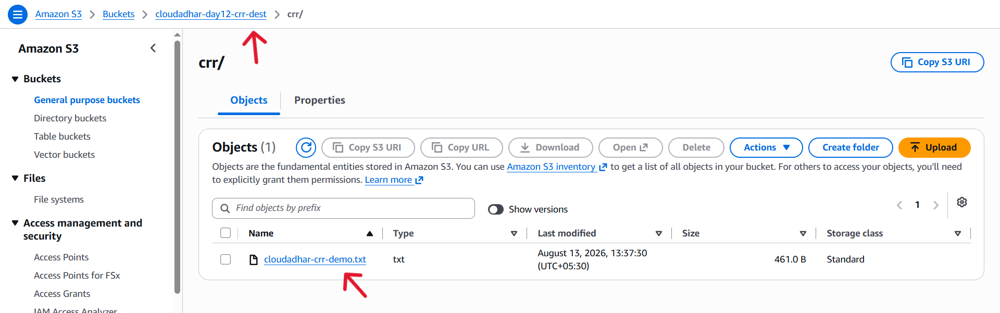

---

## 6. Tested Versioning with CRR

I then tested Versioning with Cross-Region Replication.

I uploaded Version 1 and Version 2 of:

` crr/cloudadhar-crr-demo.txt `

using the same object key.

Because Versioning was enabled, S3 maintained multiple versions of the object, and the versions were replicated to the Tokyo destination bucket.

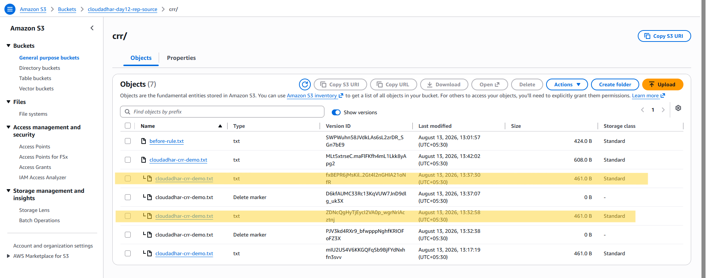

This confirmed that CRR was working correctly with versioned objects.

---

## 7. Tested Prefix-Based Replication Filtering

To verify that the replication rules only applied to their configured prefixes, I created an `other/` folder in the source bucket.

The test object was:

` other/no-replication-demo.txt `

The configured replication prefixes were only:

- `srr/`
- `crr/`

Since the object was stored under the `other/` prefix, it did not match either replication rule.

Therefore, the object was not replicated to either the SRR or CRR destination bucket.

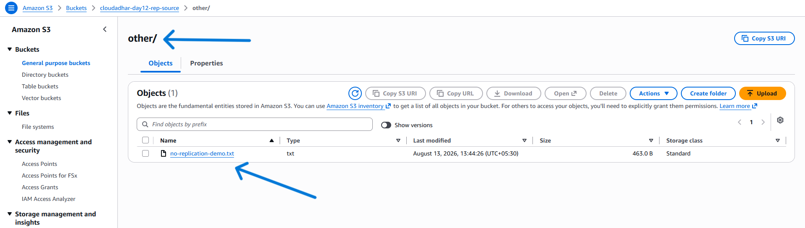

This confirmed that prefix-based replication filtering was working correctly.

---

## 8. Reviewed Existing-Object Replication

Next, I reviewed the replication configuration and located the option to create a replication job for existing objects.

This is useful when objects already existed in a bucket before a replication rule was created.

The replication job option was reviewed, but the job was **not started**.

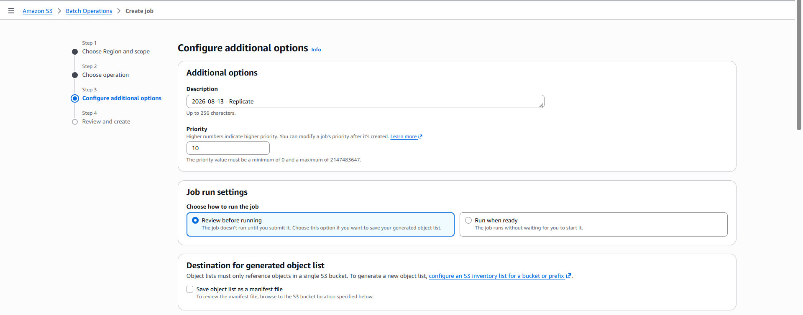

### Difference Between Live Replication and Existing-Object Replication

- **Live replication:** Replicates eligible new object versions after the replication rule is enabled.
- **Existing-object replication:** Can be performed using S3 Batch Replication for eligible objects that already existed.

---

## 9. Enabled S3 Transfer Acceleration

Next, I enabled S3 Transfer Acceleration on the source bucket.

Transfer Acceleration provides an accelerated S3 endpoint that can be used for faster data transfers over long distances.

The configuration showed:

**Transfer Acceleration:** Enabled

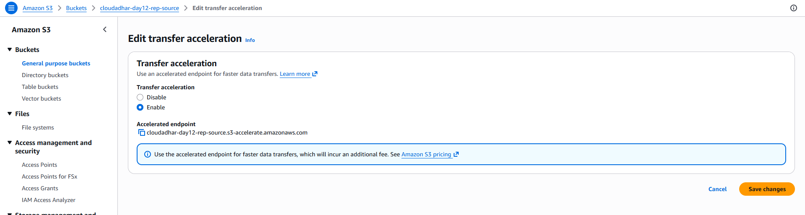

---

## 10. Verified the Accelerated Endpoint

After enabling Transfer Acceleration, S3 provided the accelerated endpoint:

`cloudadhar-day12-rep-source.s3-accelerate.amazonaws.com`

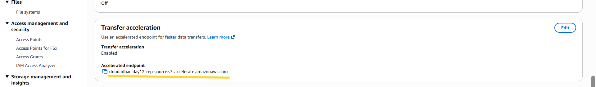

The endpoint was recorded for reference.

> A normal S3 console upload was not used as proof of Transfer Acceleration because using the console does not demonstrate that the accelerated endpoint was actually used.

---

## 11. Verified Private S3 Access

The S3 buckets were kept private with Block Public Access enabled.

I also tested access to an S3 object through an endpoint without the required authorization.

The request resulted in:

**AccessDenied**

This confirmed that the object was not publicly accessible.

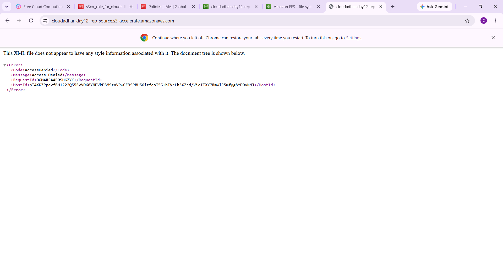

---

## 12. Configured Lifecycle Rule for Incomplete Multipart Uploads

Finally, I configured an S3 Lifecycle rule on the source bucket to automatically abort incomplete multipart uploads after 7 days.

### Lifecycle Configuration

- **Rule Name:** `abort-incomplete-multipart-7d`
- **Scope:** Entire bucket
- **Action:** Abort incomplete multipart uploads
- **After:** 7 days

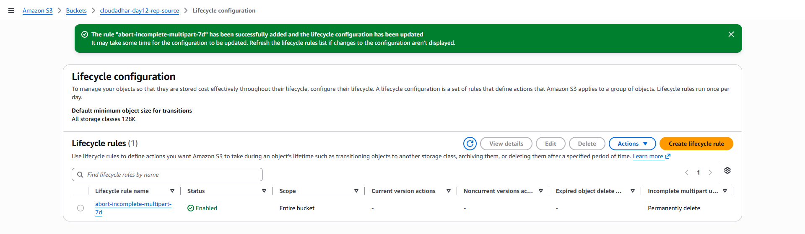

This lifecycle rule helps clean up abandoned multipart uploads and prevents incomplete uploads from unnecessarily consuming storage.

---

# Replication Validation Summary

| Test | Source Object | Destination | Result |
|---|---|---|---|
| SRR Version 1 | `srr/cloudadhar-srr-demo.txt` | Mumbai SRR bucket | ✅ Replicated |
| SRR Version 2 | `srr/cloudadhar-srr-demo.txt` | Mumbai SRR bucket | ✅ Replicated |
| CRR Version 1 | `crr/cloudadhar-crr-demo.txt` | Tokyo CRR bucket | ✅ Replicated |
| CRR Version 2 | `crr/cloudadhar-crr-demo.txt` | Tokyo CRR bucket | ✅ Replicated |
| Prefix Filter | `other/no-replication-demo.txt` | SRR/CRR destinations | ❌ Not replicated |
| Existing Object Replication | Replication Job | — | 👀 Reviewed, not started |
| Transfer Acceleration | Source bucket | Accelerated endpoint | ✅ Enabled |
| Lifecycle Rule | Incomplete multipart uploads | Source bucket | ✅ 7 days |

---

