# Day 13 — RDS, Aurora Serverless v2, Recovery, and RDS Proxy

## Overview

This Day 13 practical covers Amazon RDS for MySQL, database recovery, read replicas, Aurora Serverless v2, RDS Proxy, and the SSM/Secrets Manager/S3 logical-backup workflow.

**Completion order**
- **Tasks 1–14:** Completed.
- **Tasks 15–20:** Aurora/RDS Proxy section — **not completed because Aurora was not available in the VDI/free-plan environment**.
- **Tasks 21 onward:** Completed separately after the Aurora section.

---

## Architecture

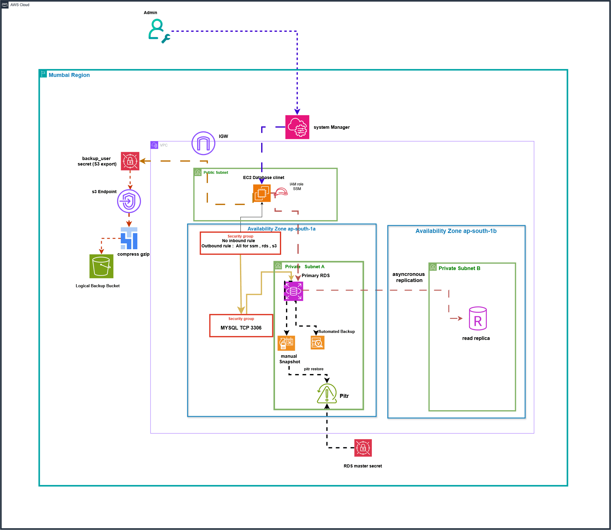


# Tasks 1–14 — RDS, Recovery, and Read Replica

## Task 1 — Prepare Session Manager Access

Configured the IAM role required for the EC2 database client to connect through AWS Systems Manager Session Manager.

Role:
`cloudadhar-ec2-ssm-role-day13`

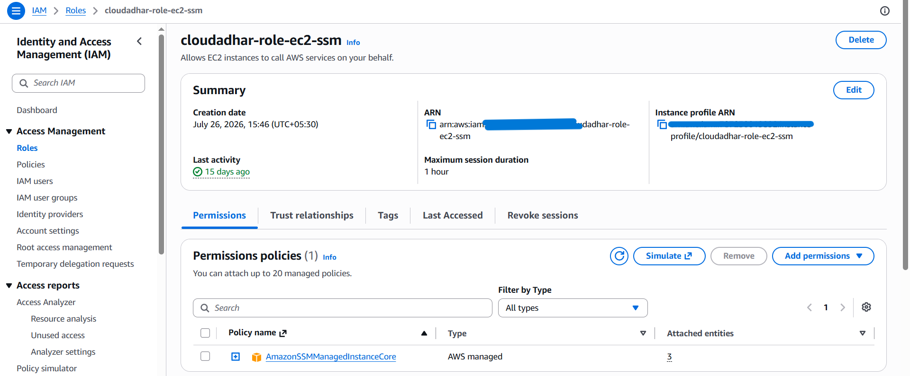

---

## Task 2 — Create the EC2 Client Security Group

Created the Security Group for the EC2 database client.

The Security Group was configured without an inbound SSH rule because Session Manager was used for access.

---

## Task 3 — Launch the EC2 Database Client

Created the EC2 database client used throughout the RDS practical and connected it through Systems Manager.

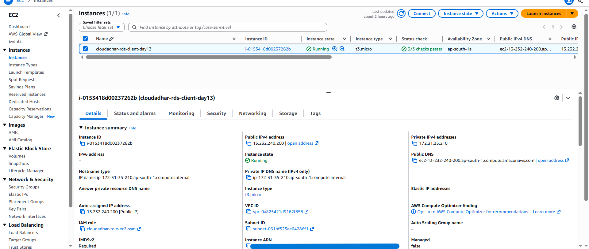

---

## Task 4 — Create the RDS Security Group

Created:

`cloudadhar-rds-sg-day13`

Configured MySQL/Aurora TCP port `3306` access from the EC2 client Security Group.

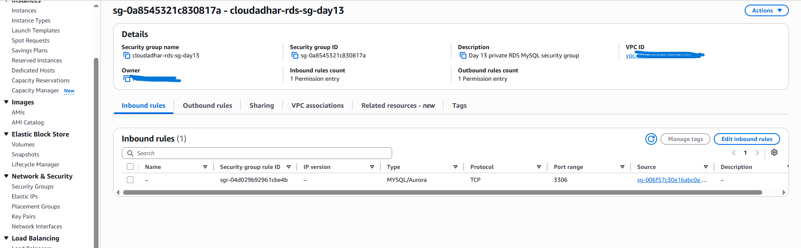

---

## Task 5 — Create the Private RDS MySQL Source

Created:

`cloudadhar-rds-day13`

Important configuration:
- MySQL Community
- MySQL 8.4.9
- `db.t4g.micro`
- Mumbai (`ap-south-1`)
- Initial database: `cloudadhardb`
- RDS SG: `cloudadhar-rds-sg-day13`
- Encryption enabled
- Automated backups enabled
- 1-day retention
- Public access disabled
- Delete protection disabled

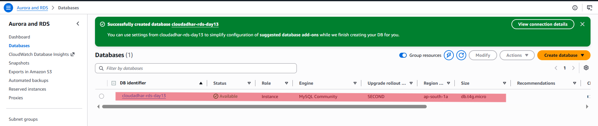

---

## Task 6 — Retrieve the Password Privately

Retrieved the RDS master credentials through AWS Secrets Manager and used the password interactively.

The password itself was not included in evidence.

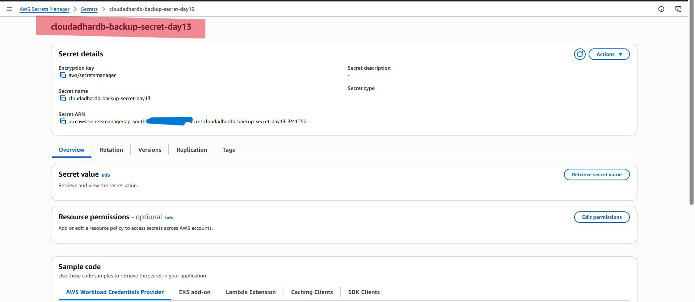

---

## Task 7 — Connect from EC2 with TLS

Connected from the EC2 client to the private RDS MySQL endpoint using TLS verification.

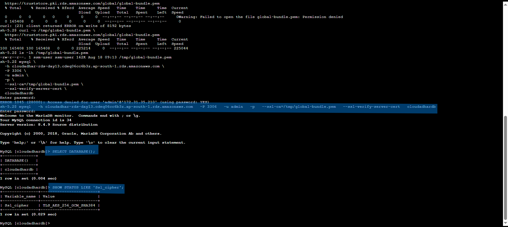

---

## Task 8 — Create and Validate Synthetic InnoDB Data

Created the `orders` table using InnoDB and inserted the required synthetic data.

```sql
CREATE TABLE orders (
    order_id INT AUTO_INCREMENT PRIMARY KEY,
    customer_name VARCHAR(100) NOT NULL,
    product_name VARCHAR(100) NOT NULL,
    amount DECIMAL(10,2) NOT NULL,
    created_at TIMESTAMP DEFAULT CURRENT_TIMESTAMP
) ENGINE=InnoDB;
```

```sql
INSERT INTO orders (customer_name, product_name, amount)
VALUES
('CloudAdhar', 'AWS Training', 4999.00),
('TrainWithShubham', 'SAA-C03 Lab', 2999.00),
('Demo Learner', 'RDS Practical', 999.00);
```

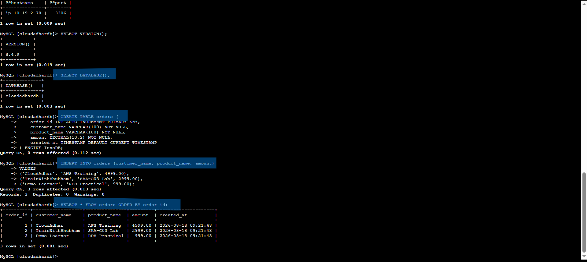

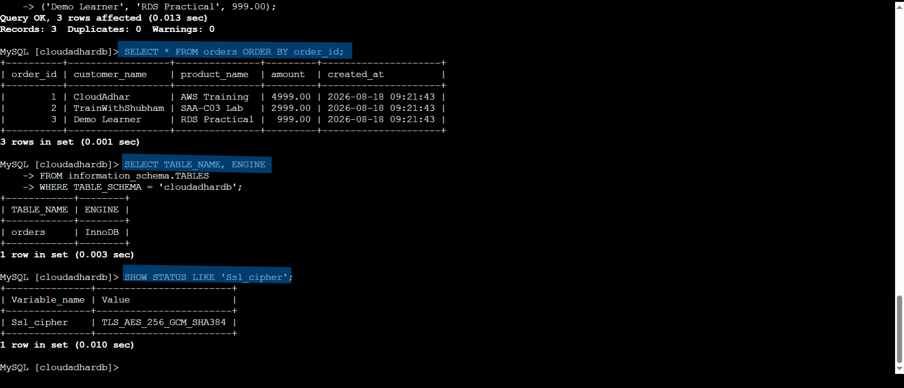

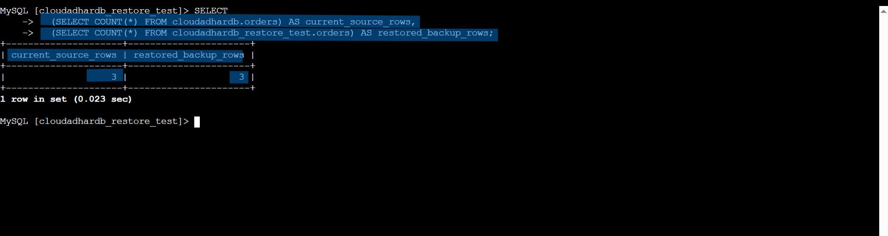

---

## Task 9 — Create a Manual Snapshot

Created:

`cloudadhar-rds-day13-snapshot`

Waited for the snapshot to become `Available`.

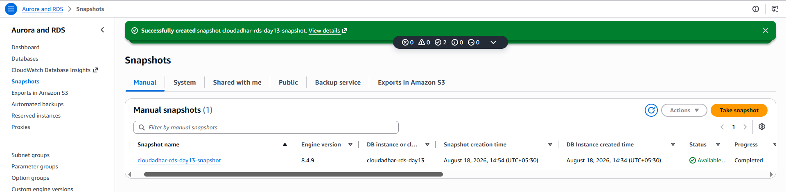

---

## Task 10 — Inspect Automated Backups

Checked:
- Backup retention
- Backup window
- Automated backup
- Latest restorable time
- InnoDB table engine


---

## Task 11 — Create a Safe PITR Window

Created the PITR marker:

```sql
INSERT INTO orders (customer_name, product_name, amount)
VALUES ('PITR Marker', 'Recover This Record', 1500.00);
```

Recorded the marker time, deleted the marker, recorded the deletion time, and used the recovery window for point-in-time restore.

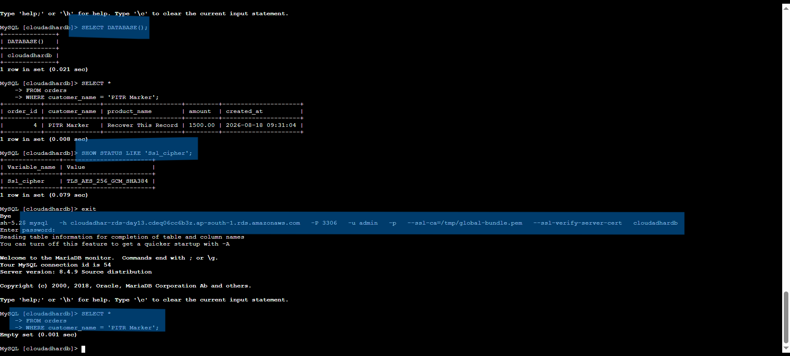

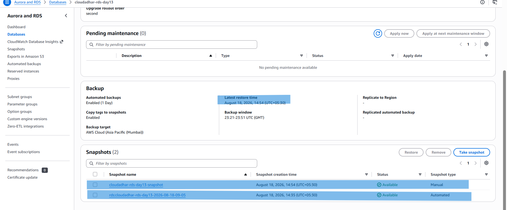

---

## Task 12 — Compare Multi-AZ Options Without Provisioning

Compared:
1. Single-AZ DB instance
2. Multi-AZ DB instance
3. Multi-AZ DB cluster

No additional Multi-AZ resources were provisioned for this cost-controlled lab.

---

## Task 13 — Create a Read Replica

Created an asynchronous read replica from:

`cloudadhar-rds-day13`

Replica:

`cloudadhar-rds-day13-read-replica`

The replica was created in Mumbai and reached `Available`.

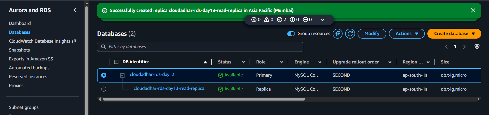

---

## Task 14 — Validate Asynchronous Read Scaling

Inserted a test row on the source:

```sql
INSERT INTO orders (customer_name, product_name, amount)
VALUES ('Replica Test', 'Asynchronous Replication', 2500.00);
```

Connected to the replica and verified the replicated row, read-only state, and replication status.

```sql
SELECT * FROM orders
WHERE customer_name = 'Replica Test';

SELECT @@global.read_only;

SHOW REPLICA STATUS\G;
```

Also tested a write on the replica, which was expected to fail because the replica is read-only.

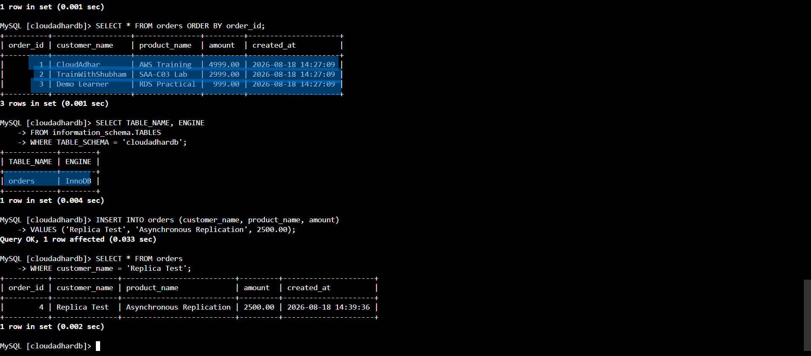

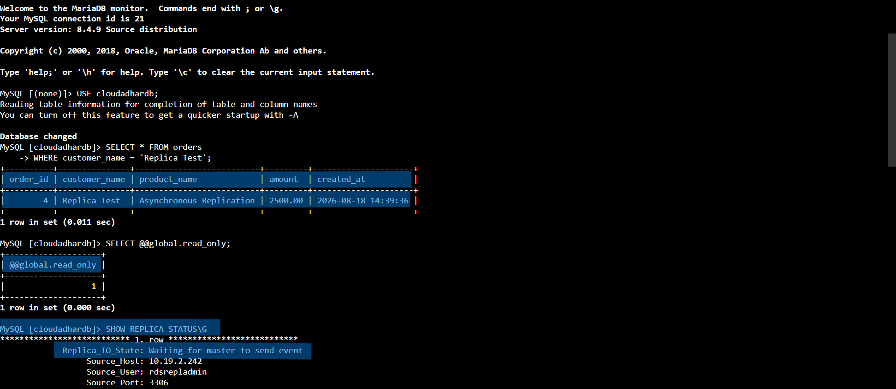

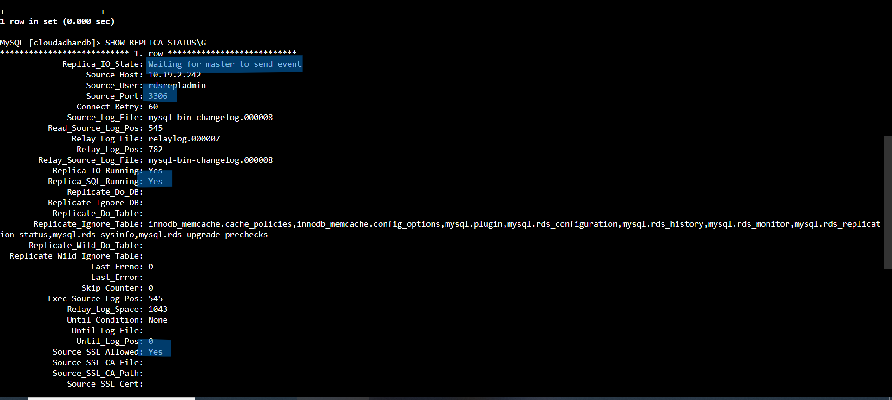

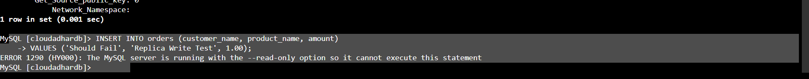

---

# Tasks 15–20 — Aurora and RDS Proxy

## Not Completed

Tasks 15–20 cover:
- Aurora Serverless v2 cluster
- Aurora reader
- Aurora writer/reader endpoint validation
- Aurora cross-AZ failover
- RDS Proxy
- RDS Proxy endpoint validation

These tasks were **not completed because Aurora was not available in the VDI/free-plan environment**.

No fake screenshots or completion claims are included for these tasks.

---

# Tasks 21 Onward — Completed Separately

After the Aurora section, the remaining applicable tasks were completed separately.

## SSM Run Command

Used AWS Systems Manager Run Command for the database backup workflow.

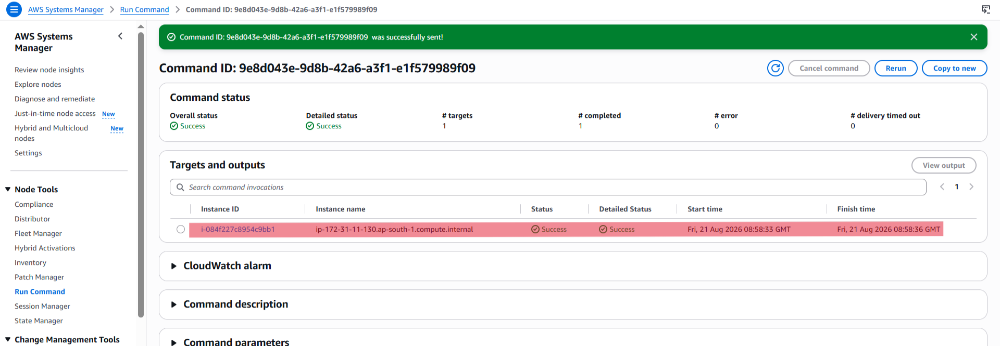

## State Manager

Configured the State Manager workflow for scheduled database backup execution.

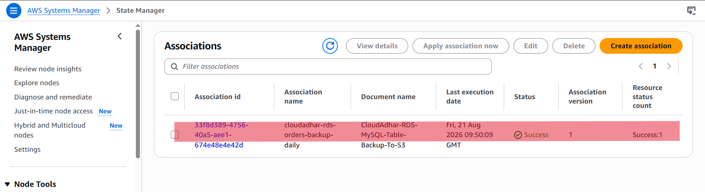

## S3 Table Backup

Uploaded the logical database backup to the encrypted S3 location and verified the files.

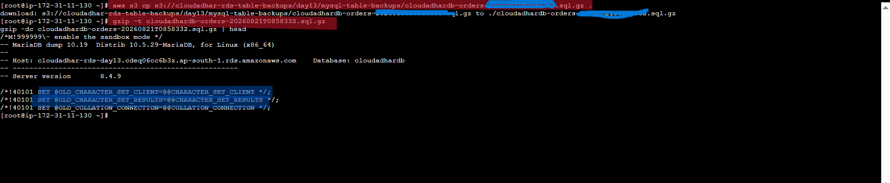

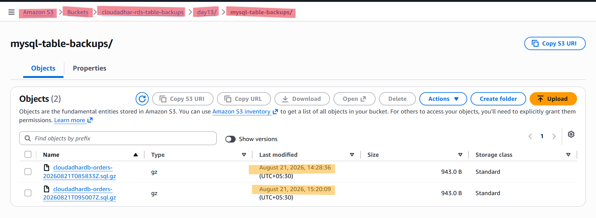

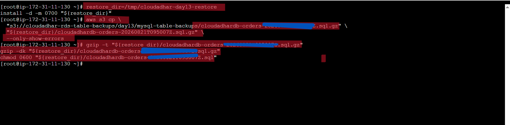

## Restore the Selected Table from S3

Restored the selected table dump into an isolated database and validated the restored data while keeping the active database unchanged.

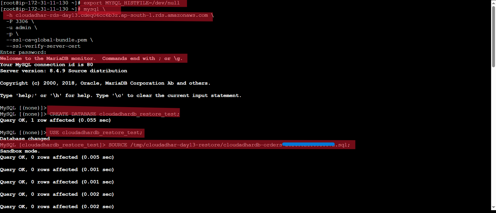

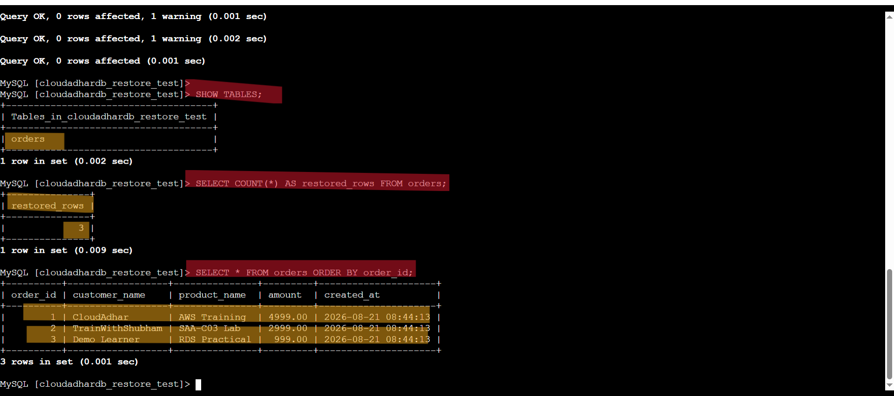

---

# Completion Summary

### Completed
- [x] Task 1 — Prepare Session Manager Access
- [x] Task 2 — Create EC2 Client Security Group
- [x] Task 3 — Launch EC2 Database Client
- [x] Task 4 — Create RDS Security Group
- [x] Task 5 — Create Private RDS MySQL Source
- [x] Task 6 — Retrieve Password Privately
- [x] Task 7 — Connect from EC2 with TLS
- [x] Task 8 — Create and Validate Synthetic InnoDB Data
- [x] Task 9 — Create Manual Snapshot
- [x] Task 10 — Inspect Automated Backups
- [x] Task 11 — Create Safe PITR Window
- [x] Task 12 — Compare Multi-AZ Options
- [x] Task 13 — Create Read Replica
- [x] Task 14 — Validate Asynchronous Read Scaling
- [x] Tasks 21 onward — applicable SSM/S3/State Manager backup and restore work

### Not Completed
- [ ] Task 15 — Aurora Serverless v2 Cluster
- [ ] Task 16 — Aurora Reader
- [ ] Task 17 — Aurora Writer/Reader Endpoint Validation
- [ ] Task 18 — Aurora Cross-AZ Failover
- [ ] Task 19 — RDS Proxy
- [ ] Task 20 — RDS Proxy Endpoint Validation

**Reason:** Aurora was unavailable in the VDI/free-plan environment.

---

# Result

The RDS portion through Task 14 was completed successfully, including private RDS MySQL deployment, EC2-to-RDS TLS connectivity, Secrets Manager credentials, InnoDB data, manual snapshot, automated backup verification, PITR workflow, read replica creation, and read replica validation.

The Aurora/RDS Proxy section was skipped because of the VDI/free-plan limitation.
