# Day 14 – DynamoDB, Lambda, DynamoDB Streams & CloudWatch

## Overview

In Day 14, I worked with **Amazon DynamoDB, AWS Lambda, DynamoDB Streams, and Amazon CloudWatch**.

The main goal of this hands-on was to create and work with a DynamoDB table, perform different DynamoDB operations, enable DynamoDB Streams, process stream events using Lambda, and verify the changes through CloudWatch Logs.

### Architecture

The architecture diagram for this Day 14 hands-on is available in the repository's `Diagram` folder.

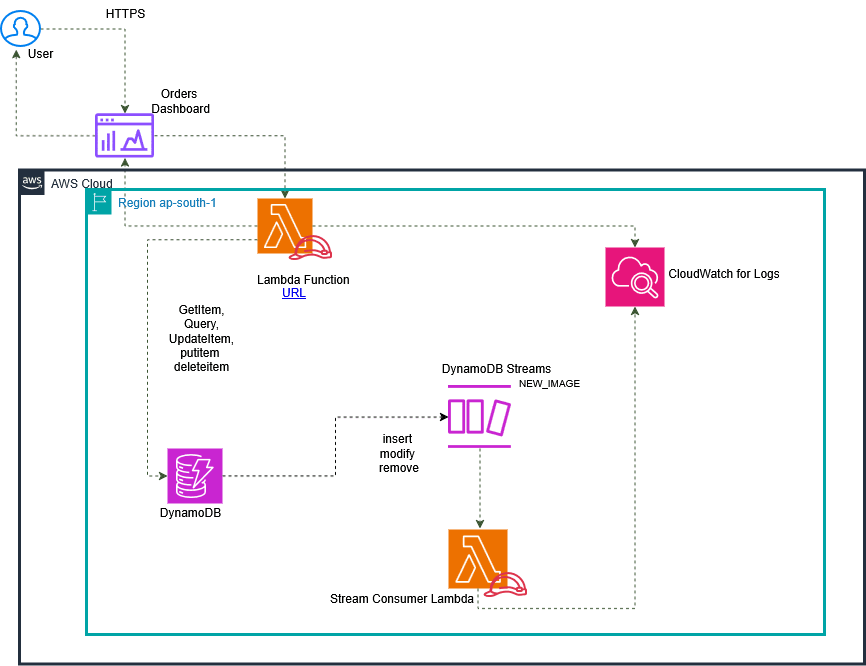


## 1. Exported the Data and Created the DynamoDB Table

I first exported the required Day 14 data and created the DynamoDB table.

The table used in this lab was:

```text
cloudadhar-orders-day14
```

The table contains customer, order, and session information.

It uses:

- Partition Key: `PK`
- Sort Key: `SK`
- GSI and LSI for additional access patterns

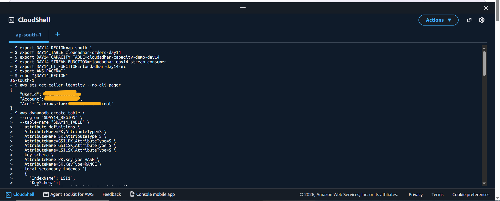

---

## 2. Verified the DynamoDB Table

After creating the table, I verified its configuration using the AWS CLI and DynamoDB Console.

I checked that the table was created successfully and reviewed its configuration.

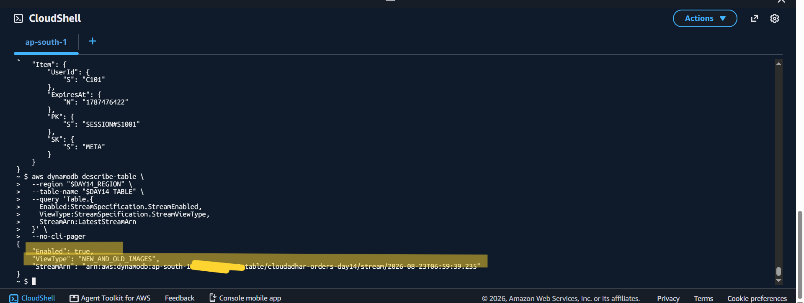

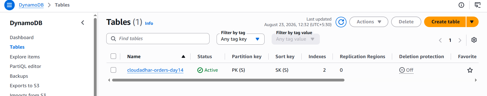

---

## 3. Inserted Items into DynamoDB

Next, I added the required data to the DynamoDB table using `PutItem`.

The data included customer, order, and session information.

For example:

```text
Order ID: O9001
Customer: C101
Status: PAID
Total: 2499
```

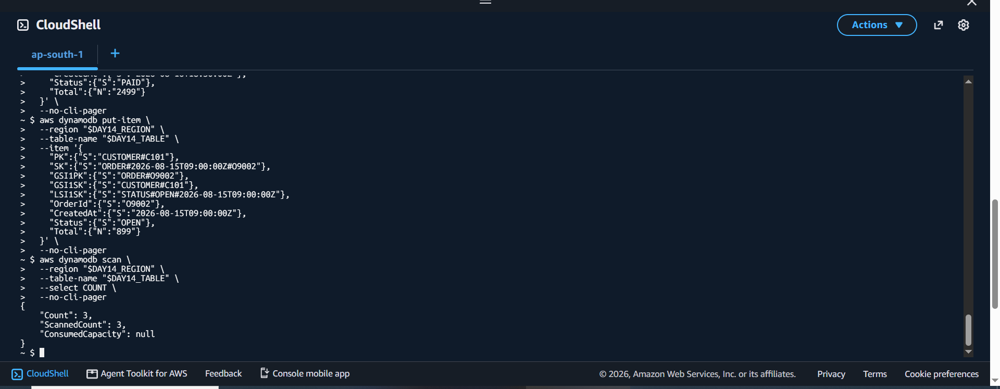

---

## 4. Retrieved an Item Using GetItem

After inserting the data, I used `GetItem` to retrieve a specific item from DynamoDB.

This verified that the item was successfully stored and could be retrieved using its primary key.

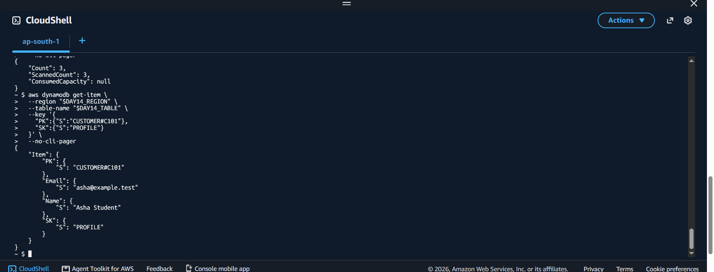

---

## 5. Queried the DynamoDB Data

I then queried the table to retrieve the required customer and order information.

This helped me understand how DynamoDB retrieves related items using the table's key design and indexes.

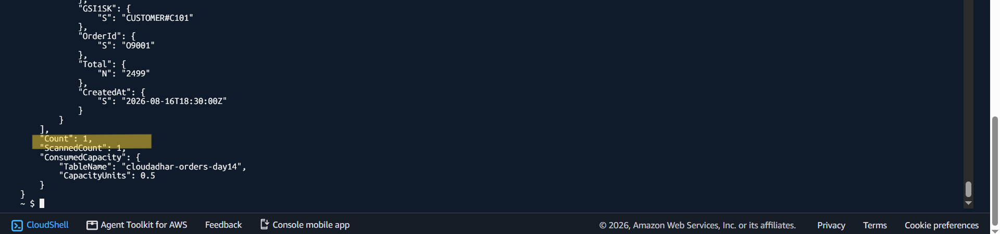

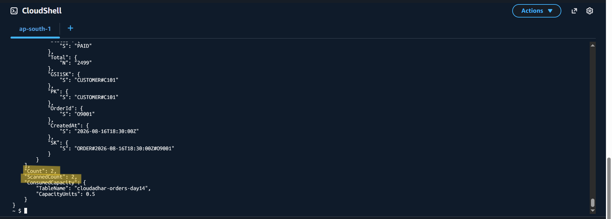

---

## 6. Verified the Existing Order Status

Before making an update, I verified the existing order status.

For order `O9001`, the initial status was:

```text
PAID
```

This gave me a baseline for verifying the update later.

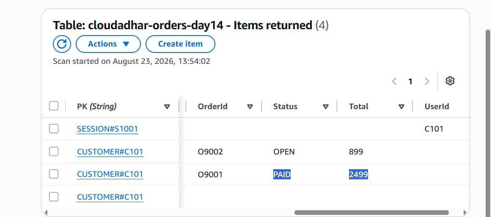

---

## 7. Enabled DynamoDB Streams

Next, I enabled **DynamoDB Streams** for the table.

The Stream was configured with:

```text
NEW_AND_OLD_IMAGES
```

This configuration allows the Stream record to contain both the previous and new versions of an item when it is modified.

For example:

```text
Old Image:
Status = PAID

New Image:
Status = SHIPPED
```

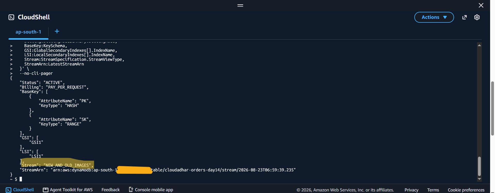

---

## 8. Created the Lambda Stream Consumer

I created the Lambda function:

```text
cloudadhar-day14-stream-consumer
```

This Lambda function is responsible for processing records generated by the DynamoDB Stream.

The flow is:

```text
DynamoDB Table
      ↓
DynamoDB Stream
      ↓
Lambda Stream Consumer
```

---

## 9. Configured the DynamoDB Stream Event Source Mapping

Next, I configured the event source mapping between the DynamoDB Stream and the Lambda function.

This allows Lambda to automatically receive records whenever changes occur in the DynamoDB table.

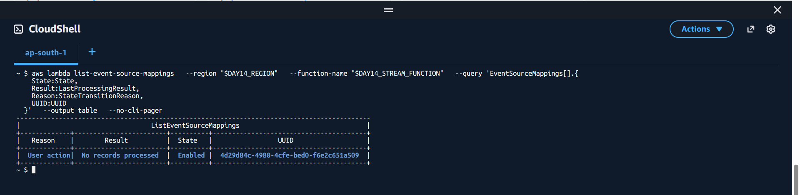

---

## 10. Tested the Lambda Application Code

After configuring Lambda, I tested the application code and verified that it successfully returned the expected DynamoDB data.

The response contained:

- Customer profile
- Orders
- Session information

For example:

```text
O9001 → PAID
O9002 → OPEN
```

This confirmed that the Lambda application code could successfully work with the DynamoDB data.

---

## 11. Updated the Order Status

Next, I updated the order status.

For order `O9001`, the status was changed from:

```text
PAID
```

to:

```text
SHIPPED
```

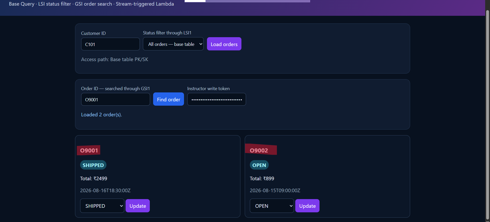

---

## 12. DynamoDB Stream Captured the Change

Because DynamoDB Streams was enabled, the update generated a Stream event.

The change was:

```text
Before:
O9001 → PAID

After:
O9001 → SHIPPED
```

Because the Stream was configured with `NEW_AND_OLD_IMAGES`, both versions of the item were available in the Stream record.

---

## 13. Verified the Change in CloudWatch

The Stream-triggered Lambda processed the DynamoDB change, and the activity was recorded in **Amazon CloudWatch Logs**.

I checked the logs to verify that the `SHIPPED` status change was received and processed.

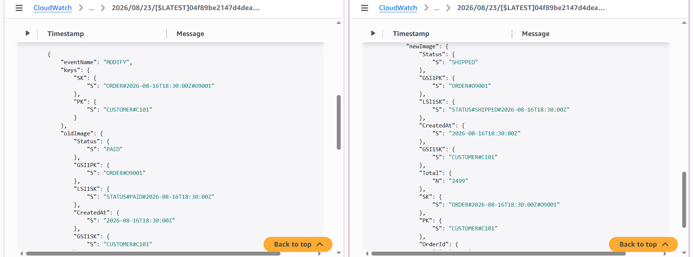

I also verified the shipped status from CloudShell.

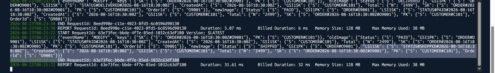

---

## 14. Verified the Updated DynamoDB Record

After the update, I checked the DynamoDB table again.

The order now showed:

```text
Order ID: O9001
Status: SHIPPED
```

This confirmed that the update was successfully reflected in DynamoDB.

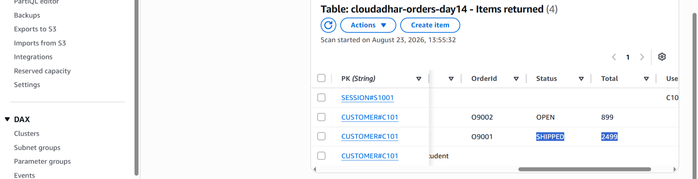

---

## 15. Updated the Order to Delivered

I then performed another status update and changed the order status to:

```text
DELIVERED
```

I verified the new status from CloudShell.

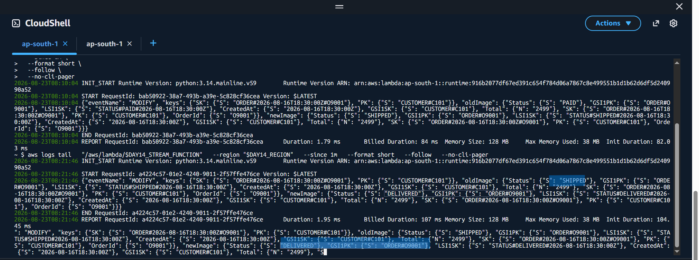

The dashboard was also updated to show the delivered status.


---

## 16. Verified the Lambda Functions

Finally, I verified the Lambda functions from the AWS Console.

The Lambda function was responsible for processing the DynamoDB Stream events.

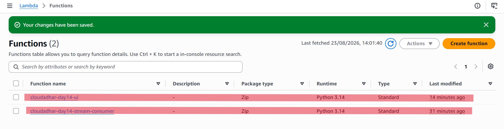

---

# Final Architecture

```text
                  ┌─────────────────────────┐
                  │     DynamoDB Table      │
                  │  cloudadhar-orders-day14│
                  └────────────┬────────────┘
                               │
                               │ Item Changes
                               ▼
                  ┌─────────────────────────┐
                  │    DynamoDB Stream      │
                  │   NEW_AND_OLD_IMAGES    │
                  └────────────┬────────────┘
                               │
                               │ Stream Records
                               ▼
                  ┌─────────────────────────┐
                  │         Lambda          │
                  │    Stream Consumer      │
                  └────────────┬────────────┘
                               │
                               │ Logs
                               ▼
                  ┌─────────────────────────┐
                  │     CloudWatch Logs     │
                  └─────────────────────────┘
```

---

# Key Concepts Learned

Through this hands-on, I practiced:

- Creating and working with DynamoDB tables
- Using `PutItem`
- Using `GetItem`
- Using `Query`
- Updating DynamoDB items
- Working with Partition Key and Sort Key
- Working with GSI and LSI
- Enabling DynamoDB Streams
- Using `NEW_AND_OLD_IMAGES`
- Creating and configuring AWS Lambda
- Creating a DynamoDB Stream event source mapping
- Processing DynamoDB Stream records with Lambda
- Monitoring Lambda activity using CloudWatch Logs
- Verifying DynamoDB changes through AWS CLI and the AWS Console
- Understanding how DynamoDB changes can trigger Lambda processing
