# Day 15 — Route 53, CloudFront, DNS, Caching and Edge Security

## Overview

This lab demonstrates how to combine Amazon Route 53, Amazon CloudFront,
Amazon S3, ACM, and EC2 to build a DNS-based, globally distributed and
secured web architecture using the domain **aliyas.online**.

The lab covers:

-   Amazon Route 53 public hosted zones
-   DNS delegation from GoDaddy to Route 53
-   Primary and secondary EC2 endpoints
-   Route 53 DNS records
-   Route 53 health checks
-   Weighted routing
-   CloudFront distribution
-   Custom domain `cdn.aliyas.online`
-   ACM certificate
-   S3 as a CloudFront origin
-   CloudFront cache behavior
-   Cache invalidation
-   CloudFront public key and key group
-   Signed URLs for private content
-   DNS troubleshooting and verification
-   HTTP and HTTPS testing using `curl`, `dig`, and `openssl`

## Architecture

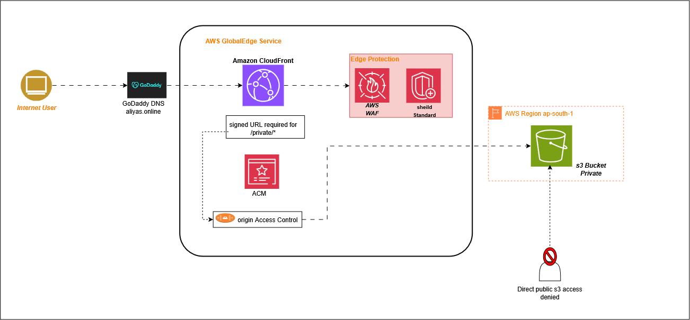

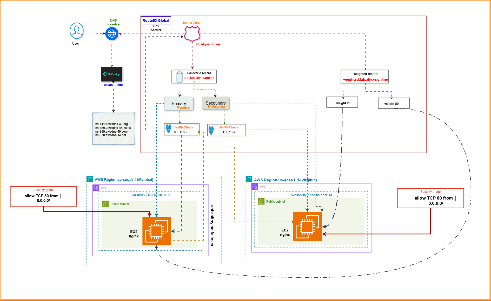

The architecture uses:

-   **GoDaddy** as the parent DNS provider for `aliyas.online`
-   **Route 53** as the authoritative DNS service for
    `lab.aliyas.online`
-   **EC2 Mumbai** as the primary endpoint
-   **EC2 N. Virginia** as the secondary endpoint
-   **Route 53 health checks** to monitor both EC2 endpoints
-   **Route 53 routing policies** for DNS traffic management
-   **Amazon S3** as the private content origin
-   **Amazon CloudFront** as the CDN
-   **ACM** for the TLS certificate for `cdn.aliyas.online`
-   **CloudFront key group** for signed access to `/private/*`

---

## Table of Contents

- [1. Lab Environment](#1-lab-environment)
- [2. EC2 Endpoints](#2-ec2-endpoints)
- [3. S3 Bucket Setup](#3-s3-bucket-setup)
- [4. CloudFront Distribution](#4-cloudfront-distribution)
- [5. ACM Certificate](#5-acm-certificate)
- [6. GoDaddy DNS for CloudFront](#6-godaddy-dns-for-cloudfront)
- [7. HTTPS Certificate Verification](#7-https-certificate-verification)
- [8. CloudFront Content Test](#8-cloudfront-content-test)
- [9. CloudFront Cache Behavior](#9-cloudfront-cache-behavior)
- [10. Cache Invalidation](#10-cache-invalidation)
- [11. Route 53 Hosted Zone](#11-route-53-hosted-zone)
- [12. Delegate lab.aliyas.online from GoDaddy](#12-delegate-labaliyasonline-from-godaddy)
- [13. Verify Route 53 Delegation](#13-verify-route-53-delegation)
- [14. Route 53 Primary Record](#14-route-53-primary-record)
- [15. Route 53 Secondary Record](#15-route-53-secondary-record)
- [16. DNS Verification](#16-dns-verification)
- [17. Local DNS Resolver Issue and Troubleshooting](#17-local-dns-resolver-issue-and-troubleshooting)
- [18. Route 53 Health Checks](#18-route-53-health-checks)
- [19. Primary Health Check](#19-primary-health-check)
- [20. Secondary Health Check](#20-secondary-health-check)
- [21. Route 53 Weighted Routing](#21-route-53-weighted-routing)
- [22. Route 53 Request Flow](#22-route-53-request-flow)
- [23. CloudFront Security](#23-cloudfront-security)
- [24. AWS WAF / Web ACL](#24-aws-waf-web-acl)
- [25. Web ACL Count / Request Testing](#25-web-acl-count-request-testing)
- [26. CloudFront Public Key](#26-cloudfront-public-key)
- [27. CloudFront Public Key Configuration](#27-cloudfront-public-key-configuration)
- [28. CloudFront Key Group](#28-cloudfront-key-group)
- [29. Private CloudFront Behavior](#29-private-cloudfront-behavior)
- [30. Unsigned Private Content Test](#30-unsigned-private-content-test)
- [31. Generate a Signed URL](#31-generate-a-signed-url)
- [32. Test the Signed URL](#32-test-the-signed-url)
- [33. Test Signed URL Expiration](#33-test-signed-url-expiration)
- [34. Securely Remove the Private Key](#34-securely-remove-the-private-key)
- [35. Important DNS Verification Commands](#35-important-dns-verification-commands)
- [36. Screenshots Included in the Lab](#36-screenshots-included-in-the-lab)
- [37. Final Architecture](#37-final-architecture)
- [38. Key Learnings](#38-key-learnings)
- [39. Final Validation Checklist](#39-final-validation-checklist)
- [40. Conclusion](#40-conclusion)

---

## 1. Lab Environment

### Domain

The root domain used throughout this lab is:

``` text
aliyas.online
```

The delegated Route 53 lab zone is:

``` text
lab.aliyas.online
```

The CloudFront custom domain is:

``` text
cdn.aliyas.online
```

### Regions Used

-   Mumbai: `ap-south-1`
-   N. Virginia: `us-east-1`

ACM certificates used with CloudFront were created in **N. Virginia
(`us-east-1`)**, because CloudFront requires its ACM certificate to be
in `us-east-1`.

---

## 2. S3 Bucket Setup

A private S3 bucket was used as the CloudFront origin.

The bucket was intentionally kept private so that users access the
content through CloudFront rather than directly through S3.

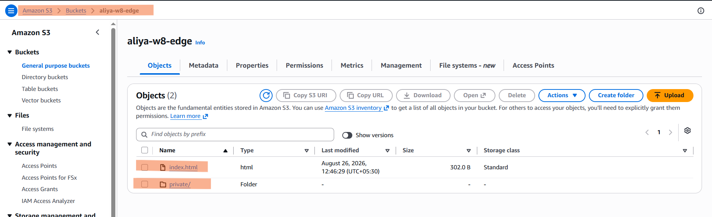

The important design principle is:

``` text
User
  |
  v
CloudFront
  |
  v
Private S3 Bucket
```

The S3 bucket contains the CloudFront test content, including:

``` text
index.html
private/learner-proof.txt
```

---

## 4. CloudFront Distribution

A CloudFront distribution was created to serve the S3 content through
the CDN.

Distribution name:

``` text
aliya-w8-day15-edge
```

The distribution uses:

-   S3 origin
-   CloudFront caching
-   HTTPS
-   Custom domain
-   ACM certificate
-   Private S3 access
-   Cache invalidation
-   Signed URL protection for private content

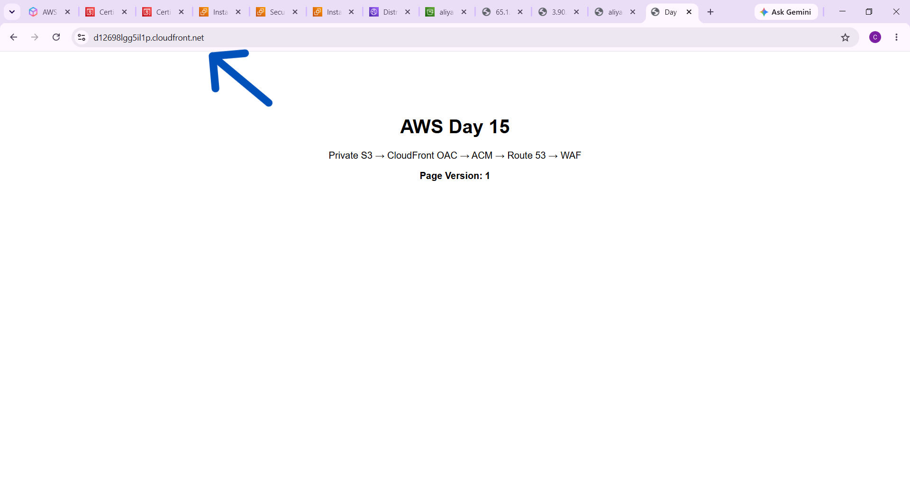

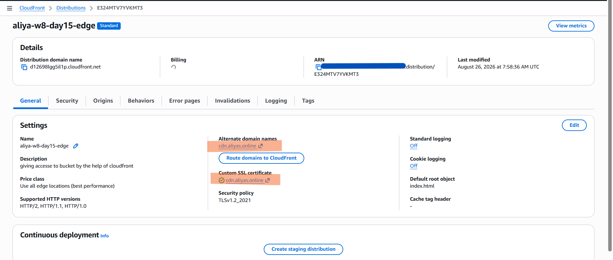

### Default Root Object

The default root object was configured as:

``` text
index.html
```

Therefore:

``` text
https://cdn.aliyas.online/
```

loads:

``` text
index.html
```

---

## 5. ACM Certificate

An ACM certificate was created for:

``` text
cdn.aliyas.online
```

The certificate was created in:

``` text
us-east-1
```

This certificate was attached to the CloudFront distribution.

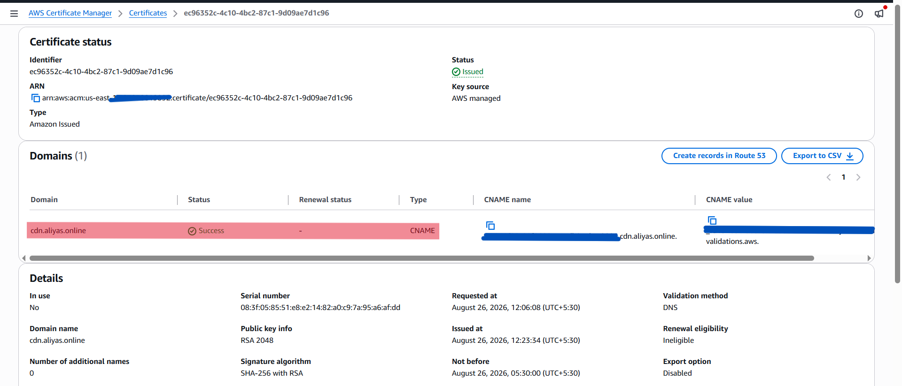

The CloudFront configuration shows:

``` text
Alternate domain name:
cdn.aliyas.online
```

and:

``` text
Custom SSL certificate:
cdn.aliyas.online
```

This allows HTTPS access through:

``` text
https://cdn.aliyas.online/
```

---

## 6. GoDaddy DNS for CloudFront

The CloudFront distribution was connected to the custom domain:

``` text
cdn.aliyas.online
```

A CNAME record was created in GoDaddy:

``` text
Type: CNAME
Name: cdn
Value: d12698lgg5il1p.cloudfront.net
TTL: 1 Hour
```

The resulting DNS relationship is:

``` text
cdn.aliyas.online
        |
        v
d12698lgg5il1p.cloudfront.net
        |
        v
CloudFront
```

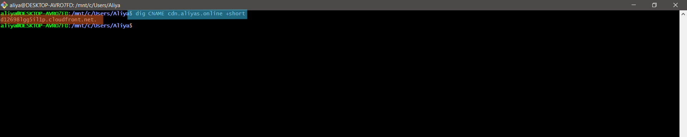

The DNS record was verified using:

``` bash
dig CNAME cdn.aliyas.online +short
```

Expected result:

``` text
d12698lgg5il1p.cloudfront.net.
```


---

## 7. HTTPS Certificate Verification

The TLS certificate presented for `cdn.aliyas.online` was checked using
OpenSSL.

Command:

``` bash
openssl s_client -connect cdn.aliyas.online:443 -servername cdn.aliyas.online </dev/null 2>/dev/null \
| openssl x509 -noout -subject -issuer -dates
```

This verifies the certificate subject, issuer, and validity dates.

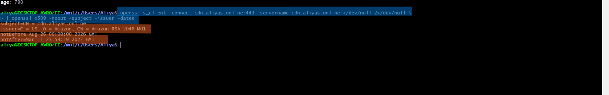

---

## 8. CloudFront Content Test

The CloudFront endpoint was tested using:

``` bash
curl -I "https://d12698lgg5il1p.cloudfront.net/index.html"
```

The custom domain was also tested using:

``` bash
curl -I "https://cdn.aliyas.online/index.html"
```

The response headers were used to inspect CloudFront behavior.

Important headers:

``` text
X-Cache
Age
Via
X-Amz-Cf-Pop
```

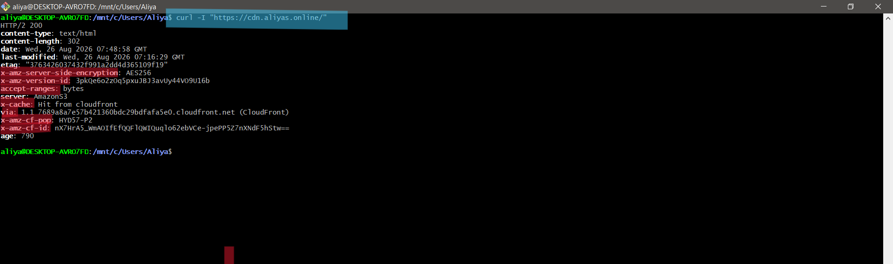

---

## 9. CloudFront Cache Behavior

The same object was requested twice:

``` bash
curl -I "https://cdn.aliyas.online/index.html"
```

Then again:

``` bash
curl -I "https://cdn.aliyas.online/index.html"
```

The first request can result in a cache miss while CloudFront retrieves
the object from the origin.

The second request can be served from the CloudFront edge cache.

The important response headers are:

``` text
X-Cache
Age
Via
X-Amz-Cf-Pop
```

### Meaning of the Headers

### X-Cache

Shows whether CloudFront served the request from cache.

Examples:

``` text
Hit from cloudfront
```

or:

``` text
Miss from cloudfront
```

### Age

Shows approximately how long the object has been stored in the
CloudFront cache.

### Via

Shows that the request passed through CloudFront.

### X-Amz-Cf-Pop

Identifies the CloudFront edge location that handled the request.

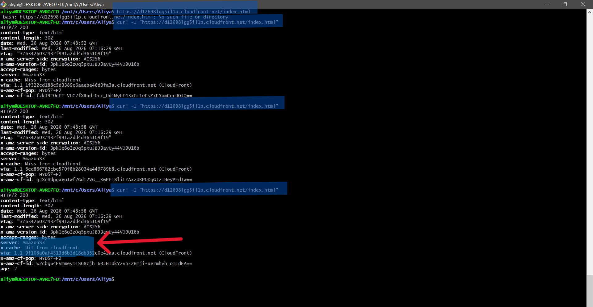

---

## 10. Cache Invalidation

The `index.html` page was changed from:

``` text
Page Version: 1
```

to:

``` text
Page Version: 2
```

The updated `index.html` was uploaded to the S3 origin.

Because CloudFront may still have the previous version cached, an
invalidation was created.

Go to:

``` text
CloudFront
→ Distribution
→ Invalidations
→ Create invalidation
```

The invalidation path was:

``` text
/index.html
```

After the invalidation reached:

``` text
Completed
```

the object was requested again:

``` bash
curl "https://cdn.aliyas.online/index.html"
```

The response should show:

``` text
Version 2
```

This demonstrates that CloudFront invalidation removes the old cached
object so that the updated origin content can be retrieved.

---

## 11. Route 53 Hosted Zone

A public Route 53 hosted zone was created for:

``` text
lab.aliyas.online
```

Configuration:

``` text
Name: lab.aliyas.online
Type: Public hosted zone
```

Route 53 automatically created:

-   NS record
-   SOA record

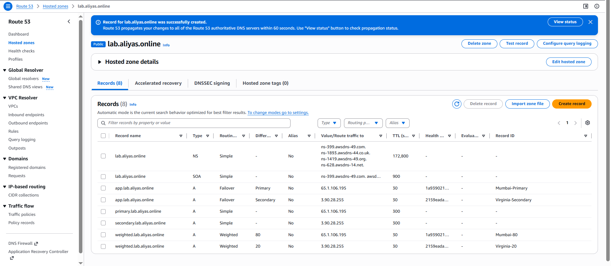

The Route 53 nameservers assigned to the zone were:

``` text
ns-399.awsdns-49.com.
ns-1893.awsdns-44.co.uk.
ns-1419.awsdns-49.org.
ns-628.awsdns-14.net.
```

---

## 12. Delegate lab.aliyas.online from GoDaddy

Because GoDaddy remains authoritative for:

``` text
aliyas.online
```

the subdomain:

``` text
lab.aliyas.online
```

was delegated to Route 53.

Four separate NS records were added in GoDaddy.

All four records used:

``` text
Type: NS
Name: lab
```

The values were:

``` text
ns-399.awsdns-49.com.
ns-1893.awsdns-44.co.uk.
ns-1419.awsdns-49.org.
ns-628.awsdns-14.net.
```

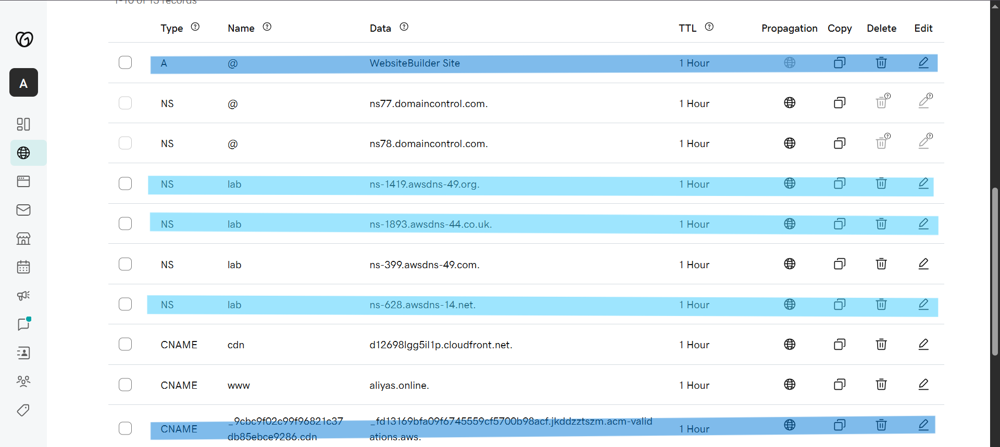

The root `aliyas.online` nameservers were not changed.

The Route 53 SOA record was not copied into GoDaddy.

---

## 13. Verify Route 53 Delegation

Delegation was verified with:

``` bash
dig NS lab.aliyas.online +short
```

The response showed the Route 53 nameservers.

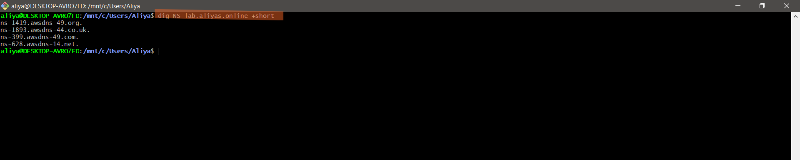

A trace was also performed:

``` bash
dig +trace primary.lab.aliyas.online
```

The trace confirmed that:

``` text
aliyas.online
```

is delegated by GoDaddy and:

``` text
lab.aliyas.online
```

is delegated to the four Route 53 nameservers.

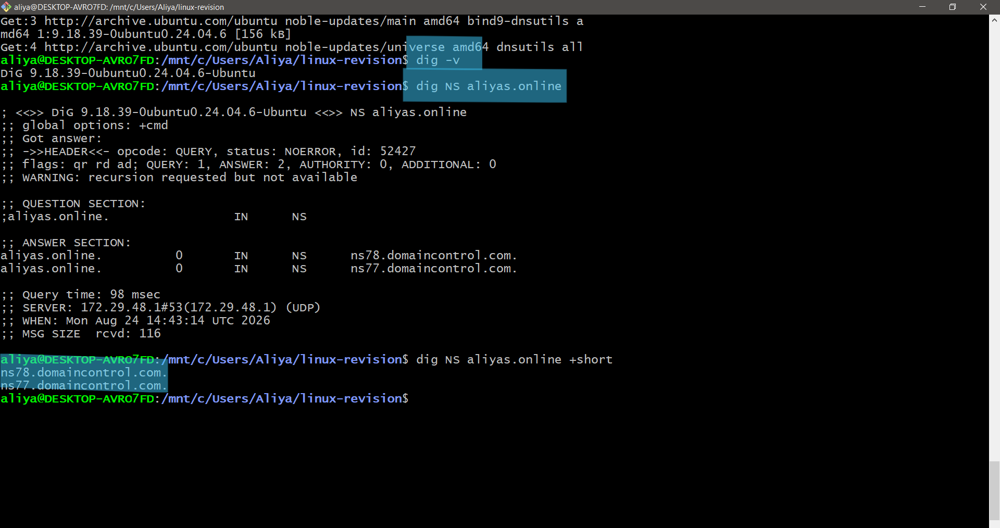

---

## 14. Route 53 Primary Record

Inside the `lab.aliyas.online` hosted zone, an A record was created.

Configuration:

``` text
Name: primary
Type: A
Value: 65.1.106.195
TTL: 300
Routing policy: Simple
```

The final hostname is:

``` text
primary.lab.aliyas.online
```


---

## 15. Route 53 Secondary Record

A second A record was created.

Configuration:

``` text
Name: secondary
Type: A
Value: 3.90.28.255
TTL: 300
Routing policy: Simple
```

The final hostname is:

``` text
secondary.lab.aliyas.online
```


---

## 16. DNS Verification

The DNS records were tested using public DNS resolvers.

Primary:

``` bash
dig @8.8.8.8 +short primary.lab.aliyas.online
```

Expected:

``` text
65.1.106.195
```

Secondary:

``` bash
dig @1.1.1.1 +short secondary.lab.aliyas.online
```

Expected:

``` text
3.90.28.255
```

Public resolver testing confirmed that the Route 53 records were
correctly delegated and available.

---

## 17. Local DNS Resolver Issue and Troubleshooting

The default WSL DNS resolver did not immediately return the Route 53
records:

``` bash
dig +short primary.lab.aliyas.online
```

returned no output.

However, querying public DNS resolvers returned the correct result:

``` bash
dig @8.8.8.8 +short primary.lab.aliyas.online
```

Result:

``` text
65.1.106.195
```

and:

``` bash
dig @1.1.1.1 +short primary.lab.aliyas.online
```

Result:

``` text
65.1.106.195
```

This showed that the Route 53 configuration was correct and the issue
was with the local DNS resolver/cache rather than the Route 53 hosted
zone.

The endpoint itself was also tested by explicitly resolving the hostname
to the EC2 IP:

``` bash
curl --resolve primary.lab.aliyas.online:80:65.1.106.195 \
"http://primary.lab.aliyas.online/"
```

Expected response:

``` html
Primary - Mumbai
```


The secondary endpoint was tested with:

``` bash
curl --resolve secondary.lab.aliyas.online:80:3.90.28.255 \
"http://secondary.lab.aliyas.online/"
```

Expected response:

``` html
Secondary - N. Virginia
```

This confirmed that both EC2 web servers were working correctly.

---

## 18. Route 53 Health Checks

Public Route 53 health checks were created for both EC2 endpoints.

The purpose of the health checks is to allow Route 53 to determine
whether each endpoint is healthy.

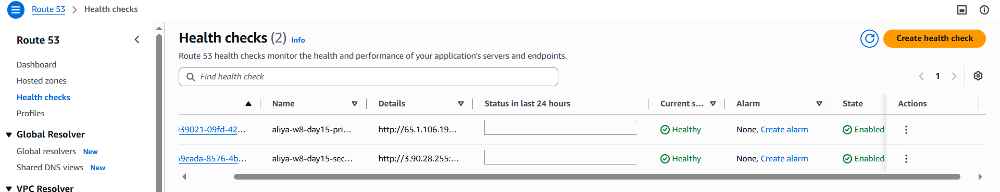

---

## 19. Primary Health Check

Configuration:

``` text
Name: aliya-w8-day15-primary-hc
Monitor: Endpoint
Endpoint by: IP address
IP address: 65.1.106.195
Protocol: HTTP
Port: 80
Path: /
Request interval: Standard (30 seconds)
Failure threshold: 3
String matching: Off
Invert status: No
```

The health check was allowed to run until its status became:

``` text
Healthy
```

---

## 20. Secondary Health Check

Configuration:

``` text
Name: aliya-w8-day15-secondary-hc
Monitor: Endpoint
Endpoint by: IP address
IP address: 3.90.28.255
Protocol: HTTP
Port: 80
Path: /
Request interval: Standard (30 seconds)
Failure threshold: 3
String matching: Off
Invert status: No
```

The health check was allowed to run until its status became:

``` text
Healthy
```

A successful browser request alone is not sufficient to prove that a
Route 53 health check will work. The EC2 security configuration must
allow the Route 53 health-checkers to reach HTTP port 80.

---

## 21. Route 53 Weighted Routing

Weighted routing was configured to demonstrate traffic distribution
between the Mumbai and N. Virginia endpoints.

The intended distribution was:

``` text
Primary / Mumbai     80%
Secondary / N. Virginia 20%
```

The weighted records use the same hostname but different routing
weights.

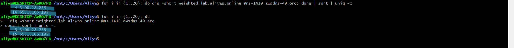

The traffic model is:

``` text
                    primary.lab.aliyas.online
                              |
                    Route 53 Weighted Routing
                         /              \
                      80%               20%
                       |                  |
                       v                  v
                Mumbai EC2          N. Virginia EC2
                65.1.106.195        3.90.28.255
```

The purpose of this configuration is to demonstrate controlled traffic
distribution.

---

## 22. Route 53 Request Flow

The overall Route 53 flow is:

``` text
User
 |
 | DNS query
 v
GoDaddy
 |
 | NS delegation for lab.aliyas.online
 v
Route 53 Hosted Zone
 |
 | Routing policy
 v
Healthy EC2 endpoint
 |
 +---- Mumbai
 |
 +---- N. Virginia
```

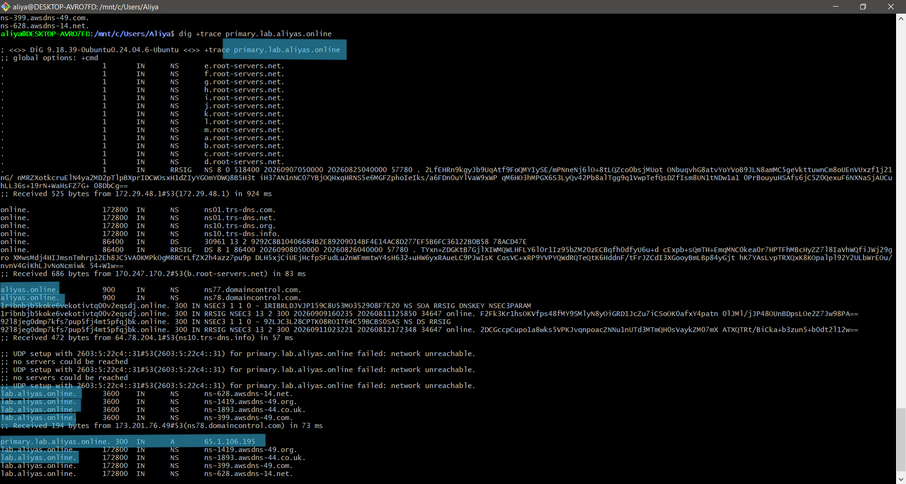

---

## 23. CloudFront Security

The S3 bucket was kept private and CloudFront was used as the public
access layer.

The security model is:

``` text
Internet
   |
   v
CloudFront
   |
   v
Private S3 Bucket
```

This prevents users from depending on direct public S3 access.

The S3 bucket configuration and access behavior were checked during the
lab.

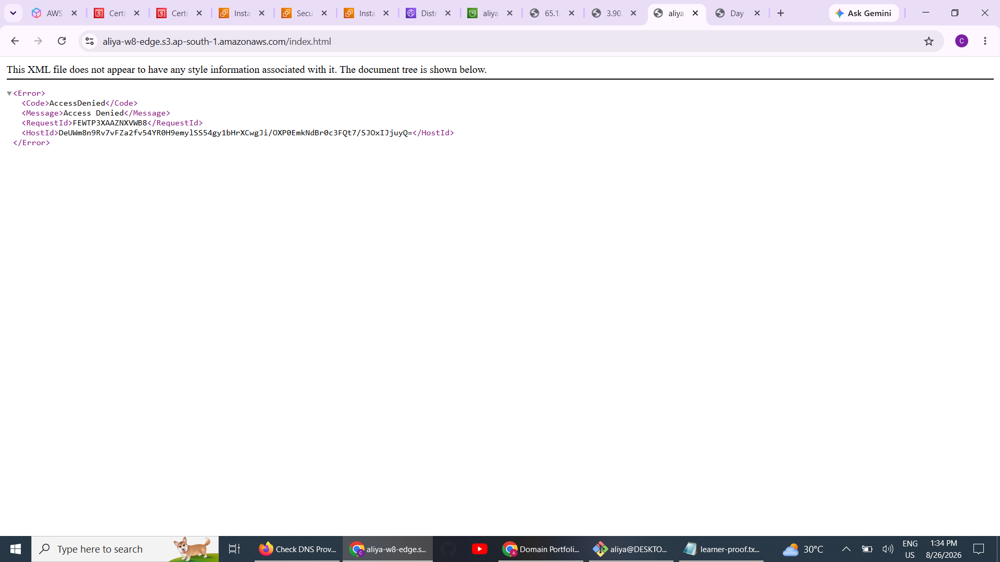

---

## 24. AWS WAF / Web ACL

A Web ACL was configured as part of the CloudFront security setup.

The Web ACL provides an additional security layer in front of the
CloudFront distribution.

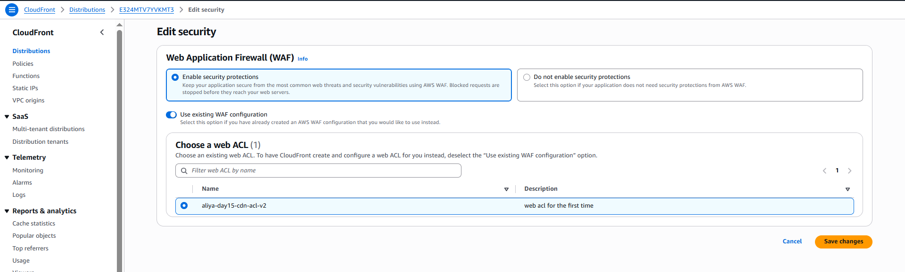

The Web ACL request behavior was tested and inspected.

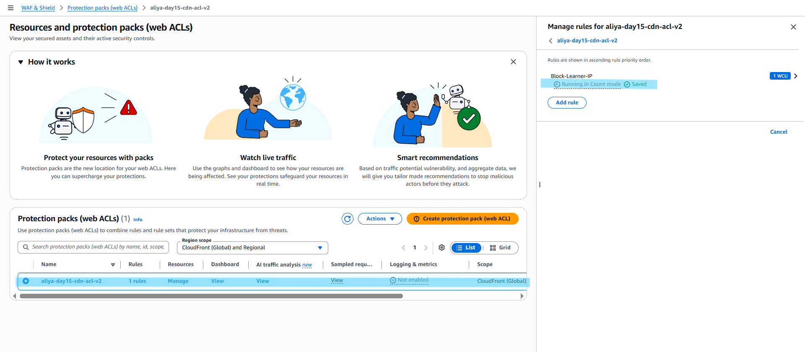

---

## 25. Web ACL Count / Request Testing

Requests were generated against the CloudFront endpoint to verify that
the Web ACL was associated with the distribution and could observe
incoming requests.

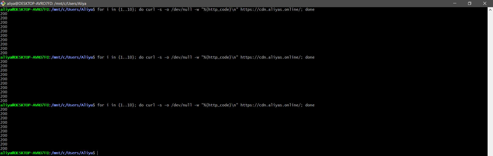

The test demonstrates the request path:

``` text
Client
  |
  v
CloudFront
  |
  v
AWS WAF
  |
  v
Origin
```

---

## 26. CloudFront Public Key

A CloudFront public key was generated as part of the signed URL setup.

The key pair was generated in CloudShell.

Private key generation:

``` bash
openssl genrsa -out cloudfront-private-key.pem 2048
```

Public key generation:

``` bash
openssl rsa -pubout \
-in cloudfront-private-key.pem \
-out cloudfront-public-key.pem
```

Private key permissions were restricted:

``` bash
chmod 600 cloudfront-private-key.pem
```

The public key was displayed with:

``` bash
cat cloudfront-public-key.pem
```

Important security rule:

``` text
NEVER publish the private key.
NEVER upload the private key to GitHub.
NEVER include the private key in screenshots.
NEVER commit the private key.
```


---

## 27. CloudFront Public Key Configuration

In CloudFront:

``` text
CloudFront
→ Public keys
→ Create public key
```

The public key was configured with the name:

``` text
aliya-w8-day15-public-key
```

Only the public PEM content was entered into CloudFront.

The public key ID was recorded for signed URL generation.

---

## 28. CloudFront Key Group

A key group was created:

``` text
aliya-w8-day15-key-group
```

The public key:

``` text
aliya-w8-day15-public-key
```

was added to the key group.

The relationship is:

``` text
Private Key
     |
     | signs URL
     v
Signed URL
     |
     v
CloudFront
     |
     | validates signature
     v
Public Key
     |
     v
Key Group
```

---

## 29. Private CloudFront Behavior

A private CloudFront behavior was added for:

``` text
private/*
```

Configuration:

``` text
Path pattern: private/*
Origin: S3 origin
Methods: GET, HEAD
Viewer protocol: Redirect HTTP to HTTPS
Cache policy: CachingOptimized
Restrict viewer access: Yes
Trusted key group: aliya-w8-day15-key-group
```

This means that objects under:

``` text
/private/
```

require a valid CloudFront signed URL.

---

## 30. Unsigned Private Content Test

The private object used for testing was:

``` text
private/learner-proof.txt
```

The unsigned URL was:

``` text
https://cdn.aliyas.online/private/learner-proof.txt
```

Opening the object without a signature should return an access-denied
response such as:

``` text
403
```

This proves that the private behavior is enforcing viewer access
restrictions.

---

## 31. Generate a Signed URL

A short-lived signed URL was generated using the private key.

The expiry time was kept within 15 minutes of the current UTC time.

Command:

``` bash
aws cloudfront sign \
  --url "https://cdn.aliyas.online/private/learner-proof.txt" \
  --key-pair-id "<PUBLIC-KEY-ID>" \
  --private-key file://cloudfront-private-key.pem \
  --date-less-than "<FUTURE-UTC-TIME>"
```

The command returns a complete signed URL.

The signed URL must be treated as temporary sensitive access.

Do not publish it in GitHub, screenshots, README files, or public posts.

---

## 32. Test the Signed URL

Open the complete signed URL in a browser or test it with `curl`.

Expected result:

``` text
HTTP 200
```

The object:

``` text
private/learner-proof.txt
```

should be accessible only while the signed URL is valid.

The access flow is:

``` text
Client
   |
   | Signed URL
   v
CloudFront
   |
   | Validate signature
   v
Trusted Key Group
   |
   v
Private S3 Object
```

---

## 33. Test Signed URL Expiration

After the signed URL reaches its expiration time, request the same URL
again.

Expected result:

``` text
403
```

This demonstrates that CloudFront rejects an expired signed URL.

---

## 34. Securely Remove the Private Key

After completing the signed URL test, remove the private key from
CloudShell.

Example:

``` bash
rm -f cloudfront-private-key.pem
```

Verify that it no longer exists:

``` bash
ls -l cloudfront-private-key.pem
```

The private key must never be uploaded to the GitHub repository.

---

## 35. Important DNS Verification Commands

The following commands were useful throughout the lab.

### Check CNAME

``` bash
dig CNAME cdn.aliyas.online +short
```

Expected:

``` text
d12698lgg5il1p.cloudfront.net.
```

### Check Route 53 NS Delegation

``` bash
dig NS lab.aliyas.online +short
```

### Trace DNS Delegation

``` bash
dig +trace primary.lab.aliyas.online
```

### Query Google DNS

``` bash
dig @8.8.8.8 +short primary.lab.aliyas.online
```

### Query Cloudflare DNS

``` bash
dig @1.1.1.1 +short primary.lab.aliyas.online
```

### Test Primary Endpoint

``` bash
curl --resolve primary.lab.aliyas.online:80:65.1.106.195 \
"http://primary.lab.aliyas.online/"
```

### Test Secondary Endpoint

``` bash
curl --resolve secondary.lab.aliyas.online:80:3.90.28.255 \
"http://secondary.lab.aliyas.online/"
```

### Test CloudFront

``` bash
curl -I "https://cdn.aliyas.online/index.html"
```

---

## 36. Screenshots Included in the Lab

The following screenshots document the implementation in sequence:

1.  EC2 Mumbai instance
2.  EC2 N. Virginia instance
3.  S3 bucket
4.  ACM certificate
5.  CloudFront distribution
6.  CloudFront distribution details
7.  GoDaddy CNAME / DNS configuration
8.  CNAME DNS verification
9.  OpenSSL certificate verification
10. CloudFront curl request
11. CloudFront cache hit
12. Route 53 hosted zone records
13. Route 53 NS verification
14. DNS trace
15. Primary and secondary DNS records
16. GoDaddy delegation records
17. Route 53 health check
18. Route 53 weighted routing
19. Route 53 request flow
20. S3 access-denied test
21. Web ACL attached to CloudFront
22. Web ACL request/count test
23. Private key/public key generation

---

## 37. Final Architecture

The completed lab combines DNS routing, health checks, CDN caching,
HTTPS, S3 security, WAF, and signed URLs.

``` text
                              Internet
                                  |
                    +-------------+-------------+
                    |                           |
                    v                           v
             Route 53 DNS                  CloudFront
          lab.aliyas.online             cdn.aliyas.online
                    |                           |
             Routing policies            HTTPS + ACM
                    |                           |
              +-----+-----+                     v
              |           |                   WAF
             80%         20%                    |
              |           |                     v
              v           v              Private S3 Origin
        Mumbai EC2   N. Virginia EC2            |
       65.1.106.195    3.90.28.255              |
              |           |                      |
              +-----+-----+                      |
                    |                            |
             Route 53 Health Checks              |
                                                 |
                                     /private/* requires
                                      Signed CloudFront URL
```


---

## 38. Key Learnings

-   Route 53 can host and manage DNS records for a delegated subdomain.
-   A subdomain can be delegated from GoDaddy to Route 53 using NS
    records.
-   Route 53 health checks can monitor public EC2 endpoints.
-   Weighted routing can distribute DNS traffic between multiple
    endpoints.
-   CloudFront provides edge caching and global content delivery.
-   CloudFront can use a custom domain such as `cdn.aliyas.online`.
-   ACM provides the TLS certificate required for HTTPS on the
    CloudFront custom domain.
-   CloudFront cache headers such as `X-Cache`, `Age`, `Via`, and
    `X-Amz-Cf-Pop` help verify CDN behavior.
-   Cache invalidation forces CloudFront to retrieve updated content
    after an object changes.
-   A private S3 bucket can be used as a CloudFront origin.
-   AWS WAF can be attached to CloudFront for additional request
    filtering and visibility.
-   CloudFront key groups and signed URLs can restrict access to private
    paths.
-   Public DNS resolvers such as `8.8.8.8` and `1.1.1.1` are useful for
    troubleshooting DNS propagation.
-   `dig +trace` is useful for understanding DNS delegation.
-   `curl --resolve` is useful for testing an HTTP hostname against a
    specific IP without depending on the local DNS resolver.
-   Private keys and signed URLs must never be committed to a public
    GitHub repository.

---

## 39. Final Validation Checklist

### DNS

-   [x] `aliyas.online` remains managed by GoDaddy.
-   [x] `lab.aliyas.online` is delegated to Route 53.
-   [x] Route 53 NS records were added at GoDaddy.
-   [x] `primary.lab.aliyas.online` resolves to `65.1.106.195`.
-   [x] `secondary.lab.aliyas.online` resolves to `3.90.28.255`.

### EC2

-   [x] Mumbai endpoint returns `Primary - Mumbai`.
-   [x] N. Virginia endpoint returns `Secondary - N. Virginia`.

### Route 53

-   [x] Public hosted zone created.
-   [x] Primary A record created.
-   [x] Secondary A record created.
-   [x] Primary health check created.
-   [x] Secondary health check created.
-   [x] Weighted routing configured.

### CloudFront

-   [x] CloudFront distribution created.
-   [x] S3 configured as origin.
-   [x] `index.html` configured as the default root object.
-   [x] `cdn.aliyas.online` configured as the custom domain.
-   [x] ACM certificate attached.
-   [x] CloudFront cache behavior tested.
-   [x] Cache invalidation tested.

### Security

-   [x] S3 origin kept private.
-   [x] WAF/Web ACL associated with CloudFront.
-   [x] CloudFront public key created.
-   [x] Key group created.
-   [x] `/private/*` behavior configured.
-   [x] Unsigned private access tested and denied.
-   [x] Signed URL generated and tested.
-   [x] Signed URL expiration tested.
-   [x] Private key removed after testing.

---

## 40. Conclusion

This Day 15 lab built a complete DNS and edge-delivery workflow around
**aliyas.online**.

The final design uses:

``` text
GoDaddy
   |
   | Delegates lab.aliyas.online
   v
Route 53
   |
   +---- Health Checks
   |
   +---- Weighted Routing
   |
   +---- Mumbai EC2
   |
   +---- N. Virginia EC2

aliyas.online
   |
   +---- cdn.aliyas.online
              |
              v
          CloudFront
              |
        +-----+-----+
        |           |
       WAF         HTTPS
        |           |
        +-----+-----+
              |
              v
          Private S3
              |
              +---- Public content
              |
              +---- /private/*
                         |
                    Signed URL
```

The lab demonstrates how DNS routing, health checks, CDN caching, HTTPS,
private object access, WAF protection, and signed URLs can work together
to create a more controlled and secure AWS web delivery architecture
using the domain **aliyas.online**.
