# Day 16 — Cross-Region EC2 Backup and Disaster Recovery

Learner prefix used throughout: `aliyas`

This document records how a disposable EC2 workload in Mumbai (`ap-south-1`) was protected with AWS Backup, copied cross-Region to N. Virginia (`us-east-1`), restored as a new EC2 instance, and validated end to end.

## Architecture Diagram

The diagram below shows both Regions, their VPCs, subnets, security groups, the backup vaults, the KMS key used for destination encryption, and the cross-Region copy relationship between them.

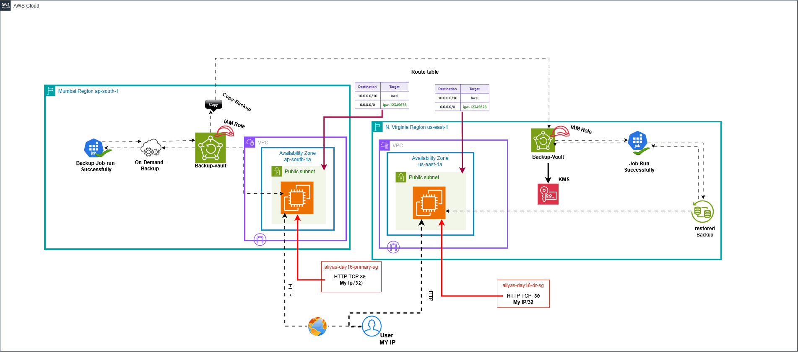

---

## Step 1 — Prepare the Source Security Group (Mumbai)

Created `aliyas-day16-primary-sg` in the Mumbai VPC, allowing inbound HTTP on TCP port 80 from my current public IP only, with default outbound access left open for package installation.

## Step 2 — Launch the Source EC2 Instance (Mumbai)

Launched `aliyas-day16-primary` in a public subnet with an 8 GiB encrypted `gp3` root volume, attached to `aliyas-day16-primary-sg`, and passed the user-data script that installs nginx and renders a page showing the instance's live Region and instance ID using IMDSv2.

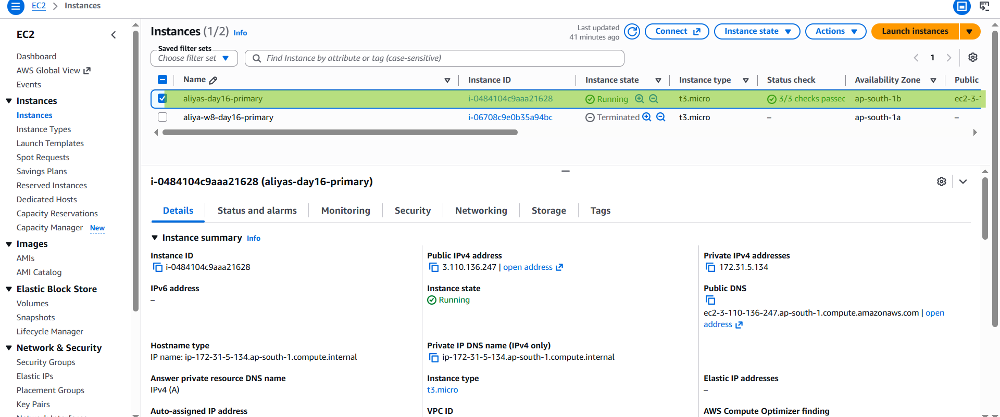

## Step 3 — Validate the Source Webpage

Confirmed the instance served its page correctly over its public IP.

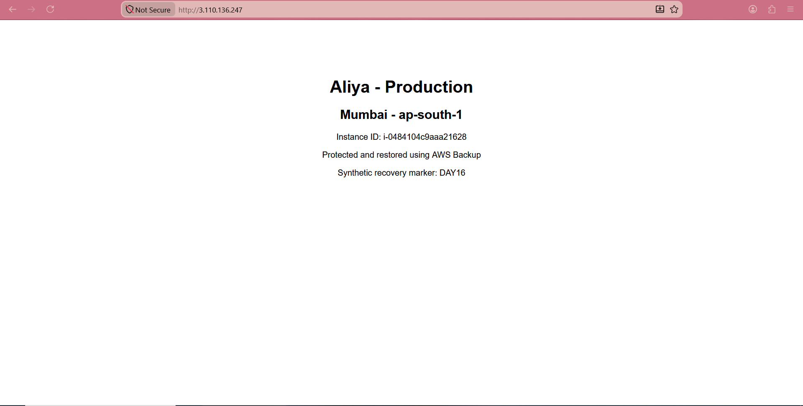

Confirmed the health check endpoint returned the expected response.

## Step 4 — Check N. Virginia Recovery Capacity

Before building anything in the destination Region, checked the On-Demand Standard vCPU quota in `us-east-1` to confirm there was enough headroom to launch a restored instance.

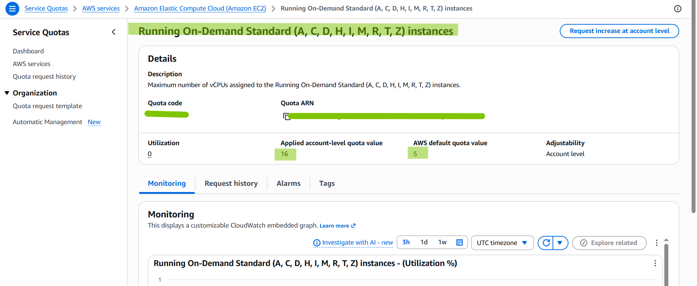

## Step 5 — Create the Destination KMS Key (N. Virginia)

Created a symmetric, single-Region customer-managed KMS key with alias `alias/aliyas-day16-dr-backup-key`, granted key usage permissions to `AWSServiceRoleForBackup` and my own IAM user, and enabled automatic key rotation.

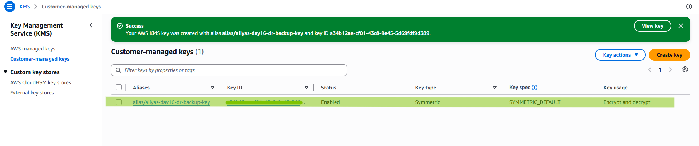

## Step 6 — Create the Destination Backup Vault (N. Virginia)

Created `aliyas-day16-dr-vault`, encrypted with the KMS key from Step 5, with Vault Lock left disabled since this is a disposable lab.

## Step 7 — Create the Destination Security Group (N. Virginia)

Created `aliyas-day16-dr-sg` in the target VPC, allowing inbound HTTP on TCP port 80 from my current public IP only.

## Step 8 — Create the Source Backup Vault (Mumbai)

Created `aliyas-day16-primary-vault` in Mumbai using the default AWS-managed encryption key.

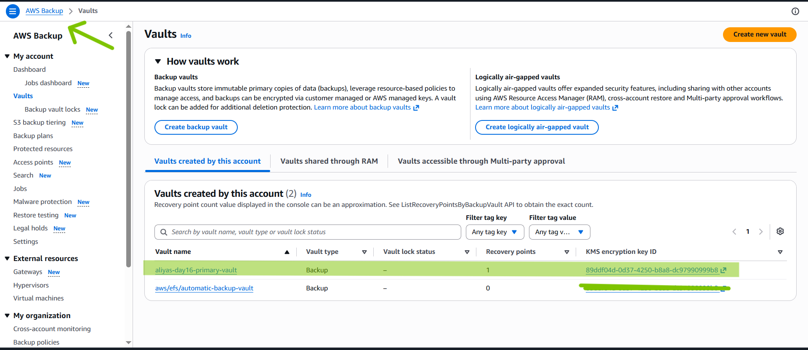

## Step 9 — Verify the AWS Backup IAM Role

Confirmed `AWSBackupDefaultServiceRole` exists with both `AWSBackupServiceRolePolicyForBackup` and `AWSBackupServiceRolePolicyForRestores` attached, so AWS Backup has the permissions it needs to perform the backup, copy, and restore operations on my behalf.

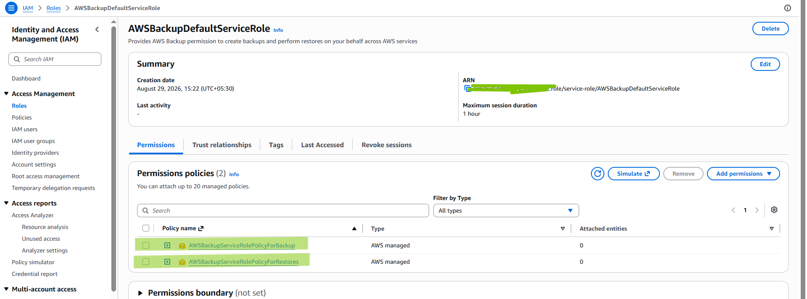

## Step 10 — Create the On-Demand Backup (Mumbai)

Created an on-demand backup of `aliyas-day16-primary`, targeting `aliyas-day16-primary-vault`. The job completed successfully after resolving an earlier permissions gap.

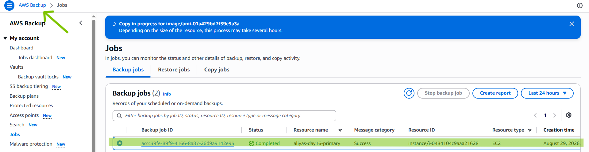

## Step 11 — Confirm the Recovery Point (Mumbai)

Verified the completed recovery point was visible inside the source vault.

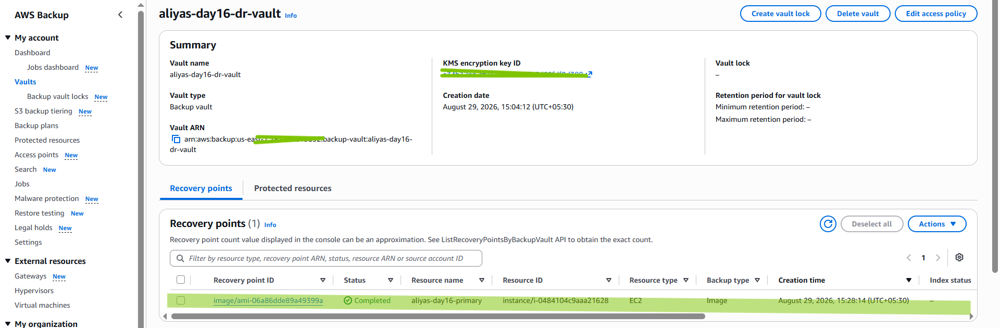

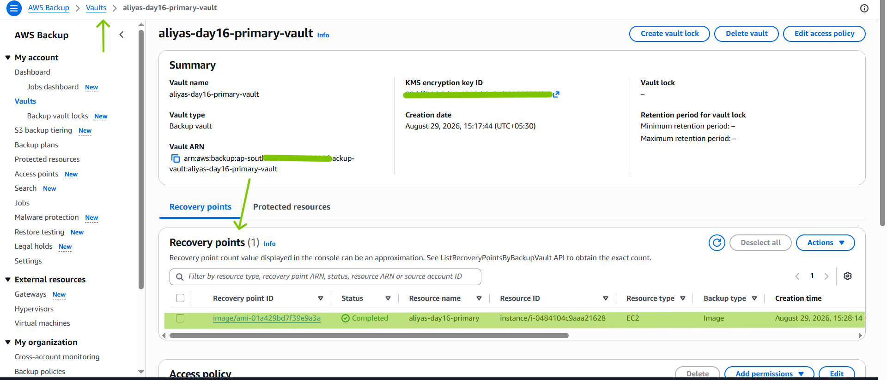

## Step 12 — Copy the Recovery Point Cross-Region

Copied the completed recovery point from `aliyas-day16-primary-vault` in Mumbai to `aliyas-day16-dr-vault` in N. Virginia, encrypting the copy with the destination KMS key, and monitored the copy job until it completed.

## Step 13 — Simulate Failure Safely

Stopped nginx on the source instance through Session Manager to simulate an application failure, without terminating the instance, and confirmed the local health check failed immediately afterward.

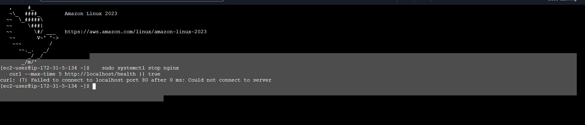

Incident and detection time recorded: approximately `2026-08-29 10:27:42 UTC`.
Declaration time recorded: `2026-08-29 10:32:09 UTC`.

## Step 14 — Restore in N. Virginia

Restored the copied recovery point into a new EC2 instance in the target VPC and subnet, attached to `aliyas-day16-dr-sg`, using the default AWS Backup restore role. An initial restore attempt failed due to the destination KMS key being in an incorrect state; after resolving the key state, a second restore attempt completed successfully and produced a new instance.

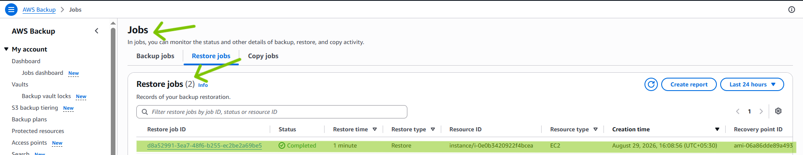

## Step 15 — Confirm the Restored Instance

Located the new instance created by the restore job in N. Virginia and tagged it `aliyas-day16-dr-restored`.

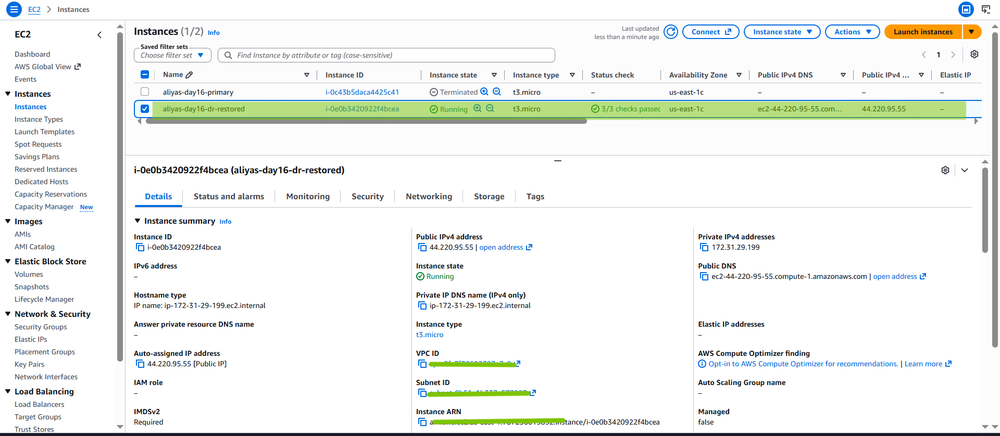

## Step 16 — Validate the Recovered Workload

Confirmed the restored instance was reachable over its public IP and served the expected recovery page.

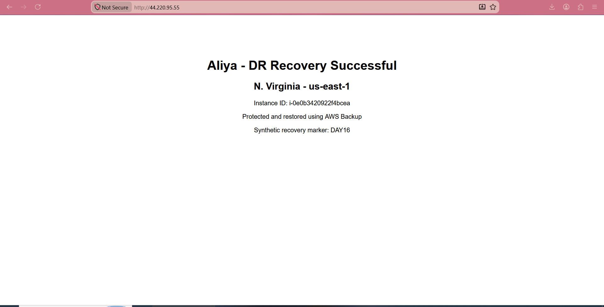

Confirmed from the instance's own terminal that the page content matched what was expected, including the recovery marker, using the same validation commands run against the source instance.

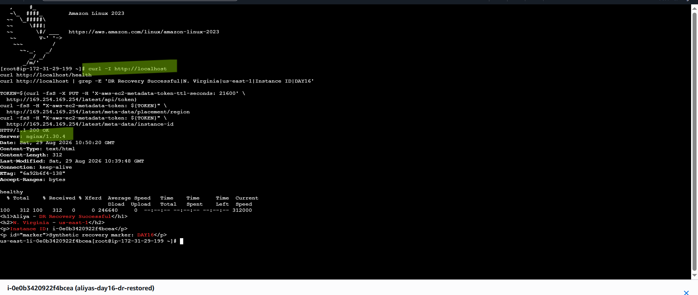

This confirmed:
- The restored instance returned HTTP 200 and a healthy health check
- The page displayed the DR success state, the N. Virginia Region, and the new instance ID
- The new instance ID differed from the original Mumbai source instance ID
- The restored EBS volume was encrypted

## Step 17 — Cleanup

After successful validation, cleaned up resources in both Regions in dependency order: terminated the restored and source EC2 instances, deleted the recovery points from both vaults, deleted both backup vaults, deleted both security groups, and scheduled deletion of the destination KMS key.

---

## Summary

This lab demonstrated a complete backup-and-restore disaster recovery cycle: protecting an EC2 workload with AWS Backup in Mumbai, encrypting and copying its recovery point cross-Region into N. Virginia, restoring it into a new, independent EC2 instance, and validating that the recovered application actually served traffic correctly — not just that the restore job reported success.
